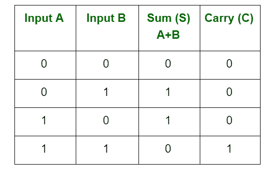
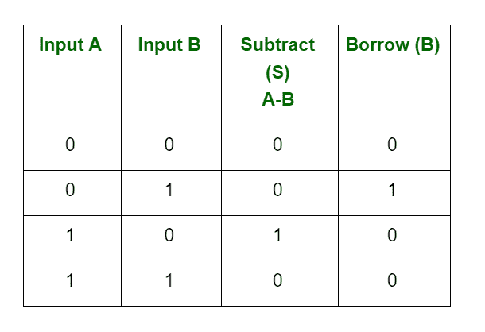
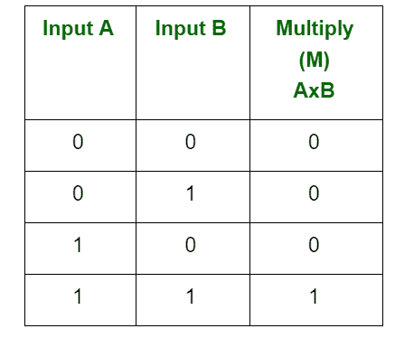
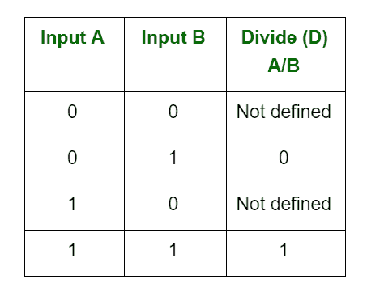

# 二进制数的算术运算

> 原文:[https://www . geeksforgeeks . org/二进制数的算术运算/](https://www.geeksforgeeks.org/arithmetic-operations-of-binary-numbers/)

[二进制](https://www.geeksforgeeks.org/binary-representation-of-a-given-number/)是一个基数为 2 的数字系统，使用两种状态 0 和 1 来表示一个数字。我们也可以称之为真态和假态。二进制数的构建方式与我们构建正常的[十进制数](https://www.geeksforgeeks.org/number-system-and-base-conversions/)的方式相同。

二进制算术是各种数字系统的重要组成部分。您可以使用各种方法对二进制数进行加减乘除。这些运算比十进制数字算术运算容易得多，因为二进制系统只有两位数:0 和 1。

二进制加法和减法的执行与十进制加法和减法相同。当我们执行二进制加法时，将有两个输出:和(S)和进位(C)。

**1。**二进制加法有四个规则:

**2。**二进制减法有四个规则:

这里 0-1 应该是 1 和 1

需要从下一个高阶位借用 1 来从 0 减去 1。所以，结果变成了 0。

**3。**二进制乘法有四个规则:

每当至少一个输入为 0 时，乘法总是为 0。

**4。**任何除法都有四个部分:被除数、除数、商和余数。

每当除数为 0 时，结果总是不被定义。