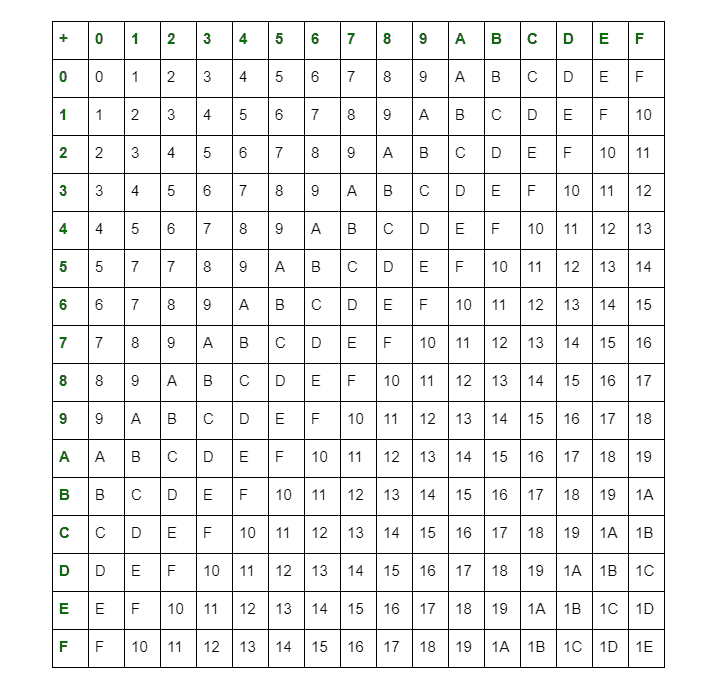

# 十六进制数的算术运算

> 原文:[https://www . geesforgeks . org/十六进制数的算术运算/](https://www.geeksforgeeks.org/arithmetic-operations-of-hexadecimal-numbers/)

**十六进制数**的基数为 16 位，范围从 0 到 F(即 0、1、2、3、4、5、6、7、8、9 和 A、B、C、D、E、F)。a、B、C、D、E、F 分别是 10、11、12、13、14、15 的等价单位数。一般用下标 16 或 Hexa (H)或(H)表示。

十六进制数的算术运算可以使用十六进制数的加法表来执行，如下所示:

**十六进制数的算术运算:**

1.  **加法:**
    我们可以借助上表
    对十六进制数进行加法运算
2.  **减法:**
    十六进制数的减法可以用补码法进行，也可以简单地作为十进制减法。简单的十六进制减法的规则是，从紧邻的高位借用的数字算作 16。

3.  **乘法:**
    在十六进制数的乘法中，如果乘积小于十六进制的基数(即 16)，那么我们就把它作为结果，否则除以十六进制的基数(即 16)，取余数作为 LSB(最低有效位)。商作为下一个有效数字的进位。使用这些规则，您可以制作一个十六进制乘法表。

4.  **除法:**
    同样，十六进制数的除法可以按照十进制数的除法规则进行，但最大允许位数为 F(=十进制中的 15)。

*十进制数*的算术运算非常流行，也容易得多。这些操作在其他数字系统中也同样执行。