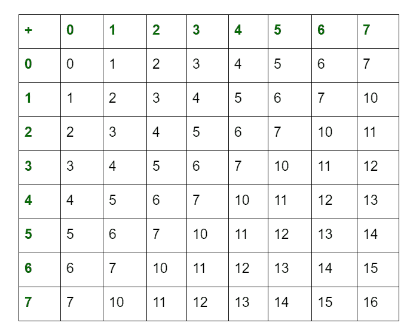

# 八进制数的算术运算

> 原文:[https://www . geesforgeks . org/八进制数的算术运算/](https://www.geeksforgeeks.org/arithmetic-operations-of-octal-numbers/)

通常，八进制数的表示是用下标 8 或八进制(o)表示的。它的基数为 8 位数，范围从 0 到 7(即 0、1、2、3、4、5、6、7)。八进制数的算术运算也和十进制或[二进制算术运算](https://www.geeksforgeeks.org/arithmetic-operations-of-binary-numbers/)一样执行。八进制数的加法表如下:

借助上表，我们可以对八进制数进行以下算术运算:

1.  **加法:**
    可以执行八进制数的加法。
2.  **减法:**
    可以进行八进制数的减法，和十进制数的减法一样。但是你只能借用一个数字 7，这是八进制数字系统允许的最大位数。
3.  **乘法:**
    如果乘积小于八进制的基数(即 8)，那么我们把它作为结果，否则除以八进制的基数(即 8)，余数作为 LSB(最低有效位)。商作为下一个有效数字的进位。
4.  **除法:**
    可以按照十进制数的除法规则进行，但最大允许位数为 7。