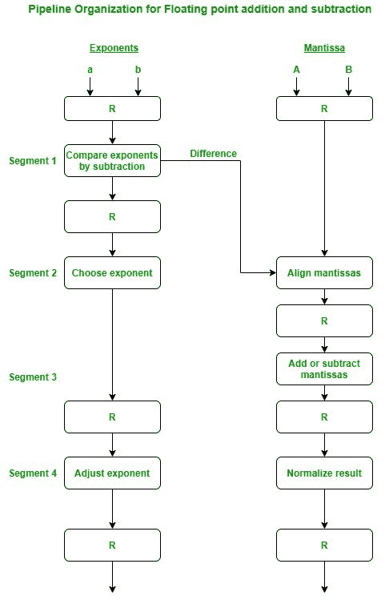
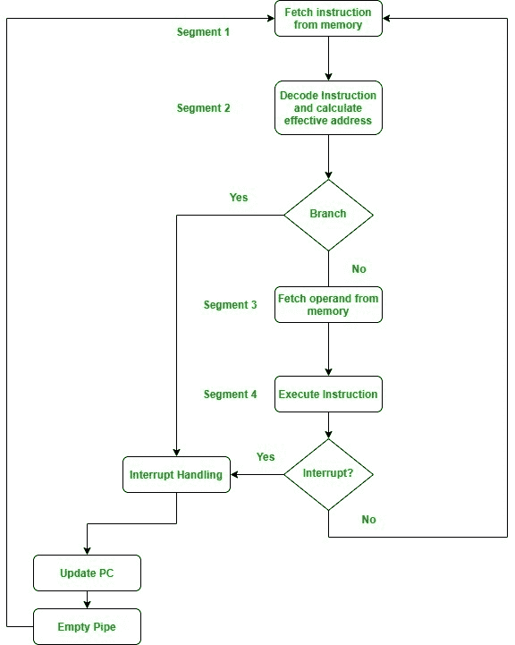
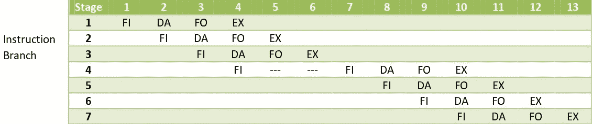

# 算术流水线和指令流水线

> 原文:[https://www . geesforgeks . org/算术-流水线和指令-流水线/](https://www.geeksforgeeks.org/arithmetic-pipeline-and-instruction-pipeline/)

**1。算术流水线:**
算术流水线将算术问题分成各种子问题，在各种流水线段中执行。它用于浮点运算、乘法和各种其他计算。图中显示了浮点加法的流程或流程图算术流水线。



**使用算术流水线的浮点加法:**
在这种情况下执行以下子操作:

1.  比较指数。
2.  对齐尾数。
3.  增加或减少尾数。
4.  标准化结果

首先比较两个指数，选择两个指数中较大的一个作为结果指数。指数的差异决定了我们必须将较小的指数向右移动多少次。然后在指数移位之后，两个尾数对齐。最后，两个数字相加，最后一个部分的结果标准化。

**例:**
我们来考虑两个数字，

```
X=0.3214*10^3 and Y=0.4500*10^2 
```

**解释:**
首先将两个指数相减，得到 3-2=1。因此，3 成为结果的指数，较小的指数向右移动 1 倍给出

```
Y=0.0450*10^3 
```

最后，这两个数字相加产生

```
Z=0.3664*10^3 
```

由于结果已经标准化，因此结果保持不变。

**2。指令流水线:**
在这种情况下，可以通过重叠指令周期的提取、解码和执行阶段来执行指令流。这种技术用于提高计算机系统的吞吐量。指令流水线从存储器中读取指令，而先前的指令正在流水线的其他段中执行。因此，我们可以同时执行多条指令。如果指令周期被分成相等持续时间的段，流水线将更有效率。

在最一般的情况下，计算机需要按以下步骤顺序处理每条指令:

1.  从内存中获取指令
2.  解码指令
3.  计算有效地址
4.  从内存中获取操作数
5.  执行指令(EX)
6.  将结果存储在适当的地方

指令流水线流程图如下所示。



我们来看一个指令流水线的例子。

**示例:**



此处指令在段 1 的第一个时钟周期提取。
现在在下一个时钟周期解码，然后提取操作数，最后执行指令。我们可以看到，在这里，由于流水线操作，提取和解码阶段重叠。当第一条指令被解码时，流水线取出下一条指令。

在第三条指令的情况下，我们看到它是一条分支指令。这里，当它被解码时，第四条指令被同时取出。但是由于它是一个分支指令，当它被解码时，它可能指向其他指令。因此，第四条指令被保持等待，直到分支指令被执行。当它被执行时，第四条指令被复制回来，其他阶段照常继续。