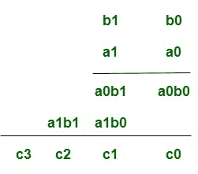
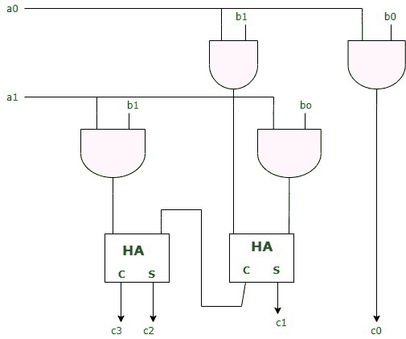

# 数字逻辑中的阵列乘法器

> 原文:[https://www . geesforgeks . org/数组-数字逻辑乘法器/](https://www.geeksforgeeks.org/array-multiplier-in-digital-logic/)

**阵列乘法器**是一种数字[组合电路](https://www.geeksforgeeks.org/construction-of-combinational-circuits/)，用于通过使用全加器和半加器阵列来相乘两个二进制数。该数组用于几乎同时添加所涉及的各种产品术语。为了形成各种乘积项，在加法器阵列之前使用与门阵列。

一次检查一个乘法器的位并形成部分乘积是一个顺序操作，需要一系列加法和移位微操作。两个二进制数的相乘可以通过组合电路一次微操作完成，该组合电路可以同时形成乘积位。这是一种将两个数相乘的快速方法，因为信号传播通过形成乘法阵列的门所需要的时间。然而，阵列乘法器需要大量的门，因此直到集成电路的发展才变得经济。

对于用组合电路实现阵列乘法器，考虑两个 2 位数字的乘法，如图所示。被乘数位是 b1 和 b0，乘数位是 a1 和 a0，乘积是

```
c3c2c1c0
```



假设 A = a1a0，B= b1b0，最终乘积项 P 的各个位可以写成:-
1。P(0)= a0b0
2。P(1)=a1b0 + b1a0
3。P(2) = a1b1 + c1，其中 c1 是 P(1)项相加过程中产生的进位。
4。P(3) = c2，其中 c2 是 P(2)项相加过程中产生的进位。

对于上述乘法，需要四个与门的阵列来形成各种乘积项，如 a0b0 等。然后需要一个加法器阵列来计算涉及上述等式中提到的各种乘积项和进位组合的和，以便得到最终的乘积位。

1.  第一部分积由 a0 乘以 b1，b0 形成。如果 a0 和 b0 两个位都是 1，则两个位的相乘产生 1；否则，它会产生 0。这与“与”运算相同，可以用“与”门实现。
2.  第一部分积通过两个与门形成。
3.  第二部分积由 a1 乘以 b1b0 形成，并向左移动一个位置。
4.  上述两个部分积用两个半加法器电路相加。通常在部分乘积中有更多的位，需要使用全加器来产生和。
5.  注意，乘积的最低有效位不必经过加法器，因为它是由第一与门的输出形成的。



具有更多位的组合电路二进制乘法器可以以类似的方式构造。乘法器的一位与被乘数的每一位进行“与”运算，级数与乘法器的位数相同。每一级与门的二进制输出与前一级的部分积并行相加，形成一个新的部分积。最后一级生产产品。对于 j 个乘数位和 k 个被乘数，我们需要 **j*k** 与门和 **(j-1)** k 位加法器来产生 **j+k** 位的乘积。