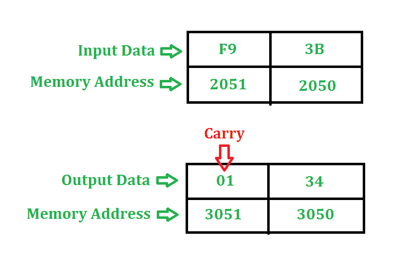

# 8085 程序添加两个 8 位数字

> 原文:[https://www . geesforgeks . org/汇编语言-程序-8085-微处理器-添加-两个 8 位数字/](https://www.geeksforgeeks.org/assembly-language-program-8085-microprocessor-add-two-8-bit-numbers/)

**问题–**编写汇编语言程序，将 8085 微处理器中地址 2050 和地址 2051 存储的两个 8 位数字相加。程序的起始地址取 2000。

**示例–**

**算法–**

1.  将第一个数字从存储单元 2050 加载到累加器中。
2.  将累加器的内容移到寄存器 h。
3.  将第二个数字从内存位置 2051 加载到 accumaltor。
4.  然后在 3050 使用“添加”指令添加寄存器 H 和累加器的内容并存储结果
5.  使用“ADC”命令恢复生成的进位，并将其存储在存储器位置 3051

**程序–**

<figure class="table">

| 存储地址 | 记忆术 | 评论 |
| --- | --- | --- |
| Two thousand | LDA 2050 | 一 |
| Two thousand and three | 莫夫·h·a | H |
| Two thousand and four | LDA 2051 | 一 |
| Two thousand and seven | 添加氢 | A |
| Two thousand and eight | 莫夫·l·a | L←A |
| Two thousand and nine | MVI A 00 | 页:1 |
| 200B | 模数转换器 | A←A+A+进位 |
| 200 摄氏度 | 莫夫·h·a | 页:1 |
| 200D | SHLD 3050 突击步枪 | H→3051，L→3050 |
| Two thousand and ten | HLT |   |

**解释–**

1.  **LDA 2050** 将 2050 内存位置的内容移动到累加器。
2.  **MOV H，A** 将累加器的内容复制到寄存器 H 到 A
3.  **LDA 2051** 将 2051 内存位置的内容移动到累加器。
4.  **添加 H** 添加 A(累加器)和 H 寄存器(F9)的内容。结果存储在 A 本身。**对于所有算术指令，默认情况下，A 是一个操作数，A 也存储结果**
5.  **MOV L，A** 将 A (34)的内容复制到 L
6.  **MVI A 00** 将即时数据(即 00)移动到 A
7.  **ADC A** 将 A(00)的内容、指定寄存器(即 A)的内容和进位(1)相加。由于模数转换器也是一个算术运算，默认情况下，A 是一个操作数，A 也存储结果
8.  **MOV H，A** 将 A (01)的内容复制到 H
9.  **SHLD 3050** 移动 3050 存储单元中 L 寄存器(34)的内容和 3051 存储单元中 H 寄存器(01)的内容
10.  **HLT** 停止执行程序并停止任何进一步的执行

</figure>