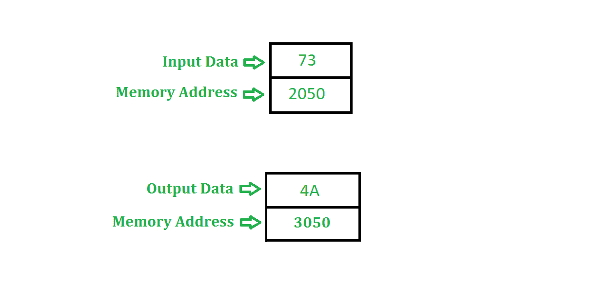

# 8085 将 8 位数字转换为灰色数字的程序

> 原文:[https://www . geesforgeks . org/汇编语言-程序-8085-微处理器-转换-8 位数字-灰色数字/](https://www.geeksforgeeks.org/assembly-language-program-8085-microprocessor-convert-8-bit-number-grey-number/)

先决条件–[二进制到/自格雷码](https://www.geeksforgeeks.org/digital-logic-code-converters-binary-gray-code/)
**问题–**用 8085 编写一个汇编语言程序，将一个 8 位数字转换成格雷码

**示例–**

**假设–**8 位数字(输入)存储在存储器位置 2050，输出存储在存储器位置 3050。

**算法–**

1.  在累加器中加载内存位置 2050 的内容
2.  复位进位标志，即 CY = 0
3.  用进位将累加器的内容向右旋转 1 位，并用输入的初始值执行异或运算
4.  将结果存储在存储器位置 3050

**程序–**

| 内存地址 | 助记符 | comment |
| 2000 | LDA 2050 | A<-M【2050】 |
| 2003 | MOV B，A | B < - A |
| 2004 | STC | CY = 1 |
| 2005 | CMC | CY<-CY的补码 |
| 2006 | rar | 进位向右旋转 1 位 |
| 2007 | XRA B | A < - A 异或 B |
| 2008 | 他们是 3050 | M【3050】<-A |
| 200B | HLT | 程序结束 |

**解释–**

1.  **LDA 2050** 将内存位置 2050 的内容加载到累加器中
2.  **MOV B，A** 在寄存器 B 中传输寄存器 A 的内容
3.  **STC** 设置进位标志，即 CY 变为 1
4.  **CMC** 补充进位标志，即 CY 变为 0
5.  **RAR** 将累加器的内容与进位标志一起旋转 1 位
6.  **XRA B** 在寄存器 A 和寄存器 B 的值中执行异或运算，并将结果存储在 A 中
7.  **STA 3050** 将累加器的值存储在存储单元 3050 中
8.  **HLT** 停止执行程序并停止任何进一步的执行