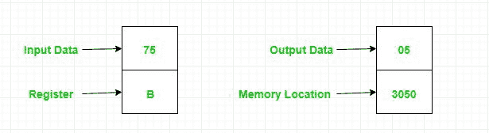

# 8085 程序对寄存器 B

内容中的 1 进行计数

> 原文:[https://www . geesforgeks . org/汇编语言-程序-8085-微处理器-计数-数-1-内容-寄存器-b/](https://www.geeksforgeeks.org/assembly-language-program-8085-microprocessor-count-number-ones-contents-register-b/)

**问题–**编写汇编语言程序，统计寄存器 B 内容中的 1 个数，并将结果存储在内存位置 3050。

**示例–**

**算法–**

*   将累加器中的十进制数转换为其二进制等价物
*   将二进制数的数字向右旋转，不带进位
*   应用一个循环，直到计数不为零，以改变 D 寄存器和计数的值
*   将 D 寄存器的值复制到累加器并存储结果

**程序–**

| 存储地址 | 记忆术 | 评论 |
| --- | --- | --- |
| Two thousand | MVI B 75 | 页:1 |
| Two thousand and two | MVI C 08 | 页:1 |
| Two thousand and four | MVI D 00 | S7-1200 可编程控制器 |
| Two thousand and six | 莫夫 a b | A ← B |
| Two thousand and seven | （Ladyofthe）RoyalRedCross（英国）皇家护士红十字勋章（获得者） | 不带进位向右旋转 |
| Two thousand and eight | jnc 200 足球俱乐部 | 不扛就跳 |
| 200B | INR D | D+1 |
| 200 摄氏度 | DCR C(消歧义) | 页:1 |
| 200D | JNZ 2007 | 如果不是零就跳 |
| Two thousand and ten | 莫夫 a，d | a′d |
| Two thousand and eleven | STA 3050 | A → 3050 |
| Two thousand and fourteen | HLT | 停止执行 |

**解释–**

1.  **MVI B 75** 将 75 位小数移入 B 寄存器
2.  **MVI C 08** 将 08 十进制数移入 C 寄存器，作为计数器，其位数为 8 位
3.  **MVI D 00** 将 00 号移入 D 寄存器
4.  **MOV A，B** 将 B 寄存器的内容移入 A(累加器)寄存器
5.  **RRC** 向右旋转 A(75，二进制等价 01110101)的内容
    
6.  **如果进位标志不为零，则 JNC 200C** 跳转到 200C 地址并执行写在那里的指令
7.  **INR D** 通过将 D 寄存器的内容加 1 来增加 D 寄存器的值
8.  **DCR C** 通过从其内容中减去一来减少 C 寄存器的值
9.  **JNZ 2007** 跳转到 2007 地址，如果零标志不为零，执行写在那里的指令
10.  **MOV A，D** 将 B 寄存器的内容移入 A 寄存器
11.  **STA 3050** 将 A 的内容存储在 3050 存储位置
12.  **HLT** 停止执行