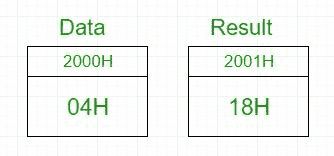
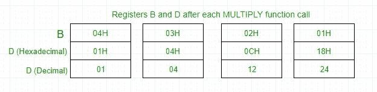

# 8085 程序求一个数的阶乘

> 原文:[https://www . geesforgeks . org/汇编语言-程序-8085-微处理器-查找-阶乘-数字/](https://www.geeksforgeeks.org/assembly-language-program-8085-microprocessor-find-factorial-number/)

**问题–**用 8085 微处理器编写一个计算一个数的阶乘的汇编语言程序。

**示例–**

```
Input : 04H
Output : 18H 
as 04*03*02*01 = 24 in decimal => 18H

```



在 8085 微处理器中，不存在直接将两个数相乘的指令，所以乘法是通过重复加法来完成的，因为 4×3 相当于 4+4+4(即 3 次)。
在 D 寄存器加载 04H->添加 04H 3 次- > D 寄存器现在包含 0CH - >添加 0CH 2 次- > D 寄存器现在包含 18H - >添加 18H 1 次- > D 寄存器现在包含 18H - >输出为 18H



**算法–**

1.  将数据载入寄存器 B
2.  若要开始乘法，请将 D 设置为 01H
3.  跳到第 7 步
4.  递减 B 以乘以上一个数字
5.  跳到步骤 3，直到值 B>0
6.  将内存指针指向下一个位置并存储结果
7.  用乙的内容物装载戊，并清除蓄能器
8.  将 D 的内容重复添加到累加器 E 中多次
9.  将累加器内容存储到 D
10.  转到第 4 步

| 地址 | 标签 | 记忆的 | 评论 |
| --- | --- | --- | --- |
| 2000 小时 | 数据 |  | 数据字节 |
| 2001H | 结果 |  | 阶乘结果 |
| 2002H |  | LXI H，2000 小时 | 从内存中加载数据 |
| 2005H |  | 莫夫 b，m | 将数据载入 B 寄存器 |
| 2006H |  | MVI D，01 小时 | 用 1 设置 D 寄存器 |
| 2008H | 阶乘 | 调用乘法 | 乘法子程序调用 |
| 200BH |  | DCR B | 减量 B |
| 200CH |  | 系数 JNZ | 调用阶乘，直到 B 变成 0 |
| 200FH |  | INX H(消歧义) | 增量内存 |
| 2010H |  | 莫夫·m·d | 将结果存储在内存中 |
| 2011H |  | HLT | 停止 |
| 2100 小时 | 多样地 | 莫夫和 b | 将乙的内容转移到丙 |
| 2101H |  | MVI A， 00H | 清除累加器以存储结果 |
| 2103H | 多平台 | 增加 | 将 D 的内容添加到 A 中 |
| 2104H |  | DCR 和 | 减量 E |
| 2105H |  | jnz multiplyloop | 叠加 |
| 2108H |  | 莫夫 d，a | 将 A 的内容转移到 D |
| 2109H |  | 浸水使柔软 | 从子程序返回 |

**解释–**

1.  首先用数据设置寄存器 B。
2.  通过调用乘法子程序一次，用数据设置寄存器 D。
3.  通过调用 MULTIPLY 子例程将 B 减 1，将 D 加到自身 B 次，因为 4*3 相当于 4+4+4(即 3 次)。
4.  重复上述步骤，直到 B 达到 0，然后退出程序。
5.  结果在存储在存储器中的 D 寄存器中获得