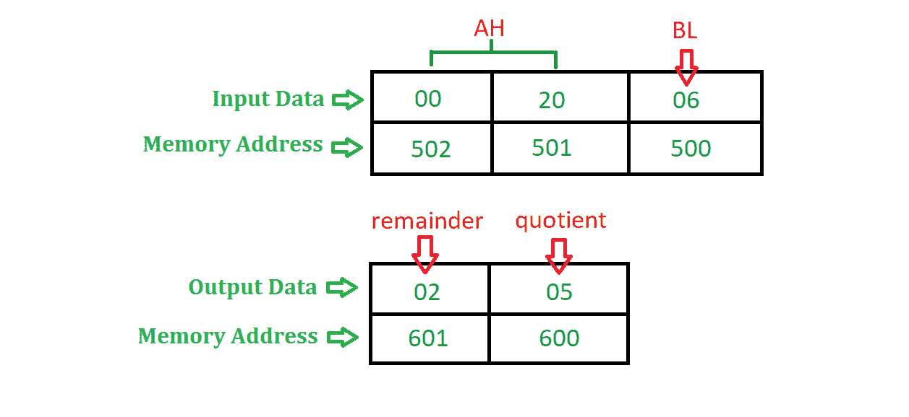

# 8086 编程将 16 位数字除以 8 位数字

> 原文:[https://www . geesforgeks . org/汇编语言-程序-8086-微处理器-除法-16 位数字-8 位数字/](https://www.geeksforgeeks.org/assembly-language-program-8086-microprocessor-divide-16-bit-number-8-bit-number/)

**问题–**在 8086 微处理器中编写汇编语言程序，将 16 位数字除以 8 位数字。

**示例–**

**算法–**

1.  在国际单位制中赋值 500，在直接投资中赋值 600
2.  在 BL 中移动[SI]的内容，并将 SI 增加 1
3.  在 AX 中移动[SI]和[SI + 1]的内容
4.  使用 **DIV** 指令将 AX 除以 BL
5.  在[DI]中移动 AX 的内容。
6.  暂停程序。

**假设–**每个段寄存器的初始值为 00000。

**物理内存地址的计算–**
内存地址=段寄存器* 10(H) +偏移量，
其中段寄存器和偏移量根据下表决定。

| 操作 | 段寄存器 | 偏移 |
| 取指令 | 代码段 | 指令指针 |
| 数据操作 | 数据段 | 基础寄存器【BX】，位移【DISP】 |
| 堆叠操作 | 堆叠段 | 栈指针(SP)，基指针(BP) |
| 以弦为源 | 数据段 | 源索引(SI) |
| 字符串作为目的地 | 额外段 | 目的地索引 |

**程序–**

| 内存地址 | 助记符 | comment |
| 0400 | MOV SI，500 | SI < - 500 |
| 0403 | di 的 MOV，600 | DI < - 600 |
| 0406 | MOV BL，[SI] | BL<-【SI】 |
| 0408 | INC SI | SI < - SI + 1 |
| 0409 | MOV AX，[SI] | ax<-【si】 |
| 040B | bl div | AX < - AX / BL |
| 040D | MOV [DI]，AX | 【迪】<【ax】 |
| 040F | HLT | 程序结束 |

**解释–**使用的寄存器 **AX、BL、SI、DI**

1.  **MOV SI，500** 给 SI 分配 500
2.  **MOV DI，600** 给 DI 分配 600
3.  **MOV BL，[SI]** 将[SI]的内容移到 BL 寄存器，即除数的值将存储在 BL 中
4.  **INC SI** 将 SI 的含量增加 1
5.  **MOV AX、【SI】**将[SI]和[SI + 1]的内容移到 AX 寄存器，即股息值将存储在 AX 中
6.  **DIV BL** 将 AX 的内容除以 BL，执行此指令后，商存储在 a1 中，余数存储在 AH 中
7.  **MOV【DI】，AX** 将 AX 的内容移动到【DI】
8.  **HLT** 停止执行程序并停止任何进一步的执行