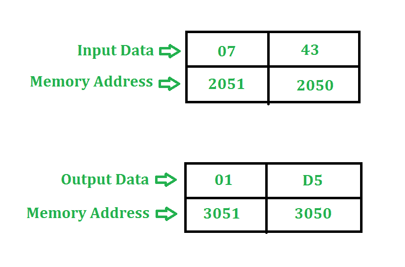

# 8085 程序将两个 8 位数字相乘

> 原文:[https://www . geesforgeks . org/汇编语言-程序-乘法-二-8 位数字-8085-微处理器/](https://www.geeksforgeeks.org/assembly-language-program-multiply-two-8-bit-numbers-8085-microprocessor/)

**问题–**将存储在地址 2050 和 2051 的两个 8 位数字相乘。结果存储在地址 3050 和 3051。程序的起始地址取 2000。

**示例–**

**算法–**

1.  在这个例子中，我们把数字 43 加七(7)次。
2.  **由于两个 8 位数字的相乘最多可以是 16 位**所以我们需要寄存器对来存储结果。

**程序–**

<figure class="table">

| 存储地址 | 记忆术 | 评论 |
| --- | --- | --- |
| Two thousand | LHLD 2050 年 | 页:1 |
| Two thousand and three | XCHG 表示 | hⅲd，lⅲe |
| Two thousand and four | 莫夫 c，d | C←D |
| Two thousand and five | MVI D 00 | D←00 |
| Two thousand and seven | LXI 小时 0000 | h←00.l←00. |
| 200A | 爸爸 D | HL←HL+DE |
| 200B | DCR C(消歧义) | C←C-1 型核潜艇 |
| 200 摄氏度 | JNZ 200A 足球俱乐部 | 如果零标志=0，转到 200A |
| 200F | SHLD 3050 突击步枪 | H→3051，L→3050 |
| Two thousand and twelve | HLT |   |

**解释–**使用的寄存器: **A、H、L、C、D、E**

1.  **LHLD 2050** 加载 H 中的 2051 含量和 L 中的 2050 含量
2.  **XCHG** 交换氢和丁的含量，交换氢和戊的含量
3.  **MOV C、D** 复制 C 中 D 的内容
4.  **MVI D 00** 将 00 分配给 D
5.  **LXI H 0000** 给 H 分配 00，给 L 分配 00
6.  **DAD D** 将 HL 和 DE 相加，并将结果赋给 HL
7.  **DCR C** 将 C 减 1
8.  **如果零标志= 0，JNZ 200A** 将程序计数器跳至 200A
9.  **SHLD** 将 H 值存储在存储单元 3051，将 L 值存储在存储单元 3050
10.  **HLT** 停止执行程序并停止任何进一步的执行

接下来阅读:[汇编语言程序(8085 微处理器)添加两个 8 位数字](https://www.geeksforgeeks.org/assembly-language-program-8085-microprocessor-add-two-8-bit-numbers/)

**另一种方法:**

我们可以在不使用 DAD 和 XCHG 命令的情况下进行两个 8 位数字的乘法运算。

**程序-**

<figure class="table">

| 地址 | 记忆术 | 评论 |
| Two thousand | LXI H，2050H |   |
| Two thousand and three | 莫夫 b，m | b(b) |
| Two thousand and four | INX H(消歧义) |   |
| Two thousand and five | 莫夫·c·m | b |
| Two thousand and six | MVI A， 00H | 页:1 |
| Two thousand and eight | 顶部:添加 B | A |
| Two thousand and nine | DCR C(消歧义) | C←C-1 型核潜艇 |
| 200A | JNZ TOP 公司 |   |
| 200D | INX H(消歧义) |   |
| 200E | 莫夫 m，a | 米←A |
| 200F | HLT | 终止程序 |

**说明–**寄存器 A、H、L、C、B 用于通用。

1. **LXI H，2050** 将用存储单元的地址 2050 加载 HL 对寄存器。

2. **MOV B，M** 将内存内容复制到寄存器 B

3. **INX H** 将 HL 对的地址递增 1，使其为 2051H。

4. **MOV C，M** 将内存内容复制到寄存器 C

5. **MVI A，00H** 给 A 分配 00

6. **top** : **ADD B** 用寄存器 B 添加累加器的内容，并将结果存储在累加器中。

7. **DCR C** 递减寄存器 C

8. **JNZ TOP** 跳到顶部，直到 C 没有变成 0。

9. **INX H** 将 HL 对的地址递增 1，使其为 2052H。

10. **MOV M，A** 复制 A 的内容，这是我们注册 M 的答案

11. **HLT** 停止执行程序，并停止任何进一步的执行。

</figure>

</figure>