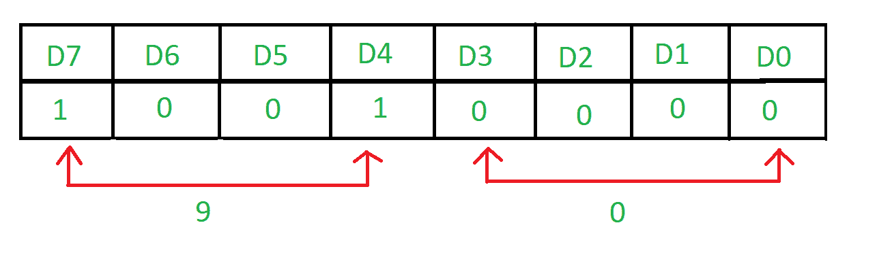

# 转换开关状态的装配程序

> 原文:[https://www . geesforgeks . org/assembly-program-transfer-status-switches/](https://www.geeksforgeeks.org/assembly-program-transfer-status-switches/)

**问题–**用 8085 编写一个 8085 和 8255 接口的汇编语言程序。端口 a 连接了 8 台交换机。将这些交换机的状态传输到端口 B，在端口 B 连接了指示灯。

**示例–**


输入端口为 A，输出端口为 b。

**算法–**

1.  构造控制字寄存器
2.  从端口 A 输入数据
3.  在端口 B 显示结果

**程序–**

| 记忆术 | 评论 |
| --- | --- |
| MVI A， 90 | A ← 92 |
| 输出 83 | 控制寄存器← A |
| 80 年 | A→A 口； | 输出 81 | 端口 C A ← A |
| 浸水使柔软 | 返回 |

**解释–**

1.  **MVI A，92** 表示控制寄存器的值为 92。

    ```
    D7=1 as it is in I/O mode
    D6=0 & D5=0 as Poet A is in m0 mode
    D4=1 as Port A is taking input
    D3=0 & D0=0 as Port C is not taking part
    D2=0 as mode of Port B is m0
    D1=0as Port B is displaying the result
    ```

2.  **OUT 83** 将 A 的值放入端口控制寄存器的端口号 83H。
3.  **IN 80** 从端口 a 的端口号 80H 取输入
4.  **输出 81** 在 81H 中显示结果，81H 是端口 B 的端口号
5.  **RET** 返回