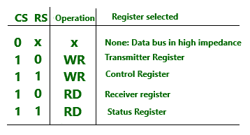

# 异步通信接口

> 原文:[https://www . geesforgeks . org/异步-通信-接口/](https://www.geeksforgeeks.org/asynchronous-communication-interface/)

异步通信接口的框图如上所示。它既是发射机又是接收机。

**部分接口:**
接口通过载入控制寄存器的控制位进行初始化。发送器寄存器通过数据总线接收来自中央处理器的数据字节，然后传输到移位寄存器进行串行传输。串行信息被接收到另一个移位寄存器中，并在累积了一个完整的数据字节后传输到接收器寄存器。状态寄存器中的位用于检查传输过程中的任何错误，以及可由中央处理器读取的输入和输出标志。芯片选择(CS)输入用于通过地址总线选择接口。寄存器选择(RS)与读(RD)和写(WR)控制相关联。两个寄存器只能读写。

选择的寄存器是遥感值和研发和 WR 状态的函数，如下表所示。

**接口工作:**
接口由中央处理器通过向控制寄存器发送一个字节来初始化。状态寄存器中的两位用作标志，一位用于指示传输寄存器是否为空，另一位用于指示接收器寄存器是否已满。

**变送器部分的工作:**
中央处理器读取状态寄存器并检查变送器。如果发射器是空的，则中央处理器将字符传输到发射器。发送器中的第一位设置为 0，产生一个起始位。字符从发送器寄存器并行传输到移位寄存器。然后变送器被标记为空。在检查状态寄存器中的标志后，中央处理器可以将另一个字符传送到发送器寄存器。

**接收部分工作:**
线路空闲时，接收数据输入为 1 状态。接收器控制监控接收数据线以检测起始位的出现。一旦检测到起始位，字符位就被转移到移位寄存器。当接收到停止位时，字符从移位寄存器并行传输到接收器寄存器。
接口检查传输过程中的任何错误，并在状态寄存器中设置适当的位。接口检查的三个可能的错误是奇偶校验错误、帧错误和溢出错误。