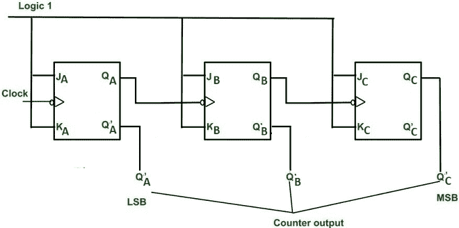
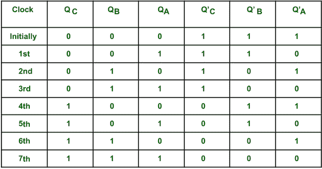
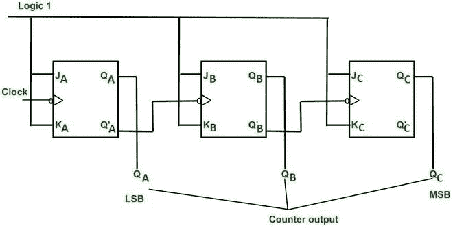
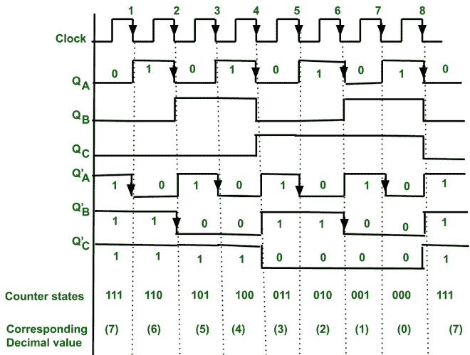
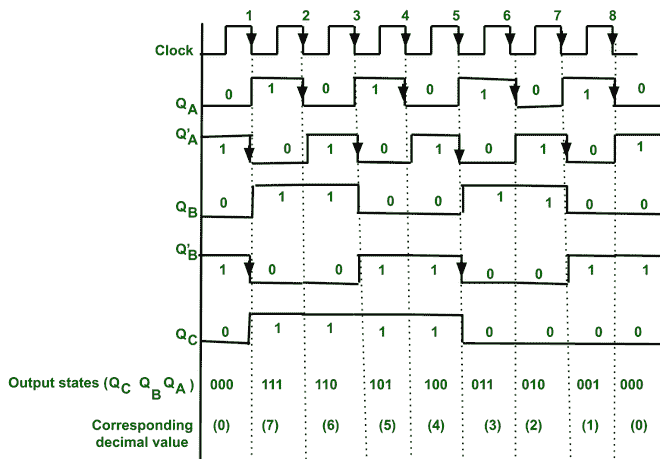
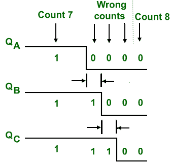

# 异步递减计数器

> 原文:[https://www.geeksforgeeks.org/asynchronous-down-counter/](https://www.geeksforgeeks.org/asynchronous-down-counter/)

**计数器:**
计数器用于计数时钟脉冲。时钟脉冲以规则的间隔出现。它们用于测量时间和频率。我们也可以说计数器是时序电路，它在时钟脉冲的帮助下改变其预定状态。它们由触发器和逻辑门构成。

它们有两种类型–

1.  异步计数器
2.  同步计数器

在异步计数器中，只为第一个触发器提供一个外部时钟脉冲，此后第一个触发器的输出作为第二个触发器的时钟脉冲，依此类推。在同步 FFs 的情况下，所有触发器都由外部时钟脉冲同时触发。
请参考 [**本**](https://www.geeksforgeeks.org/design-asynchronous-up-down-counter/) ，了解异步计数器的工作原理。

**3 位异步递减计数器:**

*   对于 3 位计数器，我们需要 3 个触发器，我们可以生成 2 3 = 8 个状态和计数(111 110 … 000)。
*   我们可以通过两种方式在异步递减计数器中生成递减计数状态。

**方法 1 :**
在该实现中，时钟脉冲(50%占空比)仅给予第一个 FF。此后，第一 FF 的输出作为时钟馈送到第二 FF，第二 FF 的输出作为第三 FF 的时钟馈送。但是互补输出取自每个 FF(即与上行计数器相同，但是输出状态是互补的)。这里 Q A 是 LSB，Q C 是 MSB。

**状态表–**

**方法 2 :**
在这个实现中，时钟脉冲只给第一个 FF。此后，第一 FF 的补充输出(Q’A)作为时钟馈送到第二 FF，第二 FF 的补充输出(即 Q’B)作为时钟馈送到第三 FF。但是输出(Q)取自每个 FF。

通过这两种实现，我们可以获得相同的计数状态。

**时序图–**
通过时序图可以很容易的理解计数器的工作。

**解释–**

*   这里使用-ve 边沿时钟脉冲(即计数器状态转换只能发生在时钟脉冲的下降沿)，因此将发生切换。
*   所有计数器状态都由分频产生。
*   最初 Q A =0 Q B =0，Q C = 0。

**第一回路–**

*   ve 边沿时钟脉冲提供给第一个计数器。因此，第一计数器的输出状态(即 Q A )将在时钟脉冲的每个下降沿切换。
*   由于 Q A 作为时钟馈送到第二个 FF，因此输出状态(即 Q B )将在 Q A 的每个下降沿切换。
*   同样，Q B 作为第三个 FF 的时钟，因此第三个 FF 的输出状态(Q C )将在 Q B 的每个下降沿切换。
*   我们知道，这是上行计数器的工作方式，但这里的输出是取补码形式(即 Q 'CQ 'BQ 'A)，因此我们得到补码输出(即倒计时 111 到 000)
*   在外部时钟脉冲的第 8 个下降沿之后，计数器复位到 000。

**第一电路时序图**

**第二电路–**

*   ve 边沿时钟脉冲提供给第一个计数器。因此，第一计数器的输出状态(即 Q A )将在时钟脉冲的每个下降沿切换。
*   由于补码输出(Q' A )作为时钟馈送到第二 FF，因此输出状态(即 Q B )将在 Q' A 的每个下降沿切换。
*   同样，Q’B 作为第三 FF 的时钟，因此第三 FF 的输出状态(Q C )将在 Q’B的每个下降沿切换。
*   在这种情况下，三个 FF 的输出取为(Q C Q B Q A )。
*   在外部时钟脉冲的第 8 个下降沿之后，计数器复位到 000。
*   这里，可以在第一个 ve 边沿时钟脉冲之后(即，在第一个 ve 脉冲之后，计数输出变为 111)获取递减计数状态。

**第二电路时序图**

**异步计数器的优点:**

*   由于传播延迟的累积，它们用于低速电路。
*   它们设计简单。
*   它们用于 mod n 计数器，以及将输入除以 n(即 n 是整数)的除以 n 计数器。

**异步计数器的缺点:**

*   随着触发器数量的增加，传播延迟也会增加。
*   对于高时钟频率，由于传播延迟，可能会出现计数错误。
    **例如**

**传播延迟导致的错误计数状态**

由于传播延迟(通过计数器)，切换动作会在一定延迟后发生，因此可能会产生错误的计数状态。

*   在截断计数器的情况下(即在 mod 计数器中)，需要额外的反馈逻辑(即逻辑门)。