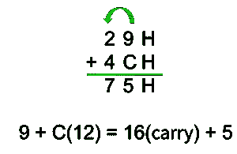

# 8086 微处理器中的辅助进位标志

> 原文:[https://www . geesforgeks . org/辅助-进位-标志-in-8086-微处理器/](https://www.geeksforgeeks.org/auxiliary-carry-flag-in-8086-microprocessor/)

**辅助进位标志(AF)** 是 8086 微处理器中的六个状态标志之一。

*   该标志用于 **BCD** (二进制编码十进制)操作。
*   对于算术逻辑单元执行的每一次算术或逻辑运算，都会更新该标志的状态。
*   如果在二进制表示中，较低半字节有**进位**或较低半字节有**借位**，则该标志设置为 1。
*   否则设置为零。

**注意:**当十六进制表示的单位有进位时，辅助进位标志设置为 1。与二进制表示中的下半字节相同。

**示例:**

在下图中，您可以看到从单位数字开始进位。因此，辅助进位标志在这里被设置为 1。这里的“H”代表一个十六进制数。

十六进制表示的辅助进位标志

让我们考虑二进制表示中的同一个例子。

29H = 0010 1001

<u>+4CH = 0100 1100</u>

75H = 0111 0101

^这里有进位生成并转发到下一个半字节，因此辅助进位标志设置为 1。