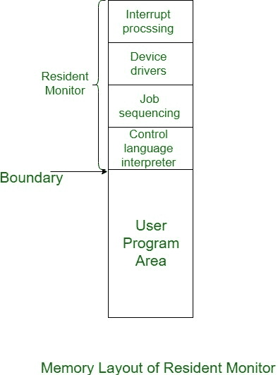

# 裸机和常驻监视器

> 原文:[https://www . geesforgeks . org/裸机驻留监视器/](https://www.geeksforgeeks.org/bare-machine-and-resident-monitor/)

在本文中，我们将讨论计算机系统的两个重要部分，即裸机和常驻监视器。因此，首先让我们研究一下它们对操作系统有多重要。

**裸机**和**常驻监视器**与操作系统没有直接关系，但是当我们研究内存管理的时候，这些组件确实很重要，所以让我们一个接一个地研究它们，然后研究它们的工作原理。

**裸机:**
所以基本上裸机就是不使用操作系统在处理器中执行程序的逻辑硬件。到目前为止，我们已经研究过，没有操作系统，我们无法执行任何进程。但是在裸机的帮助下，我们可以做到这一点。

最初，当没有开发操作系统时，指令的执行是通过直接在硬件上完成的，而不使用任何干扰硬件，当时唯一的缺点是裸机只接受机器语言的指令，因此那些对计算机领域有足够知识的人能够操作计算机。所以开发操作系统后裸机被称为低效。

**常驻监视器:**
在本节中，如果我们讨论代码如何在裸机上运行，那么使用这个组件，所以基本上，常驻监视器是一个在裸机上运行的代码。
常驻监视器的工作方式类似于操作系统，控制指令并执行所有必要的功能。它也像作业排序器一样工作，因为它也对作业进行排序，并将它们发送给处理器。

调度作业后，常驻监视器根据程序的顺序将程序一个接一个地加载到主存储器中。关于常驻监视器的一个最重要的因素是，当程序执行发生时，程序执行和处理速度之间没有间隙。

常驻监视器分为以下 4 个部分:

```
1. Control Language Interpreter
2. Loader
3. Device Driver
4. Interrupt Processing 
```



这些解释如下。

1.  **控制语言解释器:**
    常驻监视器的第一部分是控制语言解释器，用于读取和执行从一级到下一级的指令。
2.  **Loader:**
    常驻监视器的第二部分是常驻监视器的主要部分，是 Loader，它将所有必要的系统和应用程序加载到主内存中。
3.  **设备驱动程序:**
    常驻监视器的第三部分是设备驱动程序，用于管理连接到系统的输入输出设备。所以基本上它是用户和系统之间的接口。它作为请求和响应之间的接口。用户发出的请求，系统产生的设备驱动程序响应以满足这些请求。
4.  **中断处理:**
    第四部分顾名思义，它处理对系统发生的所有中断。