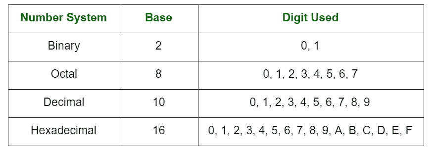

# 各种算术运算的基本规律

> 原文:[https://www . geesforgeks . org/各种算术运算的基本定律/](https://www.geeksforgeeks.org/basic-laws-for-various-arithmetic-operations/)

先决条件–[数字系统](https://www.geeksforgeeks.org/classification-of-number-system/)
数字是表示特定数量的算术值、计数或度量的一种方式。数字系统可以被认为是使用一组数字或符号的数字的数学表示法。简单地说，数字系统是一种表示数字的方法。每个数字系统都是借助于它的基数来识别的。

加法、减法、乘法和除法等算术运算是在各种基数上进行的。这些算术运算也可以使用 [r 的补码和(r-1)的补码](https://www.geeksforgeeks.org/complement-of-a-number-with-any-base-b/)表示。

**各种算术运算的基本定律:**
这些表示技术掌握各种算术运算的基本定律:

1.  **唯一存在定律:**
    任意两个数的和与积唯一存在。我们还应该注意，0 是加法的恒等式元素，1 是乘法的恒等式元素。
2.  **结合律:**
    二进制数的加法和乘法是结合律。
3.  **交换律:**
    二进制数的加法和乘法是可交换的。
4.  **分配律:**
    二进制数的乘法是两项或多项相加的分配。