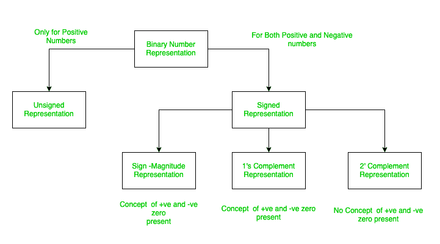
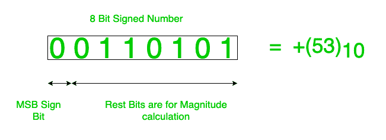
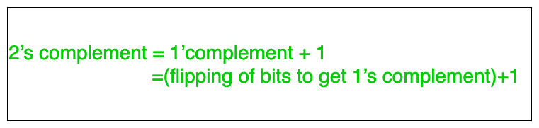
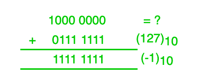

# 不同数据类型范围的带符号二进制数基础

> 原文:[https://www . geeksforgeeks . org/不同数据类型的带符号二进制数范围基础/](https://www.geeksforgeeks.org/basics-of-signed-binary-numbers-of-ranges-of-different-datatypes/)

有符号二进制数的核心概念和不同数据类型范围的解释。如果我问十进制的(1000 0000) 2 的值是多少，那么肯定会出现两个模棱两可的答案(-128) 10 和(+128) 10 。

答案确实模棱两可，因为两个答案都是正确的。
于是有符号和无符号数字的概念出现，帮助克服歧义。

如果给出的是无符号数，则(+128) 10 是正确答案，因为在无符号数的情况下没有符号位。因此，这里的最高有效位(MSB)不是保留来表示数字的符号。

但如果给出的是带符号的数字，(-128) 10 才是正确答案。
如果是带符号的数字，则保留 MSB 来表示数字的符号。
因此，如果数字是 n 位，那么在这个例子中，1 位用于表示数字的符号，其余(n-1)位用于表示数字的幅度。

表示[有符号数](https://www.geeksforgeeks.org/computer-arithmetic-set-1/)的方法:

*   **符号幅度表**
*   **1 的补码形式**
*   **2 的补码形式**

这些解释如下。

1.  **符号幅度形式:**
    这里，MSB 是为有符号位保留的，通过使用剩余(n-1)位，我们可以使用二进制到十进制转换的正常公式(通过乘以 2i，其中 I 表示从 LSB(最低有效位)开始的索引位置)直接获得十进制值。请注意，索引从 0 开始，而不是从 1 开始。
2.  **[1’s complement Form](https://www.geeksforgeeks.org/whats-difference-between-1s-complement-and-2s-complement/):**
    Here, the MSB is reserved for signed bit, and rest (n-1)bits are stored in form 1’s complement of the number.

    

    我想说的将从下面的例子中变得清楚:

    考虑用 1 的补码中的 4 位来表示-7。
    这里给出了 4 位，所以 MSB 保留 1 位来表示符号。所以，现在我们还剩 3 位。
    我们知道(+7) 10 =(111 2 。

    但是它是以 1 的补码形式存储数字的，因此，计算了(+7)的 1 的补码。
    1 的补码(+7) 10 =(000) 2 。(因为计算 1 的补码是为了将 0 翻转为 1，反之亦然)。

    因此，最终(-7) 10 =(1000) 2 的 1 的补码表示。(使用 4 位)。

3.  **[2’s complement Form](https://www.geeksforgeeks.org/efficient-method-2s-complement-binary-string/):**
    Here, the MSB is reserved for signed bit, and rest (n-1) bits are stored in form 2’s complement of the number.

    我想说的将从下面的例子中变得清楚:

    考虑上面解释的相同示例，即使用 4 位表示-7，但现在是 2 的补码。
    这里给出了 4 位，所以 MSB 保留 1 位来表示符号。所以，现在我们还剩 3 位。
    我们知道(+7) 10 =(111) 2 。

    但是它是以 2 的补码形式存储数字的，因此，计算了(+7)的 2 的补码。
    1 的补码(+7) 10 =(001)2。(因为计算 2 的补码是为了将 0 翻转为 1，反之亦然)，并在翻转位后将 1 添加到我们得到的结果中。

    换句话说，

    

    因此，最终(-7) 10 =(1001) 2 的 2 的补码表示。(使用 4 位)。

    但是等待是有歧义的，怎么会(-128)10=(1000 0000)2以 8 位 2 的形式签了号？

    但诀窍就在这里，让我们想一想，我们不知道(1000 0000) 2 代表什么，然后加上(+127) 10 ，加上之后得到的结果是(1111 1111)2=(-1)10。因此，(1000 0000) 2 的唯一可能值是(-128) 10 的 8 位 2 形式带符号数。

    这个概念在 2 的补码中是允许的，因为在 2 的补码中有(负 0)的概念。如果我们想通过取(1000 0000) 2 的 2 的补码来计算，那么在忽略 MSBs(符号位)之后，1 的补码数是(111 1111)，2 的补码数是(000 0000)。因此，大小为 0，符号为负。我们应该得到的十进制数是(-0)，但是正如我已经说过的，在 2 的补码中没有(负 0)的概念。

    因此，这证实了(-128)10=(1000 0000)2。

    

    编程语言中数据类型的范围可以用这个来解释。现在我们都知道 c++/java 中的短(数据类型)是 2 字节，即 16 位，我们说范围是(-32，768 到 32，767)。现在，请注意正数范围是直到-32，768，但是正数只有到 32，767，即负数范围大于正数范围(仅讨论两边的大小)，但是您可能会认为正数和负数范围应该相同，但在这里它们不相同。

    困惑为什么会这样？
    原因与我上面解释的概念相同，因此负范围比正范围(1000 0000 0000 0000 0000)2是(-32，768) 10 。这个概念可以扩展到所有的数据类型，也是我们在编程语言中使用的所有数据类型范围背后的原因。