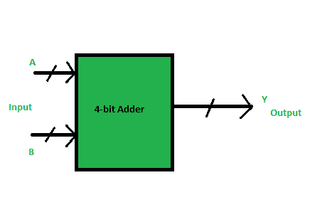
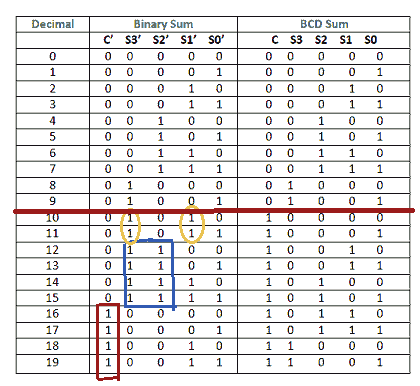
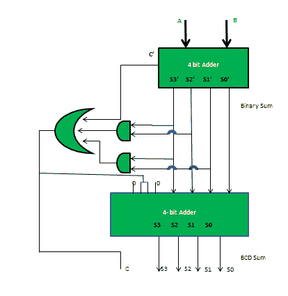

# 数字逻辑中的 BCD 加法器

> 原文:[https://www.geeksforgeeks.org/bcd-adder-in-digital-logic/](https://www.geeksforgeeks.org/bcd-adder-in-digital-logic/)

BCD 代表二进制编码的十进制。假设，我们有两个 4 位数字 A 和 B。A 和 B 的值可以从 0(二进制为 0000)到 9(二进制为 1001)不等，因为我们考虑的是十进制数。



如果不考虑前一次求和的进位，输出将从 0 到 18 不等。但是如果我们考虑进位，那么输出的最大值将是 19(即 9+9+1 = 19)。
当我们简单地把 A 和 B 相加，那么就得到二进制和。这里，为了得到 BCD 形式的输出，我们将使用 BCD 加法器。

**例 1:**

```
Input :
A = 0111  B = 1000 
Output :
Y = 1 0101

Explanation: We are adding A(=7) and B(=8). 
The value of binary sum will be 1111(=15). 
But, the BCD sum will be 1 0101, 
where 1 is 0001 in binary and 5 is 0101 in binary.

```

**例 2:**

```
Input :
A = 0101  B = 1001
Output :
Y = 1 0100

Explanation: We are adding A(=5) and B(=9). 
The value of binary sum will be 1110(=14). 
But, the BCD sum will be 1 0100, 
where 1 is 0001 in binary and 4 is 0100 in binary.

```

**注–**如果两个数之和小于或等于 9，则 BCD 和与二进制和的值相同，否则相差 6(二进制为 0110)。
现在，让我们移到表格中，找出我们要添加“0110”时的逻辑。



我们只在表格的后半部分添加了“0110”(= 6)。
**条件是:**

1.  如果 C' = 1(满足 16-19)
2.  如果 S3′. S2′= 1(满足 12-15)
3.  如果 S3′. S1′= 1(满足 10 和 11)

所以，我们的逻辑是

```
C' + S3'.S2' + S3'.S1' = 1

```

**实施:**



阅读相关文章: [BCD 至 7 段解码器](https://www.geeksforgeeks.org/digital-electronics-bcd-7-segment-decoder/)， [BCD(8421)至/自 overseas-3](https://www.geeksforgeeks.org/digital-logic-code-converters-bcd8421-tofrom-excess-3/)