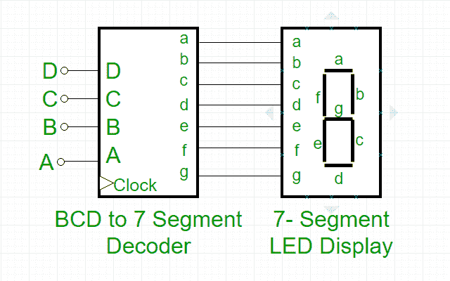
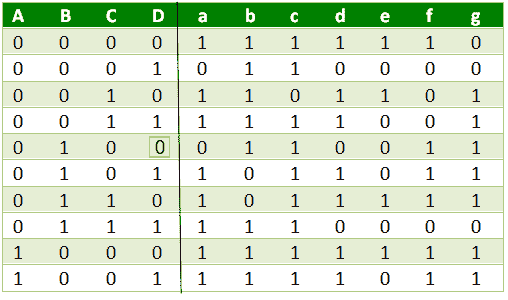
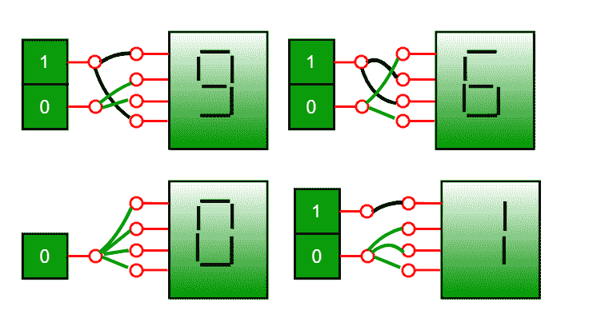
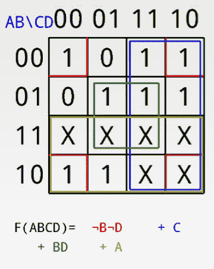
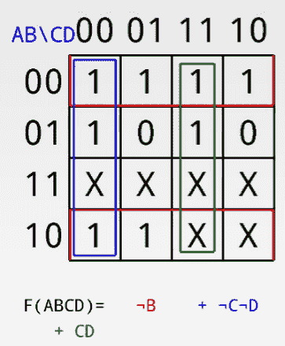
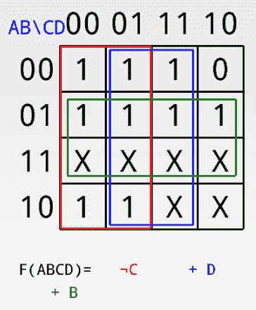
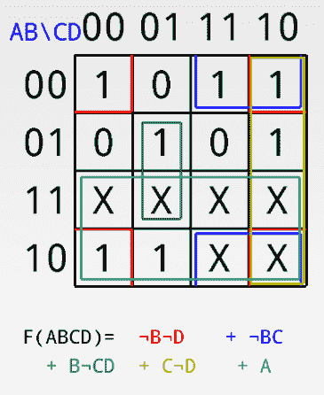
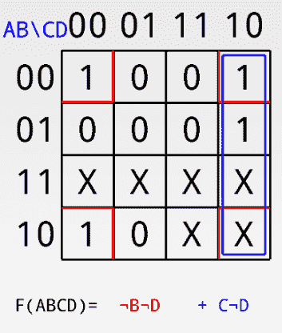
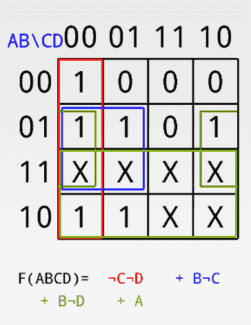
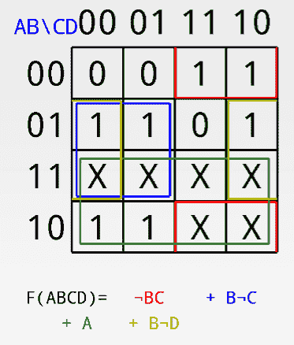

# BCD 至 7 段解码器

> 原文:[https://www.geeksforgeeks.org/bcd-to-7-segment-decoder/](https://www.geeksforgeeks.org/bcd-to-7-segment-decoder/)

先决条件–[数字系统和基数转换](https://www.geeksforgeeks.org/number-system-and-base-conversions/)、 [BCD(8421)](https://www.geeksforgeeks.org/digital-logic-code-converters-bcd8421-tofrom-excess-3/)

在**二进制编码十进制(BCD)** 编码方案中，每个十进制数(0-9)由其等价的二进制模式(通常为 4 位)表示。

鉴于，**七段**显示器是一种由七个发光二极管(LEDs)组成的电子设备，这些发光二极管以某种确定的模式(公共阴极或公共阳极类型)排列，用于显示十六进制数字(在这种情况下是十进制数字，作为输入是 BCD，即 0-9)。

两种类型的七段式发光二极管显示器:

1.  **公共阴极类型:**在这种类型的显示器中，七个发光二极管的所有阴极都连接到地或-Vcc(因此，公共阴极)，当一些“高”信号提供给各个阳极时，发光二极管显示数字。
2.  **普通阳极类型:**在这种类型的显示器中，七个发光二极管的所有阳极都连接到电池或+Vcc，当一些“低”信号提供给各个阴极时，发光二极管显示数字。

但是，七段显示器不能通过直接向不同的发光二极管段提供电压来工作。首先，我们的十进制数被改变为它的 BCD 等效信号，然后 BCD 到七段解码器将该信号转换为馈送到七段显示器的形式。

该 BCD 至七段解码器有四条输入线(A、B、C 和 D)和七条输出线(A、B、C、D、e、f 和 g)，该输出提供给七段发光二极管显示器，该显示器根据输入显示十进制数。

**真值表–**对于普通阴极型 BCD 至七段解码器:

**注–**

*   对于普通阳极型七段发光二极管显示器，我们只需在输出端互换所有的“0”和“1”，即(对于 a、b、c、d、e、f 和 g，用“0”替换所有的“1”，反之亦然)并使用 K-map 求解。
*   真值表中第一个输入组合(A、B、C 和 D)的输出对应于“0”，最后一个组合对应于“9”。类似地，rest 从上到下对应于 2 到 8。
*   BCD 编号仅在 0 到 9 之间，因此 10-F 的其余输入是无效输入。

**示例–**

**解释–**
对于所有输入(A、B、C 和 D)都为零的组合(见真值表)，我们的输出行是 a = 1、b = 1、c = 1、d = 1、e = 1、f = 1 和 g = 0。因此 7 段显示显示“零”作为输出。

类似地，对于其中一个输入为 1(D = 1)其余为 0 的组合，我们的输出行为 a = 0，b = 1，c = 1，d = 0，e = 0，f = 0 和 g = 0。因此，只有发光二极管“b”和“c”(见上图)会发光，7 段显示显示“1”作为输出。

**K-Maps:**
#为 a:

#代表 b:

#对于 c:

#为 d:

#代表 e:

#代表 f:

#对于 g:

**应用–**
七段显示用于显示计算器、时钟、各种测量仪器、数字手表和数字计数器中的数字。