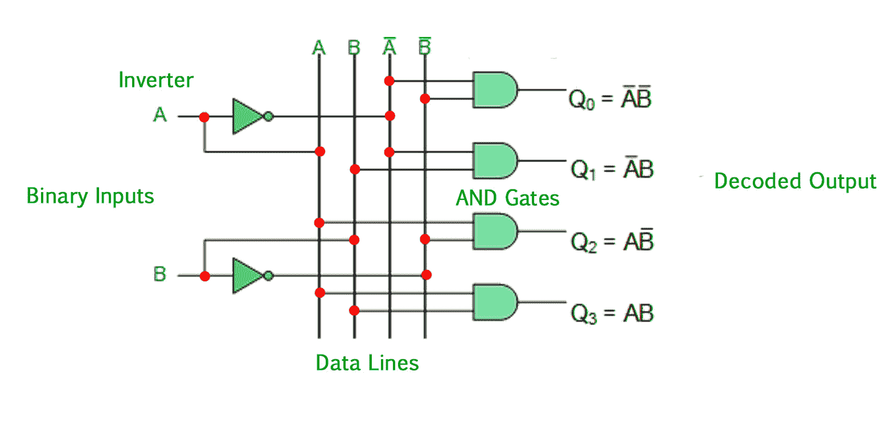
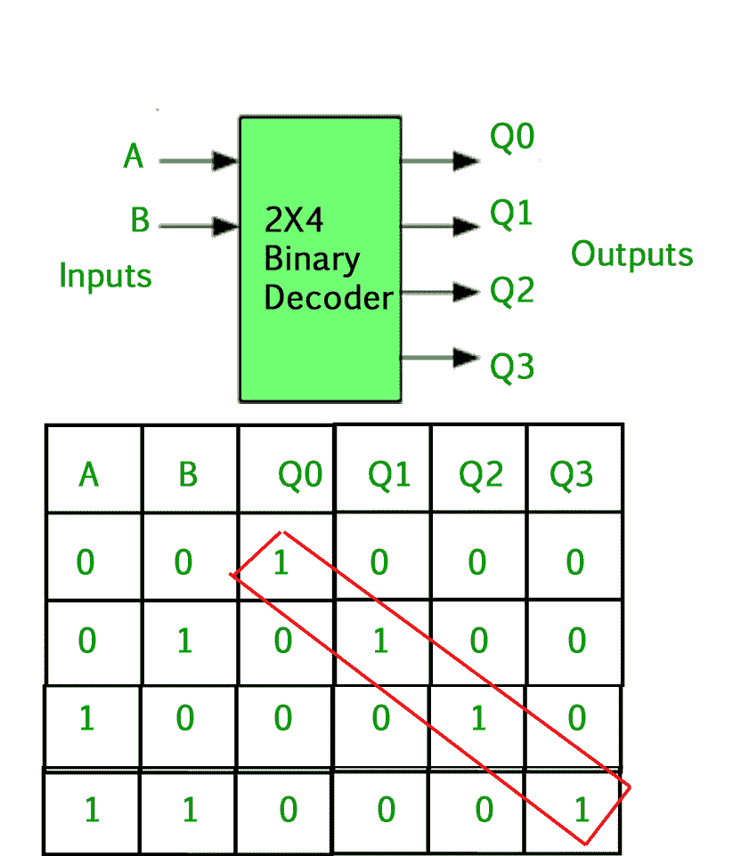

# 数字逻辑中的二进制解码器

> 原文:[https://www . geesforgeks . org/二进制数字逻辑解码器/](https://www.geeksforgeeks.org/binary-decoder-in-digital-logic/)

在数字电子技术中，离散的信息量用二进制代码表示。一个由 **n 位**组成的二进制码能够表示多达**个 2^n 不同元素**的编码信息。**“解码器”**的名称意味着将编码信息从一种格式转换或解码成另一种格式，因此数字解码器在其输出端将一组数字输入信号转换成等效的十进制代码。**解码器**是一个**组合电路**，它将来自 **n 条输入线**的二进制信息转换为最大数量的 **2^n 唯一输出线**。

### 二进制解码器–

*   二进制解码器是另一种类型的数字逻辑设备，根据数据输入线的数量，它具有 2 位、3 位或 4 位代码的输入，因此具有一组 2 位或更多位的解码器将被定义为具有 n 位代码，因此将有可能表示 2^n 可能值。
*   如果一个二进制解码器接收到 n 个输入，它将根据该输入激活其 2^n 输出中的一个，并且只激活一个，而所有其他输出都被去激活。如果 n 位编码信息具有未使用的组合，则解码器的输出可能少于 2^n 输出。
*   例如，反相器(非门)可以被分类为 1 对 2 二进制解码器，因为 1 输入和 2 输出是可能的。即输入 A 可以给出 A 或 A 的补码作为输出。
*   那么我们可以说，标准组合逻辑解码器是 n 对 m 解码器，其中 m <= 2^n，并且其输出 q 仅取决于其当前输入状态。
*   它们的目的是生成 n 个输入变量的 2^n(或更少)分位数。每种输入组合都将断言一个唯一的输出。

二进制解码器将编码输入转换为编码输出，其中输入和输出代码不同，解码器可用于将二进制或 BCD (8421 代码)输入模式“解码”为典型的十进制输出代码。
实用的“二进制解码器”电路包括 2 对 4、3 对 8 和 4 对 16 线路配置。

### 2 对 4 二进制解码器–

上面描述的 2 至 4 线二进制解码器由四个与门的阵列组成。标记为 A 和 B 的 2 个二进制输入被解码成 4 个输出中的一个，因此描述了 2-4 二进制解码器。每个输出代表两个输入变量中的一个最小项，(每个输出=一个最小项)。

输出值为:
Q0 = A ' b '
Q1 = A ' b
Q2 = AB '
Q3 = AB

二进制输入 A 和 B 决定了从 Q0 到 Q3 的哪条输出线在逻辑电平“1”时为“高”，而其余输出在逻辑电平“0”时保持“低”，因此在任何时候只能有一个输出有效(高)。因此，无论哪条输出线为“高”，都会识别输入端的二进制代码，换句话说，它会“解码”二进制输入。

一些二进制解码器有一个标记为“使能”的附加输入引脚，用于控制器件的输出。这个额外的输入允许解码器的输出根据需要被“打开”或“关闭”。仅当启用输入值为 1 时，才会生成输出；否则，所有输出为 0。只需要在实现中做一个小的改变:使能输入被馈送到产生输出的与门。

如果使能为 0，所有与门的一个输入为 0，因此不产生输出。当使能为 1 时，“与”门将其中一个输入设为 1，现在输出取决于其余输入。因此，解码器的输出取决于使能是高还是低。

**GATE CS 角题**

练习下列问题将帮助你测试你的知识。所有的问题在前几年的 GATE 考试或 GATE 模拟考试中都被问过。强烈建议你练习一下。

1.  [GATE CS 2007，问题 85](https://www.geeksforgeeks.org/gate-gate-cs-2007-question-8/)
2.  [GATE CS 20130，问题 65](https://www.geeksforgeeks.org/gate-gate-cs-2013-question-5/)

**参考文献–**

[电子集线器–二进制解码器](http://www.electronicshub.org/binary-decoder/)

本文由 [**阿鲁什·达米亚**](https://auth.geeksforgeeks.org/profile.php?user=Arushi Dhamija&list=practice) 供稿。如果你喜欢 GeeksforGeeks 并想投稿，你也可以使用[contribute.geeksforgeeks.org](http://www.contribute.geeksforgeeks.org)写一篇文章或者把你的文章邮寄到 contribute@geeksforgeeks.org。看到你的文章出现在极客博客主页上，帮助其他极客。

如果你发现任何不正确的地方，或者你想分享更多关于上面讨论的话题的信息，请写评论。