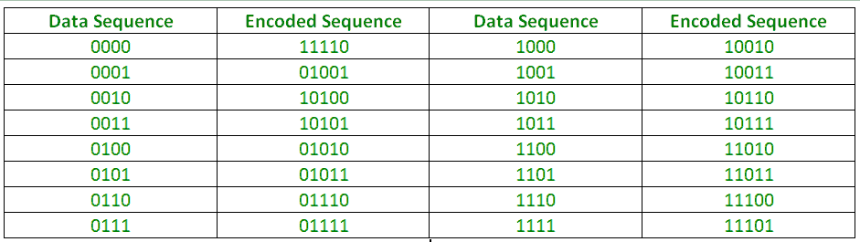
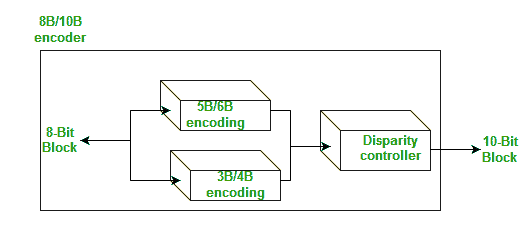

# 数字电子中的块编码

> 原文:[https://www . geesforgeks . org/block-coding-in-digital-electronics/](https://www.geeksforgeeks.org/block-coding-in-digital-electronics/)

数字数据到数字信号的转换涉及三种技术:

1.  [线路编码](https://www.geeksforgeeks.org/digital-electronics-difference-unipolar-polar-bipolar-line-coding-schemes/)
2.  分组编码
3.  登山

除了始终需要行编码之外，可能需要也可能不需要块编码和加扰。

**块编码**有助于信号的错误检测和重新传输。它通常被称为 mB/nB 编码，因为它用 n 位数据组(其中 n > m)替换每个 m 位数据组。因此，它增加了额外的比特(冗余比特)，这有助于接收端和发送端的同步，也提供了某种错误检测能力。

它通常包括三个步骤:分割、替换和组合。在分割步骤中，一个比特序列被分成 m 比特组。在替换步骤中，我们用一个 m 位组替换一个 n 位组。最后，n 比特组被组合在一起形成一个比原始比特多的流。

mB/nB 编码示例:

**4B/5B(四进制/五进制)–**
这种编码方案与 NRZ-I 结合使用。NRZ-I 的问题是它对于长的零序列存在同步问题。因此，为了克服它，我们在用 NRZ-I 编码之前，将比特流从 4 位替换为 5 位数据组**。这样它就不会有很长的零流。块编码流不超过三个连续的零(参见编码表)。**

在接收机处，NRZ-1 编码的数字信号首先被解码成比特流，然后被再次解码以去除冗余比特。

**缺点–**虽然 4B/5B 编码解决了同步问题，但是提高了 NRZ-L 的信号速率，而且没有解决 NRZ-L 的 DC 分量问题

**8B/10B(八进制/十进制)–**
这种编码类似于 4B/5B 编码，只是现在一组 8 位数据被一个 10 位代码代替，它提供了比 4B/5B 更强的错误检测能力。
其实是 5B/6B 和 3B/4B 编码的组合。10 位块的最高五个有效位被馈送到 5B/6B 编码器；最低 3 个有效位被馈送到 3B/4B 编码器。拆分是为了简化映射表。

一组 8 位可以具有 2^8 不同的组合，而一组 10 位可以具有 2^10 不同的组合。这意味着存在不用于 8B/10B 编码并且可用于错误检测和[差异](https://en.wikipedia.org/wiki/8b/10b_encoding#Running_disparity)检查的 2^10-2^8=768 冗余组。

因此，这种技术比 4B/5B 更好，因为它有更好的检错能力和更好的同步。

**参考文献-**
[数据通信与网络](https://www.amazon.in/COMMUNICATIONS-NETWORKING-UPDATE-Behrouz-Forouzan/dp/0070499357?tag=googinhydr18418-21&tag=googinkenshoo-21&ascsubtag=f648c41b-4e1c-497e-9a52-031912e87d54)作者:贝鲁兹·弗鲁赞(图书)