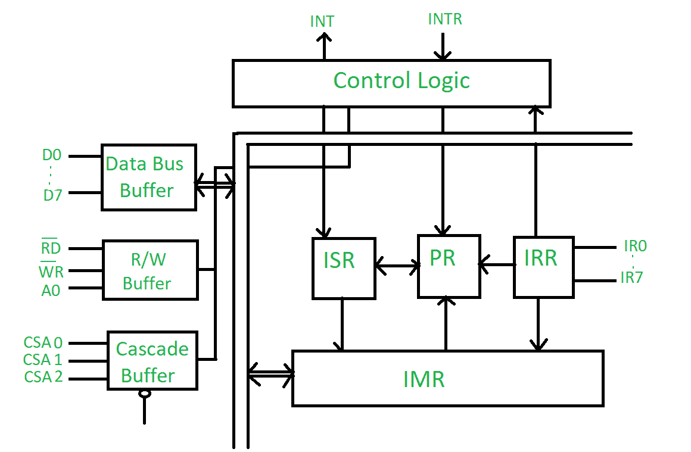
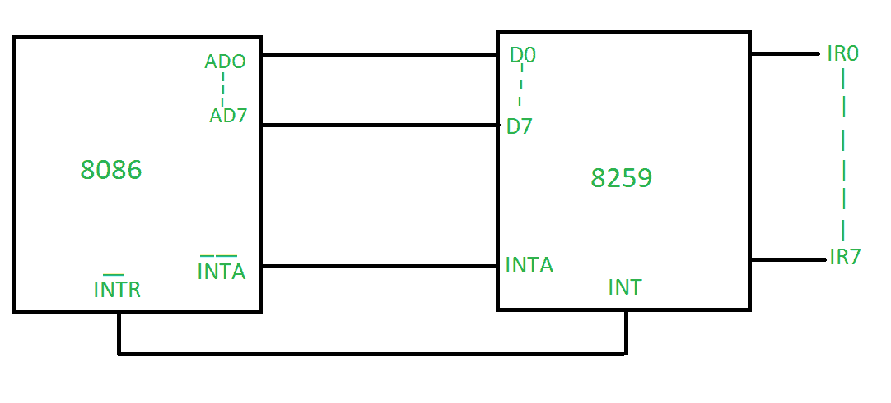

# 8259 微处理器框图

> 原文:[https://www . geesforgeks . org/8259-微处理器框图/](https://www.geeksforgeeks.org/block-diagram-of-8259-microprocessor/)

*   8259 微处理器可以根据给定的中断条件进行编程，并且可以提供电平或边沿触发中断电平。
*   它可以被编程为在 8085 或 8086 微处理器中工作。
*   单个中断位可以被屏蔽。
*   通过传导更多数量的 8259，我们可以得到多达 64 个中断引脚。

它包含 3 个寄存器，通常称为 ISR、IRR、IMR &有 1 个优先级解析器(PR)。

1.  **中断请求寄存器(IRR):** 它存储请求中断服务的那些位。
2.  **中断服务寄存器(ISR):** 它存储当前正在服务的中断级别。
3.  **中断屏蔽寄存器(IMR):** 它存储必须屏蔽的中断电平。8259 微处理器已经接受了这些中断级别。

**优先级解析器(PR):** 它检查所有 3 个寄存器，设置中断优先级，并在优先级最高的 ISR 中设置中断级别，剩余的中断位是已经接受的 IRR。

**SP/EN(低电平有效引脚):**如果其值为 1，则在主模式下工作&如果其值=e，则在从模式下工作。

**级联缓冲器:**用于级联更多数量的可编程中断控制器，将中断处理能力提高到 64 级。

