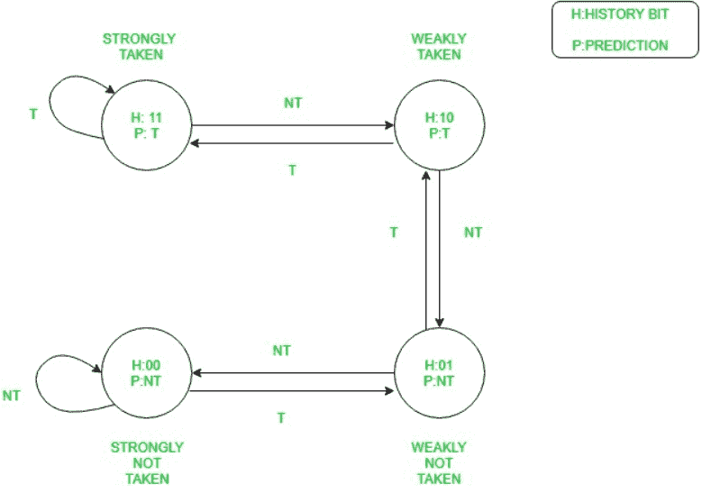

# 奔腾中的分支预测

> 原文:[https://www.geeksforgeeks.org/branch-prediction-in-pentium/](https://www.geeksforgeeks.org/branch-prediction-in-pentium/)

**为什么我们需要分支预测？**

1.  由[流水线](https://www.geeksforgeeks.org/computer-organization-and-architecture-pipelining-set-1-execution-stages-and-throughput/)产生的增益可以通过程序转移指令如 JMP、调用、RET 等的存在来降低
2.  它们改变了顺序，导致程序转移指令后进入流水线的所有指令无效
3.  因此，在重新加载管道阶段时，不需要做任何工作。

**分支预测逻辑:**
为了避免这个问题，奔腾采用了一种叫做动态分支预测的方案。在该方案中，对当前在流水线中的分支指令进行预测。预测要么被接受，要么不被接受。如果预测为真，则不会刷新流水线，也不会丢失时钟周期。如果预测为假，则流水线被刷新并从当前指令重新开始。

它是使用具有 256 个条目的 4 路集合关联缓存来实现的。这称为**分支目标缓冲区(BTB)** 。每行的目录条目包括:

*   **有效位:**表示条目是否有效。
*   **历史位:**跟踪取位频率。

源内存地址来自提取分支指令的位置。如果目录条目有效，则分支机构的目标地址存储在 BTB 的相应数据条目中。

**分支预测工作:**

1.  BTB 是一个后备高速缓存，位于 2 个流水线的解码指令(DI)级旁边，并监视分支指令。
2.  分支指令第一次进入流水线时，BTB 使用其源存储器在高速缓存中执行查找。
3.  既然这份说明书以前从未见过，那就是 BTB 小姐。它预测即使是无条件跳转指令也不会取分支。
4.  当指令到达 EU(执行单元)时，分支要么被接受，要么不被接受。如果采用，将从分支目标地址提取下一条要执行的指令。如果不采取，将有一个指令的顺序提取。
5.  当第一次采取分支时，执行单元向分支预测提供反馈。分支目标地址被发回，并记录在 BTB。
6.  创建包含源存储器地址的目录条目，并将历史位设置为强取。

下表解释了该图:

| 历史比特 | 结果描述 | 做出的预测 | 如果采取分支 | 如果没有采取分支 |
| --- | --- | --- | --- | --- |
| Eleven | 强烈反对 | 采取的分支 | 保持同样的状态 | 降级为弱服用 |
| Ten | 弱摄 | 采取的分支 | 升级为强摄 | 降级为弱未采取 |
| 01 | 弱不服用 | 未采取分支 | 升级为弱服 | 降级为强烈不接受 |
| 00 | 强烈反对 | 未采取分支 | 升级为弱未服 | 保持同样的状态 |

