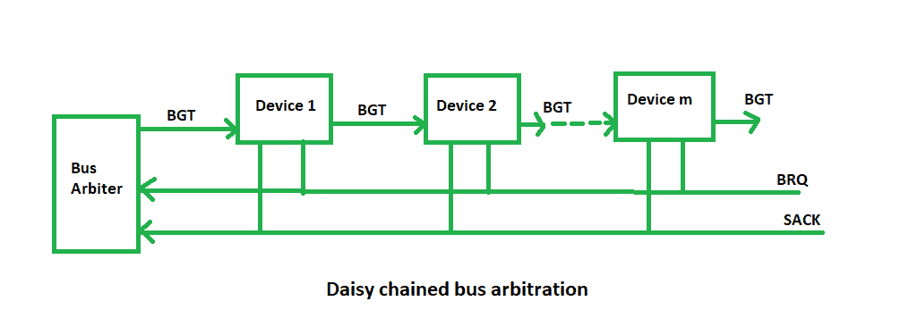
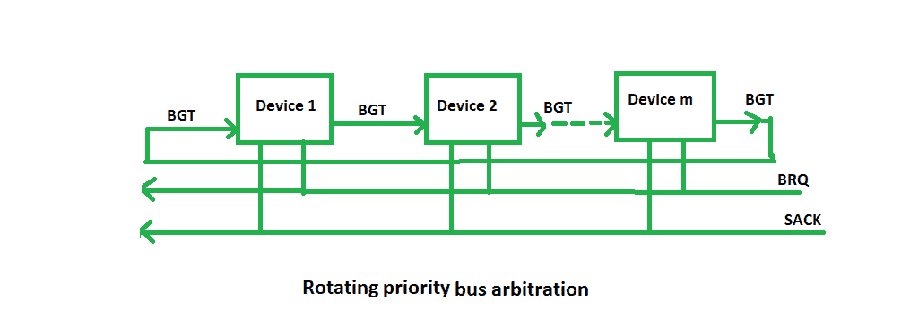
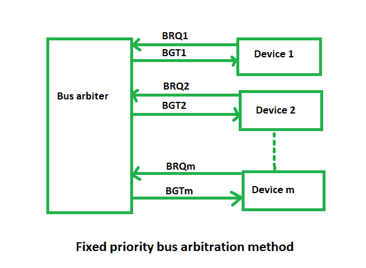

# 计算机组织中的总线仲裁

> 原文:[https://www . geesforgeks . org/bus-仲裁-计算机内组织/](https://www.geeksforgeeks.org/bus-arbitration-in-computer-organization/)

**总线仲裁**指的是当前总线主控访问然后离开总线控制并将其传递给另一个请求总线的处理器单元的过程。在某个实例中能够访问总线的控制器被称为**总线主控器**。

如果多个 DMA 控制器或其他控制器或处理器试图同时访问公共总线，但只能访问其中一个，则可能会产生冲突。同一时间点只能有一个处理器或控制器是总线主控器。为了解决这些冲突，执行总线仲裁程序来协调请求内存传输的所有设备的活动。总线主控器的选择必须考虑各种设备的需求，通过建立优先系统来获得对总线的访问。**总线仲裁器**决定谁将成为当前总线主控器。

总线仲裁有两种方法:

1.  **集中式总线仲裁–**
    单个总线仲裁器执行所需的仲裁。

2.  **分布式总线仲裁–**
    参与选择下一个总线主控器的所有设备。

**集中总线仲裁的方法–**
有三种总线仲裁方法:

**(i)菊花链方法–**
这是一种简单且便宜的方法，所有总线主控器使用同一条线路来发出总线请求。总线授权信号串行传播通过每个主机，直到遇到请求访问总线的第一个主机。该主机阻止总线授权信号的传播，因此任何其他请求模块都不会接收到授权信号，因此无法访问总线。
在任何总线周期中，总线主控器可以是连接到总线的任何设备——处理器或任何 DMA 控制器单元。

**优势–**

*   简单性和可扩展性。
*   用户可以在链上的任何位置添加更多设备，最高可达某个最大值。

**缺点–**

*   分配给设备的优先级值取决于主总线的位置。
*   这种方法会产生传播延迟。
*   如果一个设备出现故障，整个系统将停止工作。

**(ii)轮询或旋转优先级方法–**
在这种情况下，控制器用于为主机生成地址(唯一优先级)，所需的地址线数量取决于系统中连接的主机数量。控制器生成一系列主地址。当发出请求的主机识别出它的地址时，它激活占线并开始使用总线。

**优势–**

*   这种方法不支持任何特定的设备和处理器。
*   方法也相当简单。
*   如果一个设备出现故障，整个系统将不会停止工作。

**缺点–**

*   增加总线主控器是困难的，因为增加了电路的地址线的数量。

**(iii)固定优先级或独立请求方法–**
在这种情况下，每个主机都有一对单独的总线请求和总线授权线，每对都有一个分配给它的优先级。

控制器内的内置优先级解码器选择最高优先级请求，并断言相应的总线授权信号。

**优势–**

*   这种方法产生快速响应。

**缺点–**

*   硬件成本很高，因为需要大量的控制线。

**分布式总线仲裁:**
在这种情况下，所有设备都参与下一个总线主控器的选择。总线上的每个设备都分配有一个 4 位标识号。设备的优先级将由生成的标识决定。