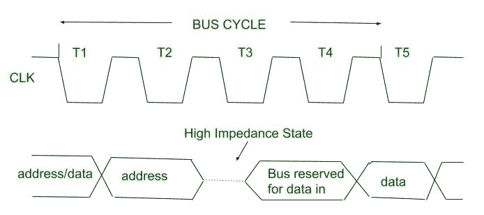
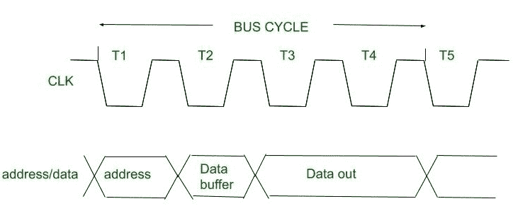

# 8086 微处理器的总线周期

> 原文:[https://www . geesforgeks . org/bus-cycles-of-8086-微处理器/](https://www.geeksforgeeks.org/bus-cycles-of-8086-microprocessor/)

总线周期也称为机器周期。 [8086](https://www.geeksforgeeks.org/architecture-of-8086/) 的总线周期用于访问存储器、外围设备(输入/输出设备)和中断控制器。总线周期对应于一系列事件，从系统地址总线上输出的地址开始，然后是写或读数据传输。在这些操作期间，微处理器还产生一系列控制信号来控制总线的方向和定时。

8086 微处理器的总线周期中至少有四个时钟周期。这四个时钟周期称为 T 1 、T 2 、T 3 和 T 4 状态。

在 5 MhZ 8086 系统中，这四种时钟状态的总线周期持续时间为 200 ns *4 = 800 ns。

1.  **读周期:**
    当要执行读周期时，在 T 1 期间，微处理器在地址总线上放置一个地址，然后在 T 2 状态期间，总线被置于高阻抗状态。在 T 3 和 T 4 期间，要读取的数据必须在总线上输出。在测试期间 3 总线被“保留用于数据输入”，最终在测试期间 4 读取数据。

*   **Write Cycle :**
    In case of write memory cycle, during T1 state microprocessor puts an address on address bus. Data is put on data bus by CPU during T2 state and maintained during T3 and T4 states, that is written out to memory or I/O devices.

    