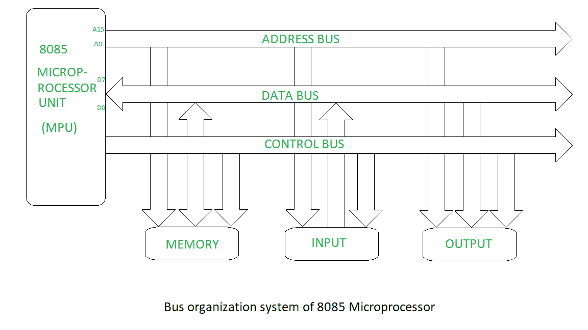

# 8085 微处理器的总线组织

> 原文:[https://www . geesforgeks . org/bus-organization-of-8085-微处理器/](https://www.geeksforgeeks.org/bus-organization-of-8085-microprocessor/)

总线是一组承载信息的导线，所有的外设都通过总线与微处理器相连。

8085 微处理器总线组织系统示意图。

公共汽车有三种类型。

1.  **Address bus –**
    It is a group of conducting wires which carries address only.Address bus is unidirectional because data flow in one direction, from microprocessor to memory or from microprocessor to Input/output devices (That is, Out of Microprocessor).

    8085 微处理器地址总线的长度为 16 位(即四个十六进制数字)，范围从 0000 H 到 FFFF H，(H 表示十六进制)。微处理器 8085 可以传输最多 16 位地址，这意味着它可以寻址 65，536 个不同的存储位置。

    地址总线的长度决定了系统可以寻址的内存量。例如具有 32 位地址总线的系统可以寻址 2^32 存储单元。如果每个内存位置保存一个字节，可寻址内存空间为 4 GB。但是，由于芯片组和主板的限制，实际可访问的内存量通常比理论限制少得多。

2.  **Data bus –**
    It is a group of conducting wires which carries Data only.Data bus is bidirectional because data flow in both directions, from microprocessor to memory or Input/Output devices and from memory or Input/Output devices to microprocessor.

    8085 微处理器的数据总线长度为 8 位(即两个十六进制数字)，范围从 00 H 到 FF H(H 表示十六进制)。

    当是写操作时，处理器将数据(待写)放在数据总线上，当是读操作时，存储控制器将从特定的存储块中获取数据并将其放入数据总线。

    数据总线的宽度与总线能够承载的最大数量直接相关，例如 8 位总线可以表示 8 个唯一值的 2 次方，这相当于数字 0 到 255。16 位总线可以承载 0 到 65535。

3.  **Control bus –**
    It is a group of conducting wires, which is used to generate timing and control signals to control all the associated peripherals, microprocessor uses control bus to process data, that is what to do with selected memory location. Some control signals are:
    *   读存储器
    *   存储写入
    *   输入输出读取
    *   输入输出写
    *   操作码提取

    如果一条控制总线可以是读/写线。如果导线低(无电流)，则读取存储器，如果导线高(有电流)，则写入存储器。