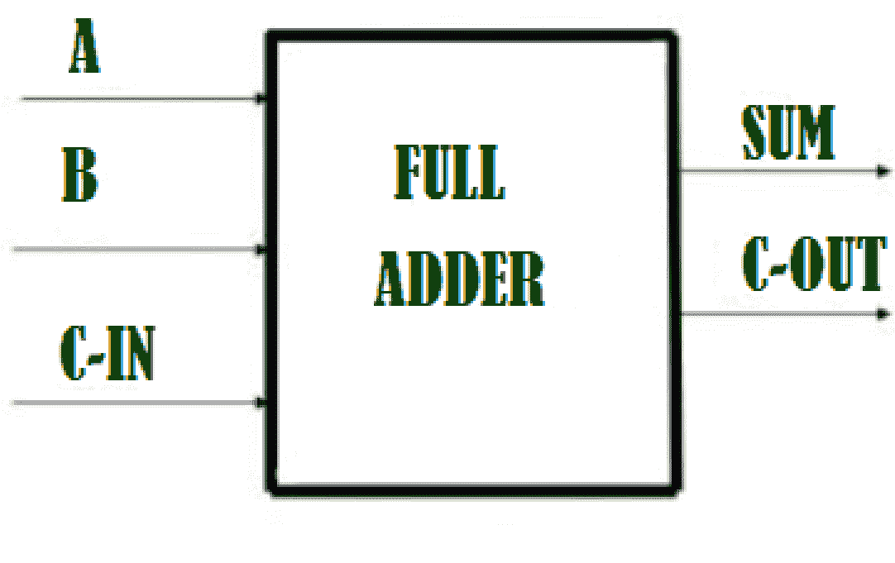
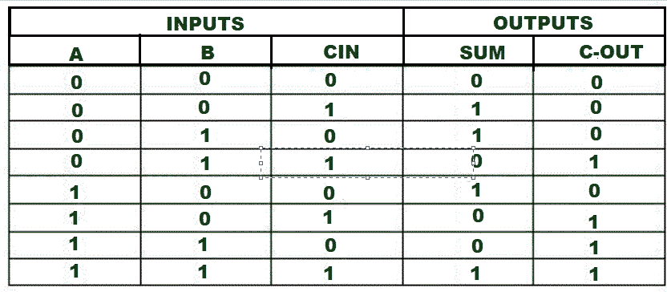

# C++程序实现全加器

> 原文:[https://www . geesforgeks . org/c-程序到实现-全加器/](https://www.geeksforgeeks.org/c-program-to-implement-full-adder/)

**先决条件:** [全加器](https://www.geeksforgeeks.org/full-adder-in-digital-logic/)
我们有全加器 A、B、C-IN 三个输入。任务是实现全加器电路和打印输出，即三个输入的和和。

**简介:**
A [全加器](https://www.geeksforgeeks.org/full-adder-in-digital-logic/)是对三个 1 位二进制数进行加法运算的组合电路。全加器有三个输入状态和两个输出状态。两个输出是求和和进位。



这里我们有三个输入 A，B，Cin 和两个输出 Sum，Cout。全加器的真值表是



**逻辑表达式:**

> SUM = C-IN 异或(A 异或 B )
> C-0UT= A B + B C-IN + A C-IN

**示例–**

1.  **输入:** A=1，B=0，C-In=0
    **输出:** Sum=1，C-Out=0
    **解释–**
    **这里从逻辑表达式 Sum= C-IN XOR (A XOR B)即 0 XOR (1 XOR 0) =1，C-Out= A B + B C-IN + A C-IN 即 1 AND 0 + 0 AND 0 + 1 AND 0 = 0。** 
2.  ****输入:** A=1，B=1，C-In=0
    **输出:**和=0，C-Out=1**

****进场:****

*   **初始化变量 Sum 和 C_Out 以存储输出。**
*   **首先，我们将获取三个输入 A、B 和 C_In。**
*   **通过 C-IN 异或(A XOR B)得到和的值。**
*   **通过应用 A B + B C-IN + A C-IN，我们得到了 C_Out 的值。**

## **C++**

```
// C++ program to implement full adder
#include <bits/stdc++.h>
using namespace std;
// Function to print sum and C-Out
void Full_Adder(int A,int B,int C_In){
    int Sum , C_Out;
    // Calculating value of sum
    Sum = C_In ^ (A ^ B);

    //Calculating value of C-Out
    C_Out = (A & B) || (B & C_In) || (A & C_In);

   // printing the values
    cout<<"Sum = "<<Sum<<endl;
    cout<<"C-Out = "<<C_Out<<endl;
  }

// Driver code

int main() {
    int A = 1;
    int B = 0;
    int C_In = 0;
    // passing three inputs of fulladder as arguments to get result function
    Full_Adder(A, B, C_In);
    return 0;
}
```

****Output**

```
Sum = 1
C-Out = 0
```**