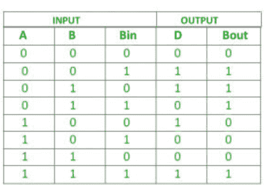

# C++程序实现全减法器

> 原文:[https://www . geesforgeks . org/c-程序到实现-全减法器/](https://www.geeksforgeeks.org/c-program-to-implement-full-subtractor/)

**先决条件:** [全减法器](https://www.geeksforgeeks.org/full-subtractor-in-digital-logic/)
给定全减法器 A、B、Bin 的三个输入。任务是实现全减法器电路并打印三个输入的输出状态差(D)和布特。

**简介:**
全减法器用于分别减去被减数、减数和借位三个 1 位数字。全减法器有三个输入状态和两个输出状态。两种输出是差和借。


这里我们有三个输入 A，B，Bin 和两个输出 D，Bout。全减法器的真值表是



**逻辑表达式:**

```
Difference = (A XOR B) XOR Bin
Borrow Out = Ā Bin + Ā B + B Bin
```

**示例–**

> 输入:0 0 1
> 输出:差=1，B-Out=1
> 说明:根据逻辑表达式差= (A XOR B) XOR Bin 即(0 XOR 0) XOR 1 =1，
> B- Out =āBin+āb+ B Bin 即 1AND 1 + 1 AND 0 + 0 AND 1 = 1。

> 输入:1 0 1
> 输出:差值=0，B-Out=0

**进场:**

*   我们将接受三个输入 A、B、Bin。
*   通过应用(异或)异或仓给出差值。
*   通过应用āBin+āb+ B Bin 给出了 B-Out 的值。

## C++

```
//c++ code for above approach
#include <bits/stdc++.h>
using namespace std;
//function to print difference and borrow out
void Full_Subtractor(int A,int B,int Bin){

   // Calculating value of Difference
    int Difference = (A ^ B) ^ Bin;

    //calculating NOT  value of a
    int A1 = not(A);

    //Calculating value of B-Out
    int B_Out = A1 & Bin | A1 & B | B & Bin;

    //printing the values
    cout<<"Difference = "<<Difference<<endl;
    cout<<"B-Out = "<<B_Out<<endl;

  }
//Driver code
int main() {
    int A = 1;
    int B = 0;
    int Bin = 1;
    // calling the function
    Full_Subtractor(A, B, Bin);
    return 0;
}
```

**Output**

```
Difference = 0
B-Out = 0

```