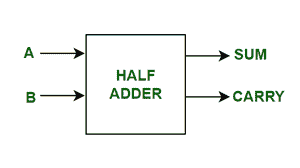
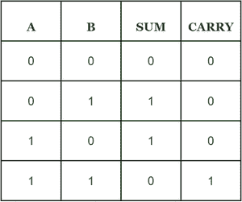

# 实现半加法器的 C++程序

> 原文:[https://www . geesforgeks . org/c-程序到实现-半加法器/](https://www.geeksforgeeks.org/c-program-to-implement-half-adder/)

先决条件:[数字逻辑中的半加法器](https://www.geeksforgeeks.org/half-adder-in-digital-logic/)

我们有两个输入 A 和 b，我们的任务是实现半加法器电路并输出两个输入的和与进位。

**简介:**

半加法器是一种组合电路，它将两个 1 位二进制数相加，这两个 1 位二进制数是加数和加数，并与进位一起给出输出值。半加法器有两个输入状态和两个输出状态。两个输出是求和和进位。



这里我们有两个输入 A，B 和两个输出求和，进位。半加法器的真值表是



**逻辑表达式:**

> 和=异或
> 
> 进位= A 和 B

**示例:**

输入:A=0，B= 0

输出:总和=0，进位=0

说明:这里从逻辑表达式 Sum = A XOR B 即 0 XOR 0 = 0，进位=A AND B 即 0 AND 0 = 0。

输入:A=1，B= 0

输出:总和=1，进位=0

说明:这里从逻辑表达式 Sum=A XOR B 即 1 XOR 0 =1，进位=A AND B 即 1 AND 0 = 0。

**进场:**

*   初始化变量 Sum 和 Carry 以存储输出。
*   首先，我们将接受两个输入 A 和 b。
*   通过应用异或我们得到和的值。
*   通过应用 A 和 B，我们得到进位的值。

## C++

```
// C++ program for above approach
#include <bits/stdc++.h>
using namespace std;
// Function to print Sum and Carry
void Half_Adder(int A,int B){
    //initialize the variables Sum and Carry
    int Sum , Carry;

    // Calculating value of sum by applying A XOR B
    Sum = A ^ B;

    // Calculating value of Carry by applying A AND B
    Carry = A & B;

    // printing the values
    cout<<"Sum = "<< Sum << endl;
    cout<<"Carry = "<<Carry<< endl;
}
//Driver code
int main() {
    int A = 1;
    int B = 0;
    // calling the function
    Half_Adder(A,B);
    return 0;
}
```

**Output**

```
Sum = 1
Carry = 0
```