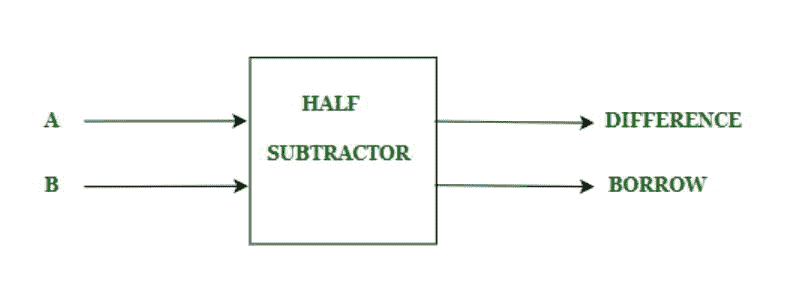
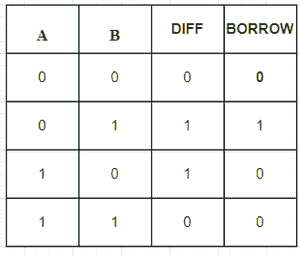

# C++程序实现半减法器

> 原文:[https://www . geesforgeks . org/c-程序到实现-半减法器/](https://www.geeksforgeeks.org/c-program-to-implement-half-subtractor/)

**前提:** [半减法器](https://www.geeksforgeeks.org/half-subtractor-in-digital-logic/)
给我们两个输入 A 和 b，我们的任务是实现半减法器电路，打印两个输入的输出差和借用。

**简介:**
半减法器用于减去被减数和减数两个 1 位数字。半减法器有两个输入状态和两个输出状态。两种输出是差和借。差异是输入之间的差异，当两个输入不同时设置，当减数大于被减数时设置借用。我们借用“1”并设置借用“1”。半减法器的框图是



这里我们有两个输入 A，B 和两个输出差，借。差值和借用值将取决于 A 和 B。半减法器的真值表为



差值由 A 和 B 的异或运算计算，借位由ā和 B 的与运算计算。这里ā是给出逆输出的 A 的非运算。

**逻辑表达式:**

```
Difference = A XOR B
Borrow =     Ā AND B
```

**示例–**

```
Input :          A=1, B= 0
Output:       Difference=1, Borrow=0
Explanation : Here from logical expression Difference = A XOR B 
              i.e  1 XOR 0 = 1, and Ā = NOT(A) i,e NOT(1) = 0.
              So, Borrow=Ā AND B  
              i.e 0 AND 0 = 0.
```

```
Input :       A=0, B= 1
Output:       Difference=1, Borrow=1
Explanation:  Here from  logical expression Difference=A XOR B 
              i.e. 0 XOR 1 =1 and Ā = NOT(A) i,e NOT(0) = 1.
              So, Borrow=Ā AND B 
              i.e 1 AND 1 =  1.
```

**进场:**

*   初始化变量“差”和“借”以存储输出。
*   首先，我们将接受两个输入
*   通过应用异或我们得到差值。
*   通过应用 NOT A，我们得到了ā的值。
*   通过应用“与”我们得到了“借”的值。

## C++

```
// C++ program to implement Half subtractor

#include <bits/stdc++.h>
using namespace std;

 // Function to print Difference and Borrow
void Half_Subtractor(int A,int B){
    // initializing Difference and Borrow
    int Difference,Borrow;
    // Calculating value of Difference
    Difference = A ^ B;

    // Calculating value of Borrow
    // Calculating not of A
    A = not(A);
    Borrow = A & B;

    // printing the values
    cout<<"Difference = "<<Difference<<endl;
    cout<<"Borrow = "<<Borrow<<endl;
}
int main() {
    int A = 1;
    int B = 0;
    // passing three inputs of half subtractor as arguments to Half_Subtractor function
    Half_Subtractor(A,B);
    return 0;
}
```

**输出:**

```
Difference = 1
Borrow = 0
```