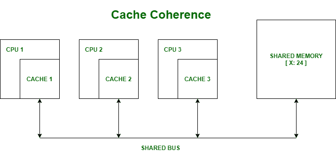

# 缓存一致性

> 原文:[https://www.geeksforgeeks.org/cache-coherence/](https://www.geeksforgeeks.org/cache-coherence/)

先决条件–[高速缓冲存储器](https://www.geeksforgeeks.org/cache-memory-in-computer-organization/)

**缓存一致性:**
在多处理器系统中，数据不一致可能发生在相邻级别之间或内存层次结构的同一级别内。

在一个共享内存多处理器中，每个处理器都有一个单独的高速缓冲存储器，任何一个指令操作数都可能有多个副本:一个副本在主存储器中，一个副本在每个高速缓冲存储器中。当操作数的一个副本改变时，操作数的其他副本也必须改变。

**示例:**
缓存和主内存可能有相同对象的不一致副本。

假设有三个处理器，每个处理器都有缓存。假设以下情况

*   **处理器 1 读取 X :** 从内存中获取 24 并缓存。
*   **处理器 2 读取 X :** 从内存中获取 24 并缓存。
*   **同样，处理器 1 写为 X :** 64，其本地缓存副本被更新。现在，处理器 3 读取 X，它应该得到什么值？
*   内存和处理器 2 认为是 24，处理器 1 认为是 64。

由于多个处理器并行运行，并且独立的多个高速缓存可能拥有同一存储块的不同副本，这就产生了高速缓存一致性问题。

缓存一致性是确保共享操作数的值的变化及时在整个系统中传播的规则。

缓存一致性有三个不同级别:-

1.  每个写操作似乎都是瞬间发生的。
2.  对于每个单独的操作数，所有处理器看到的值变化序列完全相同。
3.  不同的处理器可能会看到一个操作，并假设不同的值序列；这被称为非相干行为。

多处理器系统中有多种高速缓存一致性协议。这些是

1.  MSI 协议(已修改、共享、无效)
2.  MOSI 协议(修改、拥有、共享、无效)
3.  MESI 协议(已修改、独占、共享、无效)
4.  MOESI 协议(修改、拥有、独占、共享、无效)

这些重要术语讨论如下:

*   **Modified–**
    表示缓存中的值是脏的，即当前缓存中的值与主存不同。
*   **Exclusive–**
    表示缓存中存在的值与主内存中存在的值相同，即该值是干净的。
*   **共享–**
    这意味着缓存值保存最新的数据副本，这也是所有缓存和主内存共享的内容。
*   **Owned–**
    这意味着当前缓存保存该块，并且现在是该块的所有者，即拥有该特定块的所有权限。
*   **无效–**
    这表示当前缓存块本身无效，需要从其他缓存或主内存中提取。

有关上述协议的详细信息，请参考:- [缓存一致性协议](https://www.geeksforgeeks.org/cache-coherence-protocols-in-multiprocessor-system/)

**一致性机制:**
一致性有三种类型:

1.  **基于目录–**
    在基于目录的系统中，被共享的数据被放置在一个公共目录中，以保持缓存之间的一致性。该目录充当过滤器，处理器必须通过该过滤器请求允许将条目从主存储器加载到其高速缓存中。当一个条目被更改时，目录要么更新，要么使具有该条目的其他缓存无效。
2.  **探听–**
    探听最早于 1983 年推出，是一种进程，其中各个高速缓存监视地址线，以获取对它们已经高速缓存的存储位置的访问。它被称为写无效协议。当观察到对高速缓存具有副本的位置的写操作，并且高速缓存控制器使其自己的窥探存储器位置的副本无效时。
3.  **Snarfing–**
    这是一种机制，当第二个主设备修改主存储器中的一个位置时，高速缓存控制器监视地址和数据，试图更新其自己的存储器位置副本。当观察到对高速缓存具有高速缓存控制器副本的位置的写操作时，用新数据更新其自己的被捕获的存储器位置的副本。