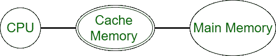
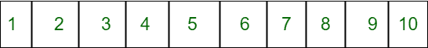
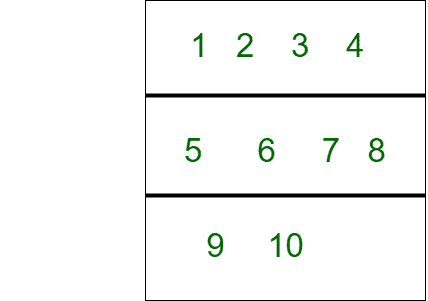

# 内存组织中的缓存命中数

> 原文:[https://www . geesforgeks . org/cache-hits-in-memory-organization/](https://www.geeksforgeeks.org/cache-hits-in-memory-organization/)

用户有记忆机器。它有一层用于数据存储，另一层用于[缓存](https://www.geeksforgeeks.org/cache-memory-in-computer-organization/)。用户在第一层存储了一个长度为 N 的数组。

当中央处理器需要数据时，它会立即在缓存中检查它是否有数据。如果存在数据，它会导致**缓存命中**，否则**缓存未命中**，即数据不在缓存中，因此它会从[主内存](https://www.geeksforgeeks.org/levels-of-memory-in-operating-system/)中检索数据，并将数据块插入缓存层。



出现的问题是:机器需要多少次将一个块加载到缓存层，即确定缓存未命中的次数？

**例–**
我们假设一个数组，用 A0、A1、…、an 来表示它的元素？
现在用户想将这个数组的一些元素加载到缓存中。



机器以大小为 B 的块加载数组:
假设块大小为 4。
1 2 3 4 进入**1 区**，5 6 7 8 进入**2 区**，9，10 进入**3 区。**



A0，A1，…，AB？1 形成一个区块；AB，AB+1，…，A2B？1 形成另一个区块，以此类推。最后一个块可能包含少于用户数组的 B 个元素。
缓存一次最多只能包含一个块。每当用户试图访问一个元素 Ai 时，机器会检查 Ai 所在的块是否已经在缓存中，如果不是，则将该块加载到缓存层，以便它可以快速访问其中的任何数据。
但是，一旦用户试图访问缓存中当前加载的块之外的元素，先前加载到缓存中的块就会从缓存中删除，因为机器会加载包含正在访问的元素的新块。

**示例–**
用户有一个他想要访问的元素 Ax1、Ax2、…、AxM 的序列，顺序如下。最初，缓存为空。我们需要找出机器将一个块加载到缓存层需要多少次。

**输入格式:**

*   每个测试用例的第一行包含三个用空格分隔的整数 N、B 和 m。
*   第二行包含 M 个用空格分隔的整数 x1，x2，…，xM。

**输入:**

```
5 3 3
0 3 4
```

**输出:**

```
2
```

**说明:**
机器将元素[A0，A1，A2]存储在一个块中，将元素[A3，A4]存储在另一个块中。访问 A0 时，加载块[A0，A1，A2]。然后，访问 A3 从高速缓存中移除先前的块，并加载块[A3，A4]。最后，当用户访问 A4 时，不会加载新的块，因为包含 A4 的块当前已加载到缓存中。

**进场:**

*   最初缓存未命中是因为缓存层为空，我们找到下一个乘数和起始元素。
*   获取用户值并找到下一个可被块大小整除的乘数。
*   查找当前块的起始元素。
*   如果用户值大于下一个乘数，小于起始元素，则发生缓存未命中。

**实施:**

## C++

```
// C++ program to implement Cache Miss
#include <iostream>
using namespace std;

// Function to find the next multiplier
int findnextmultiplier(int i, int b)
{
    for (int j = i; j <= i * b; j++) {
        if (j % b == 0)
            return j;
    }
}

// Function to find the cache miss
int ans(int n, int b, int m, int user[])
{
   // Initially cache miss occurs
   int start, cacheMiss = 1, nextmultiplier;

    // Find next multiplier for ith user and start
    nextmultiplier= findnextmultiplier(user[0] + 1, b);
    start = nextmultiplier - b + 1;

    for (int i = 1; i < m; i++) {
        // If ith user is greater than nextmultiplier or lesser 
        // than start then cache miss occurs
        if (user[i] + 1 > nextmultiplier || user[i] + 1 < start) {
            cacheMiss++;
            nextmultiplier= findnextmultiplier(user[i] + 1, b);
            start = nextmultiplier - b + 1;
        }
    }

    // Printing cache miss
    cout << cacheMiss << endl;
 return 0;
}

// Driver code
int main()
{
    int n=5, b=3, m=3;
    int user[3] = {0, 3, 4};
    ans(n, b, m, user);
   return 0;
}
```

## Java 语言(一种计算机语言，尤用于创建网站)

```
// Java program to implement Cache Hits
public class Main
{
    // Function to find the next multiplier
    public static int findnextmultiplier(int i, int b)
    {
        for (int j = i; j <= i * b; j++)
        {
            if (j % b == 0)
                return j;
        }

        return 0;
    }

    // Function to find the cache hits
    public static int ans(int n, int b, int m, int user[])
    {

       // Initially cache hit occurs
       int start, ch = 1, nextmultiplier;

        // Find next multiplier for ith user and start
        nextmultiplier= findnextmultiplier(user[0] + 1, b);
        start = nextmultiplier - b + 1;

        for (int i = 1; i < m; i++)
        {

            // If ith user is greater than nextmultiplier or lesser  
            // than start then cache hit occurs
            if (user[i] + 1 > nextmultiplier || user[i] + 1 < start)
            {
                ch++;
                nextmultiplier= findnextmultiplier(user[i] + 1, b);
                start = nextmultiplier - b + 1;
            }
        }

        // Printing cache hits
        System.out.println(ch);
     return 0;
    }

    public static void main(String[] args)
    {
        int n=5, b=3, m=3;
        int user[] = {0, 3, 4};
        ans(n, b, m, user);
    }
}

// This code is contributed by divyeshrabadiya07
```

## 蟒蛇 3

```
# Python3 program to implement Cache Hits

# Function to find the next multiplier
def findnextmultiplier(i, b):

    for j in range(i, (i * b) + 1):
        if (j % b == 0):
            return j

# Function to find the cache hits
def ans(n, b, m, user):

    # Initially cache hit occurs
    ch = 1

    # Find next multiplier for ith user and start
    nextmultiplier = findnextmultiplier(user[0] + 1, b)
    start = nextmultiplier - b + 1

    for i in range(1, m):

        # If ith user is greater than nextmultiplier
        # or lesser than start then cache hit occurs
        if (user[i] + 1 > nextmultiplier or
            user[i] + 1 < start):
            ch += 1
            nextmultiplier = findnextmultiplier(
                user[i] + 1, b)
            start = nextmultiplier - b + 1

    # Printing cache hits
    print(ch)

# Driver code
n = 5
b = 3
m = 3

user = [ 0, 3, 4 ]
ans(n, b, m, user)

# This code is contributed by rag2127
```

## C#

```
// C# program to implement Cache Hits
using System;

class GFG{

// Function to find the next multiplier
static int findnextmultiplier(int i, int b)
{
    for(int j = i; j <= i * b; j++)
    {
        if (j % b == 0)
            return j;
    }
    return 0;
}

// Function to find the cache hits
static int ans(int n, int b, int m, int[] user)
{

    // Initially cache hit occurs
    int start, ch = 1, nextmultiplier;

    // Find next multiplier for ith user and start
    nextmultiplier = findnextmultiplier(
                   user[0] + 1, b);
    start = nextmultiplier - b + 1;

    for(int i = 1; i < m; i++)
    {

        // If ith user is greater than nextmultiplier
        // or lesser than start then cache hit occurs
        if (user[i] + 1 > nextmultiplier ||
            user[i] + 1 < start)
        {
            ch++;
            nextmultiplier = findnextmultiplier(
                           user[i] + 1, b);
            start = nextmultiplier - b + 1;
        }
    }

    // Printing cache hits
    Console.WriteLine(ch);
    return 0;
}

// Driver Code 
static void Main()
{
    int n = 5, b = 3, m = 3;
    int[] user = { 0, 3, 4 };

    ans(n, b, m, user);
}
}

// This code is contributed by divyesh072019
```

## java 描述语言

```
<script>

    // Javascript program to implement
    // Cache Hits

    // Function to find the next multiplier
    function findnextmultiplier(i, b)
    {
        for(let j = i; j <= i * b; j++)
        {
            if (j % b == 0)
                return j;
        }
        return 0;
    }

    // Function to find the cache hits
    function ans(n, b, m, user)
    {

        // Initially cache hit occurs
        let start, ch = 1, nextmultiplier;

        // Find next multiplier for ith user and start
        nextmultiplier =
        findnextmultiplier(user[0] + 1, b);
        start = nextmultiplier - b + 1;

        for(let i = 1; i < m; i++)
        {

            // If ith user is greater than nextmultiplier
            // or lesser than start then cache hit occurs
            if (user[i] + 1 > nextmultiplier
                || user[i] + 1 < start)
            {
                ch++;
                nextmultiplier =
                findnextmultiplier(user[i] + 1, b);
                start = nextmultiplier - b + 1;
            }
        }

        // Printing cache hits
        document.write(ch + "</br>");
        return 0;
    }

    let n = 5, b = 3, m = 3;
    let user = [ 0, 3, 4 ];

    ans(n, b, m, user);

</script>
```

**输出:**

```
2
```

**时间复杂度:**O(m)
T3】辅助空间: O(1)