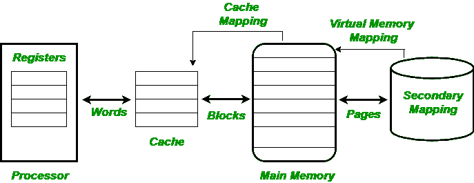

# 缓存性能

> 原文:[https://www.geeksforgeeks.org/cache-memory-performance/](https://www.geeksforgeeks.org/cache-memory-performance/)

**缓存类型:**

*   **一级缓存:**内置于 CPU 本身的缓存称为 L1 或一级缓存。这种类型的高速缓存保存最近的数据，因此当再次需要数据时，微处理器首先检查该高速缓存，因此它不需要经过主存储器或二级高速缓存。上述概念背后的主要意义是**“引用位置”**，根据这个概念，中央处理器刚刚访问的位置再次被需要的概率更高。
*   **L2 缓存:**这种类型的缓存位于 CPU 旁边的独立芯片上，也称为二级缓存。该缓存存储在 L1 缓存中找不到的最近使用的数据。一些中央处理器内置了 L1 和 L2 高速缓存，并将独立的高速缓存芯片指定为三级(l 3)高速缓存。

内置在中央处理器中的缓存比单独的缓存更快。独立缓存比内存快。内置高速缓存的运行速度与微处理器相当。

*   **磁盘缓存:**它包含最近从硬盘读入的数据，这个缓存比 RAM 慢很多。
*   **指令缓存 Vs 数据缓存:**指令或 I 缓存仅存储指令，而数据或 D 缓存仅存储数据。通过这种方法区分存储的数据，可以识别指令和数据的不同访问行为模式。例如:程序需要涉及很少的写访问，并且它们通常比它们处理的数据显示更多的时间和空间局部性。
*   **统一缓存 Vs 拆分缓存:**同时存储指令和数据的缓存称为统一缓存。另一方面，拆分缓存由两个相关但基本独立的单元组成——一个输入缓存和一个输出缓存。这种类型的高速缓存也可以设计成不同地处理两个独立的单元。

高速缓冲存储器的性能用一个称为**的量来衡量。当中央处理器引用内存并显示缓存中的单词时，就说明命中已经成功发生。如果在缓存中没有发现该单词，则中央处理器将该单词的主内存作为首选单词，并将其称为要缓存的**未命中。****

*   ******命中率(h) :******

> *******命中率(h) =命中数 CPU 对内存的引用总数=命中数/(命中数+未命中数)*******

****命中率只不过是从中央处理器的一些内存引用中获得命中的概率。所以它的范围是 **0 < = h < = 1** 。****

*   ******平均访问时间(t 平均值 ) :******

> *******tavg= h X tc+(1-h)X(tc+tm)= tc+(1-h)X tm**T15】*****

****让 ***t c 、h**T5】和 ***t m*** 分别表示缓存访问时间、缓存命中率和主访问时间。*****

****平均内存访问时间=命中时间+未命中率×未命中惩罚****

******未命中率:**可以定义为不在缓存中(即(1-h))的访问分数。****

******未命中惩罚:**可以定义为服务未命中的额外时钟周期，即在高速缓存未命中的情况下，从主存储器将青睐的信息传送到高速缓存所需的额外时间。****

****

***缓存结构******* 

******缓存未命中的类型:******

*   ******强制未命中** **(冷启动未命中或首次引用未命中):**这种类型的未命中发生在第一次访问数据块时。在这种类型的未命中中，块必须被带入高速缓存。****
*   ******容量未命中:**当程序工作集远大于缓存存储容量时，就会发生这种类型的未命中。块需要被丢弃，因为在程序执行期间不可能保留所有的块。****
*   ******冲突未命中(冲突未命中或干扰未命中):**这种未命中主要出现在集合关联或直接映射的块放置策略的情况下，当几个块被映射到同一集合或块帧时，就会发生冲突未命中。****
*   ******一致性缺失(无效):**当其他外部处理器(如 I/O)更新内存时发生。****

******CPU 性能:**
CPU 时间分为用于执行包/程序的时钟周期和用于等待内存系统的时钟周期。缓存命中是常规 CPU 周期的一部分。****

> *******CPU 时间= ( CPU 执行时钟周期+内存停滞时钟周期)X 时钟周期时间*******

******1。内存停滞时钟周期(用于回写缓存):******

*   ****内存停滞时钟周期=读取停滞周期+写入停滞周期****
*   ****读写周期=(读/程序)X 读失败率 X 读失败率****
*   ****写暂停周期=(写/程序)X 写未命中率 X 写未命中惩罚+写缓冲区暂停****

******2。内存停滞时钟周期(对于直写缓存):******

*   ****假设写缓冲区停顿可以忽略不计。每一次访问(读/写)都是相似的。****
*   ****内存停滞时钟周期=(内存访问/程序)X 未命中率 X 未命中惩罚****
*   ****内存停滞时钟周期=(指令/程序)X(未命中/指令)X 未命中惩罚****

******测量和提高缓存性能:******

******1。用于最小化平均内存访问时间的技术:******

*   ****减少命中时间、失误惩罚或失误率。****
*   ****降低失误惩罚 X 失误率。****

******2。减少命中时间的技巧:******

*   ****小型简单缓存。****
*   ****跟踪缓存和流水线缓存访问****
*   ****避免地址翻译中的时间损失。****

******3。减少失误惩罚的技巧:******

*   ****多级缓存的使用。****
*   ****优先考虑读未命中而不是写。****
*   ****受害者缓存****

******4。降低漏检率的技术:******

*   ****增加块大小****
*   ****更高的关联性。****
*   ****编译器优化****
*   ****大型缓存。****

******5。降低(失误率×失误惩罚)的技术:******

*   ****非阻塞高速缓存****
*   ****硬件预取****
*   ****编译器控制的预取****