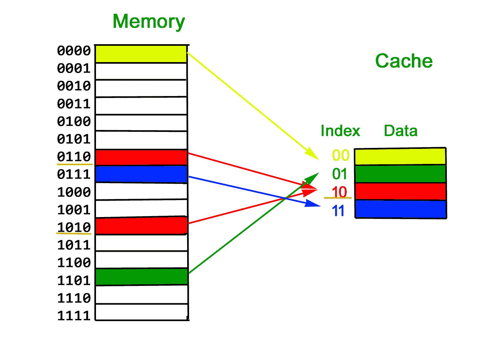
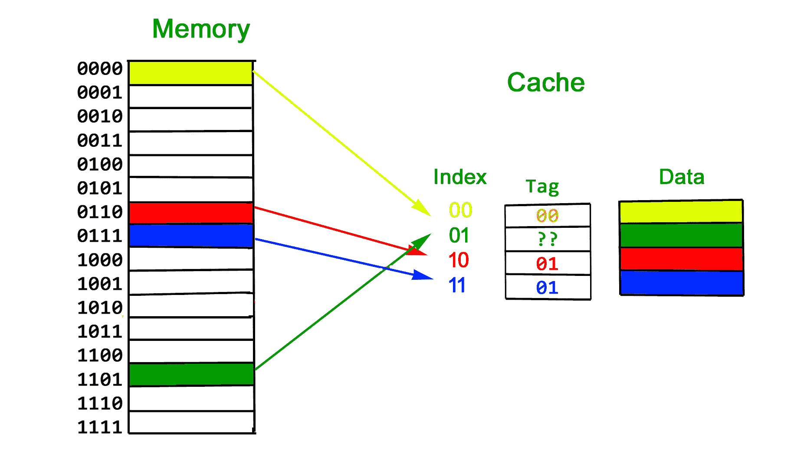
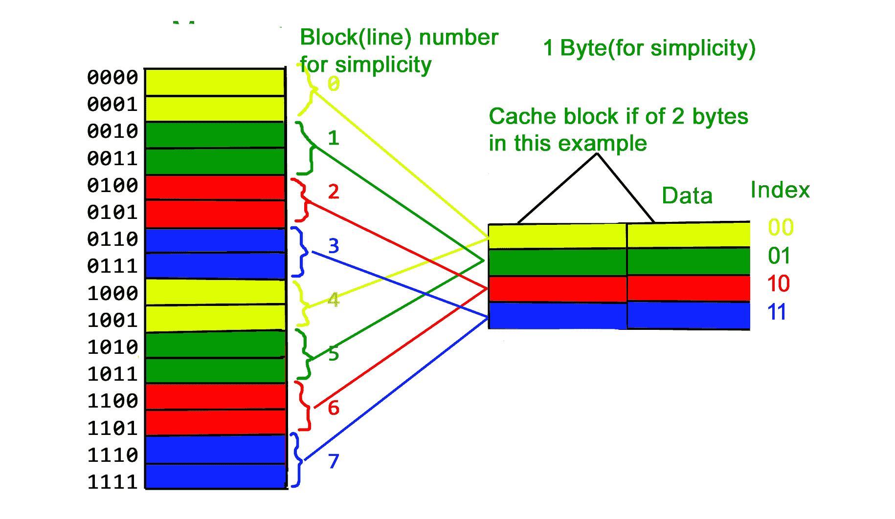
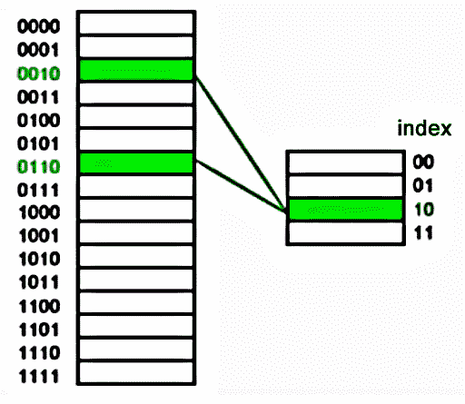
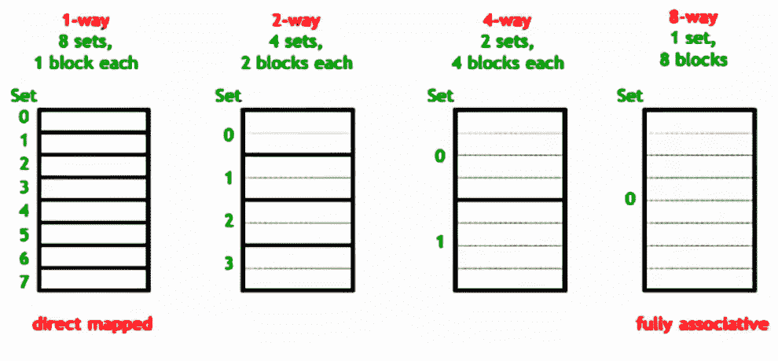

# 缓存组织|集合 1(简介)

> 原文:[https://www . geesforgeks . org/cache-organization-set-1-introduction/](https://www.geeksforgeeks.org/cache-organization-set-1-introduction/)

缓存接近 CPU，比主存快。但同时比主存小。缓存组织是将内存中的数据映射到缓存中的某个位置。

**一个简单的解决方案:**
进行这种映射的一种方法是考虑长内存地址的最后几个位来查找小缓存地址，并将它们放在找到的地址上。

**简单解法的问题:**
这种方法的问题在于，我们丢失了高阶比特的信息，没有办法找出低阶比特属于哪个高阶比特。

**解决方法是 Tag:**
为了处理上述问题，更多的信息存储在缓存中，以告知缓存中存储了哪个内存块。我们将附加信息存储为**标签**

**什么是缓存块？**
由于程序具有空间局部性(一旦检索到位置，很有可能在不久的将来检索到附近的位置)。所以缓存是以块的形式组织的。典型的缓存块大小为 32 字节或 64 字节。

**上述安排是直接映射高速缓存，它有以下问题**
我们已经在上面讨论过，存储器地址的最后几个位被用于在高速缓存中寻址，剩余的位被存储为标签。现在假设缓存非常小，地址为 2 位。假设我们使用主内存地址的最后两位来决定缓存(如下图所示)。因此，如果一个程序访问 2，6，2，6，2，…，每次访问都会导致命中，因为 2 和 6 必须存储在缓存中的相同位置。

**上述问题的解决方案–关联性**
如果我们可以将数据存储在缓存中的任何位置，上述问题就不会出现了，会怎么样？这会降低缓存的速度，所以我们在两者之间做一些事情。

**来源:**T2[https://www.youtube.com/watch?v=sg4CmZ-p8rU](https://www.youtube.com/watch?v=sg4CmZ-p8rU)T5】

我们将很快讨论缓存组织的更多细节。

本文由安库尔·古普塔供稿。如果您发现任何不正确的地方，或者您想分享关于上面讨论的主题的更多信息，请写评论