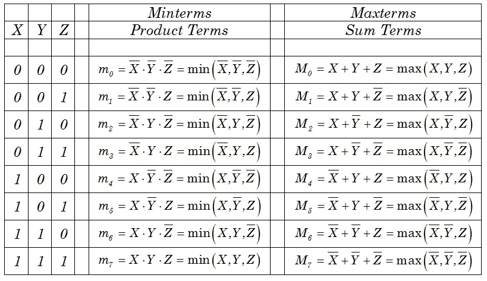

# 规范和标准形式

> 原文:[https://www.geeksforgeeks.org/canonical-and-standard-form/](https://www.geeksforgeeks.org/canonical-and-standard-form/)

**范式–**在布尔代数中，布尔函数可以表示为称为**小项**的规范析取范式，有些表示为称为**最大项**的规范合取范式。
在 Minterm 中，我们寻找输出结果为“1”的函数，而在 Maxterm 中，我们寻找输出结果为“0”的函数。
我们执行**最小项之和**也称为乘积之和(SOP)。
我们执行**最大项积**也称为和积(POS)。
表示为最小项之和或最大项之积的布尔函数称为规范形式。

**标准形式–**布尔变量可以用真形式或补形式表示。在标准形式中，布尔函数将包含真实形式或补充形式的所有变量，而在规范形式中，变量的数量取决于标准操作程序或位置的输出。

布尔函数可以从给定的真值表通过形成一个:

*   在函数中产生 1 的每个变量组合的最小项，然后取所有这些项的或。
*   在函数中产生 0 的变量的每个组合的 maxterm，然后取所有这些项的 and。

**代表最小项和最大项的真值表–**

从上表可以清楚地看出，minterm 是用产品格式表示的，maxterm 是用 sum 格式表示的。

**最小项的和–**
最小项的和定义了布尔函数，它们给出真值表中函数的 1。因为对于每个最小项，函数可以是 1 或 0，并且因为有 2^n 最小项，所以人们可以计算出由 n 个变量 be (2^(2^n)).用最小项形式的和来表示布尔函数有时很方便。

*   **示例–**将布尔函数 F = A+B’c 表示为最小项的标准和。
*   **解–**
    A = A(b+ B ')= AB+AB '
    这个函数还是少了一个变量，所以
    A = AB(C+C ')+AB '(C+C ')= ABC+ABC '+AB'C+AB ' C '
    第二项 B ' C 少了一个变量；因此，
    B'C = B'C(A + A') = AB'C + A'B'C
    结合所有的术语，我们有
    F = A+B ' c = ABC+ABC '+AB'C+AB ' c '+AB ' c+A ' B ' c
    但是 AB ' c 出现了两次，
    根据定理 1 (x + x = x)，有可能去掉其中一次出现。将最小项按升序重新排列，最终得到
    F = A ' b ' c+AB ' c '+AB ' c+ABC '+ABC
    = m1+M4+M5+M6+M7
    SOP 表示为适马(1，4，5，6，7)
    *   **示例–**将布尔函数 F = xy + x'z 表示为最大项的乘积
    *   【f = xy+x’z
        =(xy+x】(xy+z)
        =(x+x】(y+z)【y+z)
        =(x '+y)=(x+z)(y+z)
        【x '+y '+x '+y '+ZZ‘‘T7 y+z
        = y+z+xx
        =(x '+y+z)
        f =(x+y+z)(x '+y '+z)(x '+y+z)
        = m0 * m2 * M4 * M5
        pos 表示为 Pi(0，2，4，5)
        *   **Example –** 

            F(A，B，C) =适马(1，4，5，6，7)
            F’(A，B，C) =适马(0，2，3) = m0 + m2 + m3
            现在，如果我们用 DeMorgan 定理取 F’的补码，我们得到不同形式的 F:
            F =(m0+m2+m3)'
            = m0 ' m2 ' m3 '
            = M0 * M2 * M3
            = PI(0，2，3)

    *   **示例–**将标准形式的布尔表达式转换为 F=y'+xz'+xyz
    *   **解–**F =(x+x ')y '(z+z ')+x(y+y ')z '+XYZ
        F = xy ' z+xy ' z '+x ' y ' z+x ' y ' z '+XYZ '+xy ' z '+XYZ