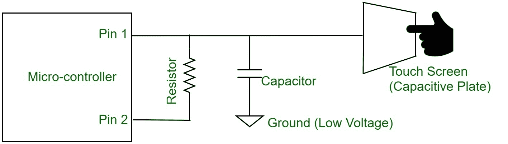

# 电容触控技术

> 原文:[https://www.geeksforgeeks.org/capacitive-touch-technology/](https://www.geeksforgeeks.org/capacitive-touch-technology/)

我们都熟悉**触摸屏**。简单易用的输入界面，供用户根据使用底层编程呈现给他们的选项输入他们的选择。但是这些触摸输入是如何工作的呢？在这篇文章中，我们将看看电容式触摸技术，这是一种触摸输入类型，主要用于当今的触摸显示设备，主要是智能手机和平板电脑。

首次引入触摸输入技术是为了将输出显示与输入触摸屏捆绑在一起，以获得更轻松的图形用户体验。除了电容式触摸技术，还有各种其他技术，它们使用各种其他电子原理从触摸屏获取用户输入。在电容式触摸屏中，顾名思义，电容的原理被用来确定人类触摸的存在。

一个简单的**电容器**当被提供特定的电压时，需要时间充电到其全部容量，随后当电压源被移除并且电容器被连接到接收器时需要时间放电。注意到充电和放电的持续时间，并且在电路没有变化的情况下保持相当恒定。这个充放电时间随着电路电容的变化而变化。这是电容式触摸屏背后的主要工作原理。

当人的*手指触碰到*电路中的电容时，它就充当了另一个加到电路中的电容。*人体充当电介质*。这增加了电路的总电容，并干扰了电路的充电和放电时间。因此，电路上充放电时间的差异将表示用户触摸的存在。

**Figure –** Capacitive Touch Sensing Circuit

其中涉及的硬件大部分时间是一个专用微控制器，它为电容屏幕充电，并寻找电路充放电时间的差异，当该值偏离正常值时，它会向主控制器发送一个关于用户输入的信号。清晰透明的触摸屏显示器是玻璃绝缘层和**氧化铟锡(ITO)** 导电层的结果。这就形成了一个电容器，当人的手指接触到这个电容器时，人体就充当了电介质，改变了电路的总电容。

**像这样的电容传感**可以用于测量物体属性，而无需实际与物体相互作用，因为任何电介质的紧密存在都充当电路的电容。因此，当研究中的对象不能被接触时，这个原理被利用。

因此，**电容触摸**屏幕基本上就是一个**充放电电容电路**寻找充放电次数的变化。