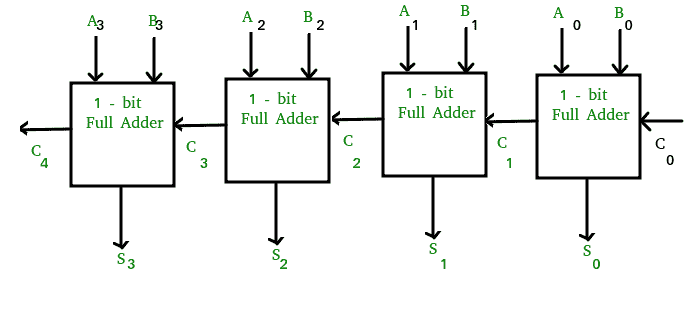
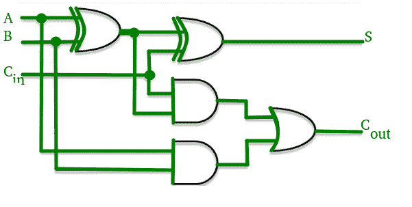
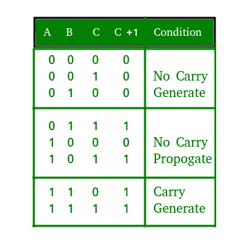

# 进位前瞻加法器

> 原文:[https://www.geeksforgeeks.org/carry-look-ahead-adder/](https://www.geeksforgeeks.org/carry-look-ahead-adder/)

**超前进位加法器背后的动机:**
在波纹进位加法器中，对于每个加法器块，要相加的两位立即可用。然而，每个加法器块等待进位从它的前一个块到达。因此，在输入进位已知之前，不可能产生任何块的和与进位。区块等待区块产生进位。因此会有相当大的时间延迟，即载波传播延迟。

考虑上述 4 位纹波进位加法器。一旦输入信号加到相应的全加器上，该和就由全加器产生。但是进位输入在其最终稳态值上不可用，直到进位在其稳态值上可用。同样取决于取决于。因此，尽管进位必须传播到所有级，以便输出和进位确定它们的最终稳态值。

传播时间等于每个加法器块的传播延迟乘以电路中加法器块的数量。例如，如果每个全加器级具有 20 纳秒的传播延迟，那么将在 60 (20 × 3)纳秒后达到其最终正确值。如果我们扩展级数以增加位数，情况会变得更糟。

**超前进位加法器:**
超前进位加法器通过引入更复杂的硬件来减少传播延迟。在该设计中，波纹进位设计被适当地变换，使得加法器的固定比特组上的进位逻辑被简化为两级逻辑。让我们详细讨论一下设计。

考虑上面所示的全加器电路和相应的真值表。我们将两个变量定义为**【进位生成】** 和**【进位传播】** 然后，

求和输出和进位输出可以用进位生成和进位传播来表示，如下所示

其中在、均为 1 时产生进位，与输入进位无关。与进位从到的传播有关。

4 级超前进位加法器中每一级的进位输出布尔函数可以表示为

从上面的布尔方程我们可以观察到不需要等待和传播，实际上是与和同时传播的。由于每个进位输出的布尔表达式都是乘积之和，因此可以用一级与门后跟一个或门来实现。

下图显示了超前进位发生器的每个进位输出(、和)的三个布尔函数的实现。

**时间复杂度分析:**
我们可以把超前进位加法器想象成由两个“部分”
组成

1.  计算每个位的进位的部分。
2.  将输入位和每个位位置的进位相加的部分。

复杂性来自产生进位的部分，而不是增加位的电路。
现在，为了生成进位位，我们需要在(n+1)个输入之间执行“与”运算。加法器的复杂性归结于我们如何执行这个“与”运算。如果我们有与门，每个与门的扇入(接受的输入数)为 k，那么我们可以在时间内找到所有位的与门。这用渐近符号表示为。

**超前进位加法器的优缺点:**
**优点–**

*   传播延迟减少。
*   它提供了最快的加法逻辑。

**劣势–**

*   随着变量数量的增加，超前进位加法器电路变得复杂。
*   该电路成本更高，因为它涉及更多的硬件。

**GATE CS 角题**

练习下列问题将帮助你测试你的知识。所有的问题在前几年的 GATE 考试或 GATE 模拟考试中都被问过。强烈建议你练习一下。

1.  [GATE CS 2016(第 1 集)，第 43 题](https://www.geeksforgeeks.org/gate-gate-cs-2016-set-1-question-43/)
2.  [GATE CS 2004，第 90 题](https://www.geeksforgeeks.org/gate-gate-cs-2004-question-62/)
3.  [GATE CS 2007，问题 85](https://www.geeksforgeeks.org/gate-gate-cs-2007-question-35/)
4.  [GATE CS 2006，问题 85](https://www.geeksforgeeks.org/gate-gate-cs-2006-question-36/)
5.  [GATE CS 1997，问题 15](https://www.geeksforgeeks.org/gate-gate-cs-1997-question-15/)

**参考资料–**
[虚拟实验室](http://cse10-iitkgp.virtual-labs.ac.in/cla_design.html)
[超前进位加法器–维基百科](https://en.wikipedia.org/wiki/Carry-lookahead_adder)