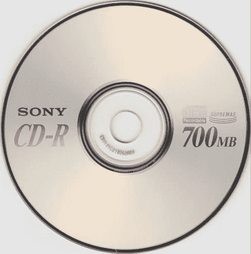

# CD-R 完整格式

> 原文:[https://www.geeksforgeeks.org/cd-r-full-form/](https://www.geeksforgeeks.org/cd-r-full-form/)

先决条件–[光盘(CD)](https://www.geeksforgeeks.org/introduction-of-compact-disk-cd-optical-memory/)
**CD-R** 代表**光盘–可刻录**。它是 1988 年推出的数字光盘存储格式。CD-R 是一种只能写一次的光盘。可以多次阅读。它由一个反射金属圆盘制成，顶部有一层绿色或不透明的 bye。这是一张空白光盘，其中的数据可以存储一次，存储数据后，会转换成光盘。
大多数普通光盘阅读器都能读取 CD-R 光盘。它也可以被在 CD-R 引入之前制造的 CD 阅读器读取

**历史:**
CD-R 最初被称为 CD-WO(光盘–一次写入)。它最早是由飞利浦和索尼在 1988 年开发的。CD-R 的规格在同年的《橙书》上发表。后来在 1990 年，它完全上市了。

**写入 CD-R :**

*   单个轨道以螺旋模式从光盘中心向侧面延伸。
*   高功率激光照射到 CD-R 上，改变了上面染料的透明度。透明代表 1，不透明代表 0。
*   光盘继续旋转，激光跟随轨道。它将二进制数据以螺旋轨道的形式放在 CD-R 上。
*   数据终于写好了。

**从 CD-R 读取:**

*   单个轨道以螺旋模式从光盘中心向外延伸。
*   在磁盘的表面上，一个低功率的激光被照射，反射光被光电二极管传感器捕获。不透明染料与透明染料的反射不同，这意味着它可以区分 1 和 0。
*   光盘继续旋转，激光跟随轨道。
*   二进制数据放在一起，CD-R 已被读取。

**优势:**

*   成本更低。
*   它可以被任何光盘播放器读取。

**缺点:**

*   CD-R 中的寻道时间很慢。
*   数据会随着时间而退化。
*   数据不能在光盘上重写