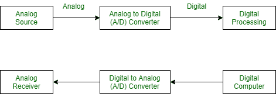

# 数字系统的特点和优势

> 原文:[https://www . geeksforgeeks . org/数字系统的特点和好处/](https://www.geeksforgeeks.org/characteristics-and-benefits-of-digital-system/)

[数字系统](https://www.geeksforgeeks.org/introduction-to-digital-systems/)的重要特点如下:

*   数据在数字系统中表示为二进制变量的向量。
*   数字系统可以提供仅受用于表示变量的位数限制的精度(动态范围)
*   数字系统比模拟系统更不容易出错。
*   数字系统中的数据表示适用于错误检测和纠正。
*   数字系统是使用可重复使用的模块以分层方式设计的。

**数字相对于模拟系统的优势:**
我们使用数字表示法而不是模拟系统的原因有几个:

*   它既经济又易于设计。
*   它非常适合数字和非数字信息处理。
*   它具有很高的抗噪声能力。
*   随着
    微电子技术的出现，类似的电路很容易复制，复杂的数字集成电路也很容易制造。
*   精度可调，易于计算机控制。

数字系统中有限数量的值可以用只有两个值的信号向量来表示，即二进制:3 是 0011，9 是 1001。因此，处理信号的设备非常简单，即开/关。

然而，数字系统也有如下缺点或不足。

**数字系统的缺点:**

*   它的速度很低。
*   因为物理世界是模拟的，所以需要转换器，例如模数转换器和数模转换器。

由于数字电路处理模拟信号、电流或电压，因此它允许忽略模拟信号，并允许使用一些离散值。数字信号通信有两种类型:同步和异步。同步是指输出在特定时间(或时钟)改变其值，例如 5、6、7、…等。而异步是指输出可以在任何时刻改变，例如 5、8、15 …等。

数字计算器、数字计算机和数字手表是数字系统的好例子。