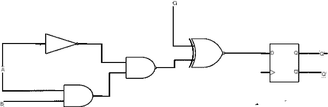
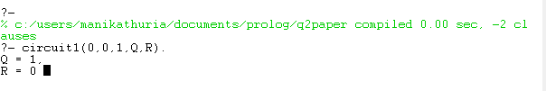

# 使用序言的电路(组合和顺序)实现

> 原文:[https://www . geesforgeks . org/circuit-组合和顺序实现-使用-prolog/](https://www.geeksforgeeks.org/circuit-combinational-and-sequential-implementation-using-prolog/)

先决条件–[序言|简介](https://www.geeksforgeeks.org/prolog-an-introduction/)

**概述:**
数字电路或[数字电子学](https://www.geeksforgeeks.org/digital-electronics-logic-design-tutorials/)是电子学的一个分支，它处理数字信号以执行各种任务来满足各种要求。施加到这些电路的输入信号是数字形式的，以 0 和 1 的二进制语言格式表示。这些电路是用执行逻辑运算的逻辑门设计的，如与门、或门、非门、或非门、异或门。这种表示有助于电路从一种状态切换到另一种状态，以提供精确的输出。数字电路系统的设计主要是为了克服模拟系统速度较慢以及所获得的输出数据可能包含误差的缺点。数字电路有两种:组合电路和时序电路。

**使用 Prolog 的实现:**
Prolog 是一种逻辑和声明性的编程语言。名字本身，Prolog，是逻辑编程的缩写。

**例:**
问题来了，我们如何在一个序言代码中描绘一个电路。考虑下面的电路图。



电路图中有 3 个输入，A、B 和 c。我们将在下面的代码行中考虑并将上面的电路图作为序言代码传递如下。

```
circuit1(A,B,C,Q,R):-
    not(A,T1),
    and(A,B,T2),
    nand(T1,T2,T3),
    xnor(T3,C,T4),
    dff(T4,Q,R).
```

**描述:**
这里 Q 和 R 是输出变量。T1- T4 是中间门的实例值或输出。已经使用的逻辑门有:-非门、与门、与非门和或非门。有一个 D 触发器和两个输出 Q 和 Q’。我们将把真值表看作事实，把电路图看作序言中的规则，如下面的代码中所写。

**注意–**
在下面的代码中，真值表是为 g-prolog 编写的。在 swi-prolog 中，真值表是预先定义的。

**代码实现:**
在这里，我们将实现逻辑，并用 prolog 编写代码。

**步骤-1 :**
这里，我们将为 2 个输入 A 和 b 实现所有逻辑门的真值表

```
% Made by - Maninder kaur 
% Following are the truth tables of all logic gates for 2 inputs A and B.

and(0,0,0).
and(0,1,0).
and(1,0,0).
and(1,1,1).

or(0,0,0).
or(0,1,1).
or(1,0,1).
or(1,1,1).

not(0,1).
not(1,0).

nand(0,0,1).
nand(0,1,1).
nand(1,0,1).
nand(1,1,0).

nor(0,0,1).
nor(0,1,0).
nor(1,0,0).
nor(1,1,0).

xor(0,0,0).
xor(0,1,1).
xor(1,0,1).
xor(1,1,0).

xnor(0,0,1).
xnor(0,1,0).
xnor(1,0,0).
xnor(1,1,1).
```

**步骤-2 :**
这里，我们将针对 4 个输入 A、B、C 和 d 实现 OR GATE 的真值表

```
% Following is the truth tables of OR GATE for 4 inputs A ,B ,C and D.
% (Used in 8X3 Encoder)

or4(0,0,0,0,0).
or4(0,0,0,1,1).
or4(0,0,1,0,1).
or4(0,0,1,1,1).
or4(0,1,0,0,1).
or4(0,1,0,1,1).
or4(0,1,1,0,1).
or4(0,1,1,1,1).
or4(1,0,0,0,1).
or4(1,0,0,1,1).
or4(1,0,1,0,1).
or4(1,0,1,1,1).
or4(1,1,0,0,1).
or4(1,1,0,1,1).
or4(1,1,1,0,1).
or4(1,1,1,1,1).
```

**第三步:**
这里，我们将实现半加法器。

```
% HALF ADDER :-
% INPUT VARIABLES - A,B,C
% OUTPUT VARIABLES - S ,Ca(Sum and Carry)

half_adder(A,B,S,Ca):-
    xor(A,B,S),
    and(A,B,Ca).
```

**步骤-4 :**
这里，我们将实现全加器。

```
%FULL ADDER :-
%INPUT VARIABLES - A,B,C
%OUTPUT VARIABLES - S ,Ca (Sum and Carry)

full_adder(A,B,C,S,Ca):-
     xor(A,B,T1),
    xor(C,T1,S),
    and(T1,C,T2),
    and(A,B,T3),
    or(T3,T2,Ca).
```

**步骤-5 :**
这里，我们将实现半减法器。

```
%    HALF SUBTRACTOR :-
%    INPUT VARIABLES - A,B
%    OUTPUT VARIABLES - D ,BO (Difference and borrow)

half_sub(A,B,D,BO):-
    xor(A,B,D),
    not(A,T1),
    and(B,T1,BO).
```

**步骤-6 :**
这里，我们将实现全减法器。

```
% FULL SUBTRACTOR :-
% INPUT VARIABLES - A,B
% OUTPUT VARIABLES - D ,BO (Difference and borrow)

full_sub(A,B,BI,D,BO) :-
    xor(A,B,T1),
    xor(T1,BI,D),
    not(T1,T2),
    not(A,T3),
    nand(T2,BI,T4),
    nand(T3,B,T5),
    nand(T4,T5,BO).

```

**第 7 步:**
现在，我们将实现 2 × 4 解码器。

```
% 2 X 4 DECODER
% INPUT VARIABLES - A,B
% OUTPUT VARIABLES - D0,D1,D2,D3

decoder_2x4(A,B,D0,D1,D2,D3):-
    not(A,A_0),
    not(B,B_0),
    and(A_0,B_0,D0),
    and(A_0,B,D1),
    and(A,B_0,D2),
    and(A,B,D3).
```

**第 8 步:**
现在，我们将实现 3 × 8 解码器。

```
% 3 X 8 ENCODER
% OUTPUT VARIABLES - A,B
% INPUT VARIABLES - D0,D1,D2,D3,D4,D5,D6,D7

encoder_8x3(_,D1,D2,D3,D4,D5,D6,D7,A,B,C):-
    or4(D1,D3,D5,D7,A),
    or4(D2,D3,D6,D7,B),
    or4(D4,D5,D6,D7,C).
```

**步骤 9 :**
现在，我们将实现 2 X 1 多路复用器。

```
% 2 X 1 MULTIPLEXER
% INPUT VARIABLES - A,B,S (Selector)
% OUTPUT VARIABLES - Z

mux_2x1(A,B,S,Z):-
    not(S,S1),
    and(A,S1,I0),
    and(B,S,I1),
    or(I0,I1,Z).
```

**第 10 步:**
现在，我们将实现 1 × 2 解复用器。

```
% 1 X 2 DEMULTIPLEXER
% INPUT VARIABLES - I (Input) ,S (Selector)
% OUTPUT VARIABLES - A,B

demux_1x2(I,S,A,B):-
    not(S,S_0),
    and(I,S_0,A),
    and(I,S,B).
```

**第 11 步:**
现在，我们将实现 1 × 4 解复用器。

```
% 1 X 4 DEMULTIPLEXER
% INPUT VARIABLES - I (Input) ,S0 and S1(Selectors)
% OUTPUT VARIABLES - A,B,C,D

demux_1x4(I,S0,S1,A,B,C,D):-
    decoder_2x4(S0,S1,T0,T1,T2,T3),
    and(I,T0,A),
    and(I,T1,B),
    and(I,T2,C),
    and(I,T3,D).
```

**第 12 步:**
现在，我们将实现 D 触发器。

```
% D FLIP FLOP TRUTH TABLE

dff(0,0,1).
dff(1,1,0).
```

**步骤-13 :**
现在，我们将实现电路代码。

```
% CIRCUITS

circuit1(A,B,C,Q,R):-
    not(A,T1),
    and(A,B,T2),
    nand(T1,T2,T3),
    xnor(T3,C,T4),
    dff(T4,Q,R).
```

**输出:**

