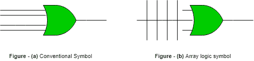
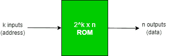
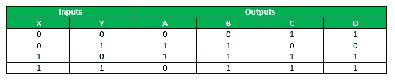
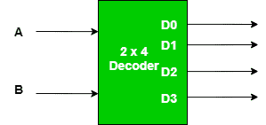
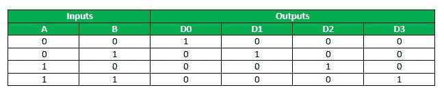
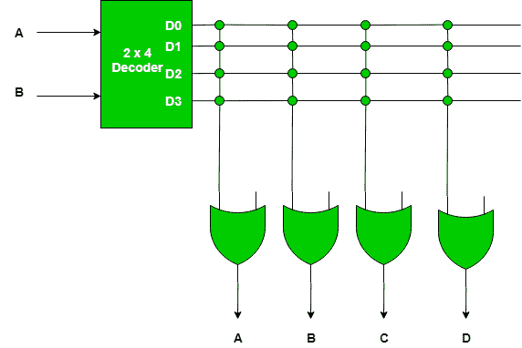
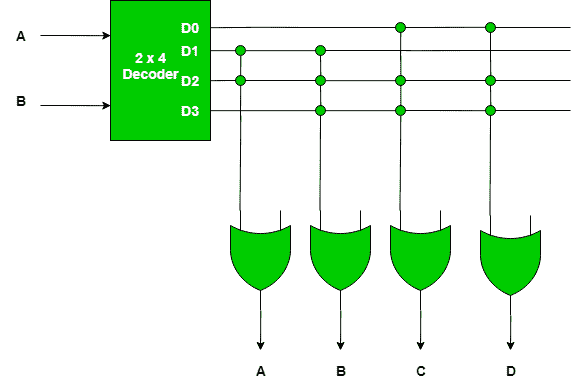

# 只读存储器的分类和编程

> 原文:[https://www . geesforgeks . org/只读存储器分类和编程-rom/](https://www.geeksforgeeks.org/classification-and-programming-of-read-only-memory-rom/)

只读存储器和随机存取存储器是任何计算机系统的主要存储单元，但与随机存取存储器不同，在只读存储器中，二进制信息被永久存储。现在，要存储的信息由设计者提供，然后存储在只读存储器中。一旦储存，即使电源关闭并再次打开，它也会保留在设备中。

信息以位的形式嵌入只读存储器中，通过一种称为编程只读存储器的过程。这里，编程用于指硬件过程，该过程指定将要插入设备硬件配置的位。这就是只读存储器成为可编程逻辑器件的原因。

**可编程逻辑器件**

可编程逻辑器件是一种集成电路，其内部逻辑门通过类似于保险丝的电子路径连接。在原始状态下，所有的保险丝都完好无损，但是当我们对这些设备进行编程时，我们会沿着必须移除的路径熔断某些保险丝，以实现特定的配置。这就是在只读存储器中发生的事情，只读存储器除了基本的逻辑门之外什么也没有，这些逻辑门以存储指定位的方式排列。

典型地，一个可编程逻辑器件可以具有通过数百到数千条内部路径互连的数百到数百万个门。为了显示这种设备的内部逻辑图，使用了特殊的符号，如下所示-

第一幅图显示了表示逻辑门输入的传统方式，第二个符号显示了表示逻辑门输入的特殊方式，称为阵列逻辑符号，其中每条垂直线表示逻辑门的输入。

**只读存储器的结构**

只读存储器的框图如下-

**块体结构**

*   它由 k 条输入线和 n 条输出线组成。
*   k 条输入线用于获取我们想要访问只读存储器内容的输入地址。
*   由于 k 条输入线中的每一条都可以是 0 或 1，因此总共有 2 个地址可以被这些输入线引用，并且这些地址中的每一个都包含 n 位信息，这些信息作为只读存储器的输出给出。
*   这样的只读存储器被指定为 2  x n 只读存储器。

**内部结构**

*   它由两个基本组件组成——解码器和或门。
*   解码器是一种组合电路，用于将任何编码形式(如二进制、BCD)解码成更为已知的形式(如十进制)。
*   在只读存储器中，解码器的输入是二进制形式，输出是十进制形式。
*   解码器用 l×2表示，即它有 l 个输入和 2 个输出，这意味着它将采用 l 位二进制数，并将其解码为 2 个十进制数之一。
*   只读存储器中的所有或门都将解码器的输出作为它们的输入。

**ROM 的分类**

1.  **Mask ROM –** In this type of ROM, the specification of the ROM (its contents and their location), is taken by the manufacturer from the customer in tabular form in a specified format and then makes corresponding masks for the paths to produce the desired output . This is costly, as the vendor charges special fee from the customer for making a particular ROM (recommended, only if large quantity of the same ROM is required).

    **用途–**用于网络操作系统、服务器操作系统、激光打印机字体存储、电子乐器声音数据。

2.  **PROM –** It stands for Programmable Read-Only Memory . It is first prepared as blank memory, and then it is programmed to store the information . The difference between PROM and Mask ROM is that PROM is manufactured as blank memory and programmed after manufacturing, whereas a Mask ROM is programmed during the manufacturing process.
    To program the PROM, a PROM programmer or PROM burner is used . The process of programming the PROM is called as burning the PROM . Also, the data stored in it cannot be modified, so it is called as one – time programmable device.

    **用途–**它们有几种不同的应用，包括手机、视频游戏机、RFID 标签、医疗设备和其他电子产品。

3.  **EPROM –** It stands for Erasable Programmable Read-Only Memory . It overcomes the disadvantage of PROM that once programmed, the fixed pattern is permanent and cannot be altered . If a bit pattern has been established, the PROM becomes unusable, if the bit pattern has to be changed .

    这个问题已经被电子顺磁共振克服了，因为当电子顺磁共振被放置在一个特殊的紫外线下一段时间，短波辐射使电子顺磁共振返回到它的初始状态，然后可以相应地编程。同样，为了擦除内容，使用可编程只读存储器编程器或可编程只读存储器刻录机。

    **用途–**在 EEPROMs 出现之前，一些微控制器，像某些版本的英特尔 8048，飞思卡尔 68HC11 使用 EPROM 来存储它们的程序。

4.  **EEPROM –** It stands for Electrically Erasable Programmable Read-Only Memory . It is similar to EPROM, except that in this, the EEPROM is returned to its initial state by application of an electrical signal, in place of ultraviolet light . Thus, it provides the ease of erasing, as this can be done, even if the memory is positioned in the computer. It erases or writes one byte of data at a time .

    **用途–**用于存储计算机系统基本输入输出系统。

5.  **Flash ROM –** It is an enhanced version of EEPROM .The difference between EEPROM and Flash ROM is that in EEPROM, only 1 byte of data can be deleted or written at a particular time, whereas, in flash memory, blocks of data (usually 512 bytes) can be deleted or written at a particular time . So, Flash ROM is much faster than EEPROM .

    **用途–**许多现代电脑的基本输入输出系统存储在闪存芯片上，称为闪存基本输入输出系统，也用于调制解调器。

**对只读存储器进行编程**

为了理解如何对只读存储器编程，考虑一个 4×4 的只读存储器，这意味着它总共有 4 个存储信息的地址，每个地址都有一个 4 位信息，这是永久的，当我们访问一个特定的地址时，必须作为输出给出。需要执行以下步骤对只读存储器进行编程

1.  Construct a truth table, which would decide the content of each address of the ROM and based upon which a particular ROM will be programmed.

    因此，4 x 4 只读存储器规格的真值表描述如下:

    

    该真值表显示，在位置 00 处，要存储的内容是 0011，在位置 01 处，内容应该是 1100，以此类推，使得每当给定特定地址作为输入时，就提取该特定地址处的内容。因为在 2 个输入位的情况下，4 个输入组合是可能的，并且这些组合中的每一个都保存 4 位信息，所以该只读存储器是 4 X 4 只读存储器。

2.  Now, based upon the total no. of addresses in the ROM and the length of their content, decide the decoder as well as the no. of OR gates to be used .
    Generally, for a 2 x n ROM, a k x 2 decoder is used, and the total no. of OR gates is equal to the total no. of bits stored at each location in the ROM .

    因此，在这种情况下，对于 4×4 只读存储器，要使用的解码器是 2×4 解码器。
    以下是一个 2×4 解码器–

    

    2×4 解码器的真值表如下–

    

    当两个输入都为 0 时，则只有 D 为 1，其余为 0，当输入为 01 时，则只有 D 为高，以此类推。(请记住，如果解码器的输入组合解析为一个特定的十进制数 d，那么在输出端，从顶部位置 d + 1 的端子将是 1，其余的将是 0)。

    现在，由于我们希望每个地址在 4×4 只读存储器中存储 4 位，因此，将有 4 个或门，解码器的 4 个输出中的每一个输入到 4 个或门中的每一个，其输出将是只读存储器的输出，如下所示

    

    该图中的十字符号表示两条线之间的连接完好无损。现在，由于解码器有 4 个或门和 4 条输出线，因此总共有 16 个交叉点，称为交叉点。

3.  Now, program the intersection between the two lines, as per the truth table, so that the output of the ROM ( OR gates ) is in accordance with the truth table .
    For programming the crosspoints, initially all the crosspoints are left intact, which means that it is logically equivalent to a closed switch, but these intact connections can be blown by the application of a high – voltage pulse into these fuse, which will disconnect the two interconnected lines, and in this way the output of a ROM can be manipulated .

    因此，要编程一个只读存储器，只需查看指定只读存储器的真值表，并消除(如果需要的话)一个连接。根据真值表，4 x 4 只读存储器的连接如下所示–

    

    记住，十字符号用来表示连接保持完整，如果没有十字，这意味着没有连接。

    在该图中，因为从指定只读存储器的真值表中可以看出，当输入为 00 时，输出为 0011，所以我们从解码器的真值表中知道，输入 00 给出输出，使得只有 D 为 1，其余为 0，因此为了从或门获得输出 0011，D 与前两个或门的连接已经被切断，以获得输出为 0，而最后两个或门给出输出为 1，这是所需要的。

    类似地，当输入为 01 时，则输出应为 1100，在输入为 01 的情况下，在解码器中只有 D 为 1，其余为 0，因此为了获得所需的输出，前两个或门与 D 的连接保持不变，而最后两个或门的连接被切断。其余的也遵循同样的程序。

这就是只读存储器的编程方式，因为这些门的输出每次都保持不变，所以这就是信息永久存储在只读存储器中的方式，即使开关也不会改变。

**参考-**

1.  阿南德·库马尔的《数字电路基础》

本文由**姆里根德拉·辛格**供稿。如果你喜欢 GeeksforGeeks 并想投稿，你也可以使用[contribute.geeksforgeeks.org](http://www.contribute.geeksforgeeks.org)写一篇文章或者把你的文章邮寄到 contribute@geeksforgeeks.org。看到你的文章出现在极客博客主页上，帮助其他极客。

如果你发现任何不正确的地方，或者你想分享更多关于上面讨论的话题的信息，请写评论。