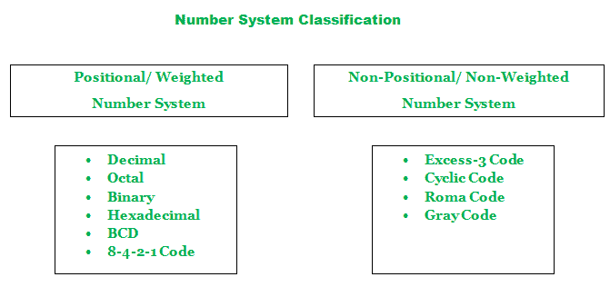
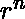

# 编号系统分类

> 原文:[https://www . geesforgeks . org/分类编号系统/](https://www.geeksforgeeks.org/classification-of-number-system/)

数字是表示特定数量的算术值、计数或度量的一种方式。一个**数字系统**可以被认为是使用一组数字或符号的数字的数学符号。简单地说，数字系统是一种表示数字的方法。每个数字系统都是借助于它的基数来识别的。

**一个数字系统的基数或基数:**
一个数字系统的基数或基数可以指在一个特定的数字系统中可以使用的不同符号的总数。基数在拉丁语中是“根”的意思。

基数等于 4 意味着在那个数字系统中有 4 个不同的符号。同样，基数等于“x”意味着在那个数字系统中有“x”个不同的符号。

**数制分类:**
数制可分为两类，即:

```
Positional and Non-Positional number system 
```



**1。位置(或加权)数字系统:**
位置数字系统也称为加权数字系统。顾名思义，每个数字都有一个权重。

根据它在数字中出现的位置，对每个数字进行加权。向左边，权重增加一个常数因子，等于基数或基数。借助于基点('.')，对应于整数权重(1)的位置不同于对应于分数权重(< 1)的位置。

任何大于或等于 2 的整数值都可以用作基数。数字位置“n”有重量。数字位置的最大值总是比基值小 1。数字的值是其位数的加权和。

例如:

```
1358 = 1 x  + 3 x  + 5 x  + 8 x  
13.58 = 1 x  + 3 x  + 5 x  + 8 x  
```

位置数制的例子很少，有十进制、二进制、八进制、十六进制、BCD 等。

**2。非位置(或非加权)数制:**
非位置数制也称非加权数制。数字值与其位置无关。非位置数字系统用于移位位置编码和错误检测。

非加权数制的例子很少，如格雷码、罗马码、超额-3 码等。