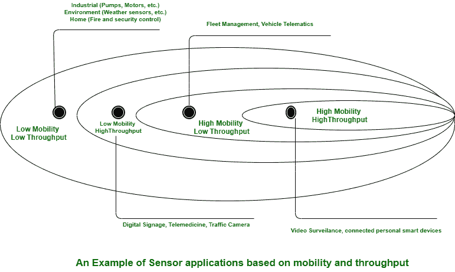

# 智能物体分类

> 原文:[https://www . geesforgeks . org/smart-objects 分类/](https://www.geeksforgeeks.org/classification-of-smart-objects/)

**智能对象**是一个不仅能增强与人的相互作用，还能增强与不同智能对象的相互作用的对象。也称为智能连接产品或智能连接事物(SCoT)，它们是嵌入处理器、传感器、软件程序和连接的产品、资产和不同的事物，有助于允许信息在产品及其环境、不同的产品和系统之间交换。

此外，连接性还允许产品的某些功能在物理设备之外的产品云中呈现。从这些产品中收集的记录随后可以被分析，以便为决策提供信息，提高运营效率，并不断增强产品的整体性能。

**智能对象分类:**
智能对象分为:

*   **移动的还是静止的–**
    这种分类是基于“事物”是应该移动还是总是位于相同的位置。传感器也可以是单元，因为它从一个对象移动到另一个对象(例如，在化工厂中从一批移动到另一批的粘度传感器)，或者因为它连接到转移对象(例如，在仓库或制造单元地板上转移物品的区域传感器)。

此外，运动的频率可能会有所不同，从偶尔到永久。机动性的范围(从几英寸到几英里远)通常驱动可能的动力源。

*   **Low or Excessive Reporting Frequency –**
    This classification is primarily based on how regularly the object must report monitored parameters. A rust sensor can also report values as soon as a month. A motion sensor can also report acceleration at various hundred instances per second.

    更高的频率迫使更大的强度消耗，这也会对可行的强度供应(以及因此的物体移动性)和传输范围产生限制。

    *   **Battery-Powered or Power-Connected –**
    This classification is primarily based on whether or not the object incorporates its very own energy supply or receives non-stop power from an exterior power source. Battery-powered matters can be moved greater without difficulty than line-powered objects.

    然而，电池限制了物体的寿命和允许消耗的电量，因此，骑行传输因频率而异。

    *   **Simple or Rich Data –**
    This classification is based totally on the extent of records exchanged at every reporting cycle. A humidity sensor in an area can also report an easy daily index value (on a binary scale from zero to 255), whilst an engine sensor may also record various parameters, including temperature to pressure, compression speed, carbon index, etc. Richer records normally drive greater strength consumption.

    这种分类通常与前面的分类混合，以决定对象信息吞吐量(低吞吐量到高吞吐量)。一个中等吞吐量的对象可以额外地以替代的高频发送简单记录(在这种情况下，滑动形状看起来是连续的)，或者可以额外地以替代的低频发送繁荣信息(在这种情况下，流动形状看起来是突发的)。

    *   **Object Density Per Cell –**
    This classification is based totally on the number of smart objects (with a comparable need to communicate) over a given area, linked to the identical gateway. An oil pipeline can also make use of a single sensor at key places every few miles.

    相比之下，像惠普尔天文台的 SETI 巨像望远镜这样的望远镜在一个小区域内安装了数百面，有时甚至数千面镜子，每面都有不止一个陀螺仪、重力和振动传感器。

    *   **Report Range –**
    This classification is primarily based on the distance at which the gateway is located. For example, for your fitness band to speak with your phone, it desires to be positioned a few meters away at most. The assumption is that your smartphone needs to be at a visible distance for you to seek advice from the said records on the smartphone screen. If the phone is a long way away, you commonly do not use it, and reporting records from the band to the phone is now not necessary. By contrast, a moisture sensor in the asphalt of a street might also want to speak with its reader numerous hundred meters or even kilometres away.

    