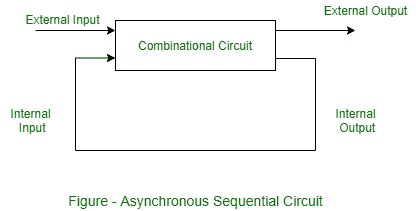
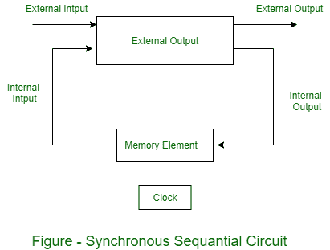

# 组合电路和时序电路的分类

> 原文:[https://www . geeksforgeeks . org/组合和时序电路分类/](https://www.geeksforgeeks.org/classifications-of-combinational-and-sequential-circuits/)

**1。组合电路的分类:**
[组合电路](https://www.geeksforgeeks.org/combinational-circuits-using-decoder/)主要有三类:算术或逻辑功能、数据传输和[代码转换器](https://www.geeksforgeeks.org/code-converters-binary-to-from-gray-code/)，如下图所示。

组合电路的功能通常用布尔代数、真值表或逻辑图来表示。布尔代数是以表达式形式表达的逻辑函数。真值表包含所有可能输入的输出。而逻辑图是使用逻辑门的逻辑功能的图形表示。组合电路图有逻辑门，没有反馈路径或存储元件。对于特定的逻辑电路，这三种表示总是相等的。

**2。[时序电路](https://www.geeksforgeeks.org/introduction-of-sequential-circuits/) :**
现在，这些是时序电路的类型和分类。

**时序电路类型:**
时序电路可以是事件驱动、时钟驱动和脉冲驱动。时序电路有两种主要类型:(a)同步的和(b)异步的。

*   **(a). [Asynchronous Sequential circuits](https://www.geeksforgeeks.org/asynchronous-sequential-circuits/) –**
    Asynchronous circuits do not synchronize with positive edge or negative edge of the clock signal, that means, the outputs of asynchronous sequential circuits do not change or affect at the same time and change their state immediately when there is a change in the input signal. So, these circuits are faster and independent of the internal clock pulses. But these circuits have uncertainty in the outputs and are difficult to design.

    

*   **(b). [Synchronous Sequential circuits](https://www.geeksforgeeks.org/synchronous-sequential-circuits-in-digital-logic/) –**
    Synchronous circuits synchronize with either positive edge or negative edge of the clock signal, that means, the outputs of synchronous sequential circuits change or affect at the same time. These circuits use clock signal and level input (or pulsed with restrictions on pulse width and circuit propagation). Since they wait for the next clock pulse to arrive to perform the next operation, so these circuits are a bit slower compared to asynchronous. Level output changes state at the start of an input pulse and remains in that until the next input or clock pulse. The synchronous sequential circuit can be locked or unlocked (or pulsed).

    

    [计数器](https://www.geeksforgeeks.org/counters-in-digital-logic/)、[触发器](https://www.geeksforgeeks.org/flip-flop-types-and-their-conversion/)和[米尔摩尔机器](https://www.geeksforgeeks.org/mealy-and-moore-machines-in-toc/)的设计都是同步时序电路的例子。