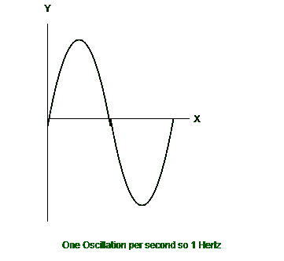
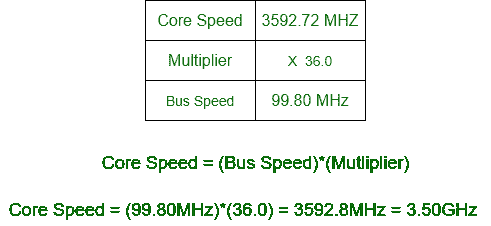

# 时钟速度

> 原文:[https://www.geeksforgeeks.org/clock-speed/](https://www.geeksforgeeks.org/clock-speed/)

当我们同时向一个中央处理器提供大量的数据和指令时，它不能单独运行。它需要其他组件来为它工作，为此它需要一个时钟来同步系统的所有组件。

一个处理器在一秒钟内完成其总处理周期的速率称为它的“时钟速度”。它也被称为时钟速率。中央处理器的性能对程序的加载和执行速度有很大影响。通常以兆赫或千兆赫为单位。在现代中央处理器中，我们以千兆赫为单位测量时钟速度。

```
1 Megahertz = 1, 000, 000 cycles / sec
1 Gigahertz = 1, 000, 000, 000 cycles / sec 
```

**示例:**

*   时钟速度为 4.2 兆赫的中央处理器每秒执行 420 万个周期。
*   时钟速度为 4.2 千兆赫的中央处理器每秒执行 42 亿个周期。

一般都说时钟速度越高，CPU 越快。但这可能不是 CPU 更快的唯一原因。背后有很多因素，如处理器数量、内存速度、总线速度、缓存大小等。有些指令需要更多的 CPU 周期才能完成。根据中央处理器的架构，时钟速度可能或多或少很重要。一些中央处理器实际上可以在较慢的时钟速度下执行得更快，而一些处理器的架构更注重高时钟速度，每个周期的指令很少。




中央处理器的速度决定了它在一秒钟内可以执行的计算次数。然而，处理能力的中央处理器时钟的速度可以通过“超频”来提高。但是当你提高时钟速度时，可能会出现稳定性问题，你的系统可能会崩溃。更高的时钟速度会产生更多的热量，因此，为了避免危险的过热，处理器过热时会被抑制到更低的频率。当你没有给你的中央处理器足够的电力时，这可能会发生。超频也可能导致**过卷**。

过电压是指为了提高时钟速度而提高芯片的电压。

第一款商用 Altair 8800 采用了时钟速率为 2 MHz(200 万周期/秒)的英特尔 8080 CPU，英特尔 P5 奔腾的时钟速率为 100 MHz (1 亿周期/秒)。2000 年，AMD 是第一个达到 1 千兆赫(10 亿周期/秒)的处理器。2002 年，英特尔高级 4 是第一个时钟速率为 3 千兆赫(30 亿周期/秒)的中央处理器。