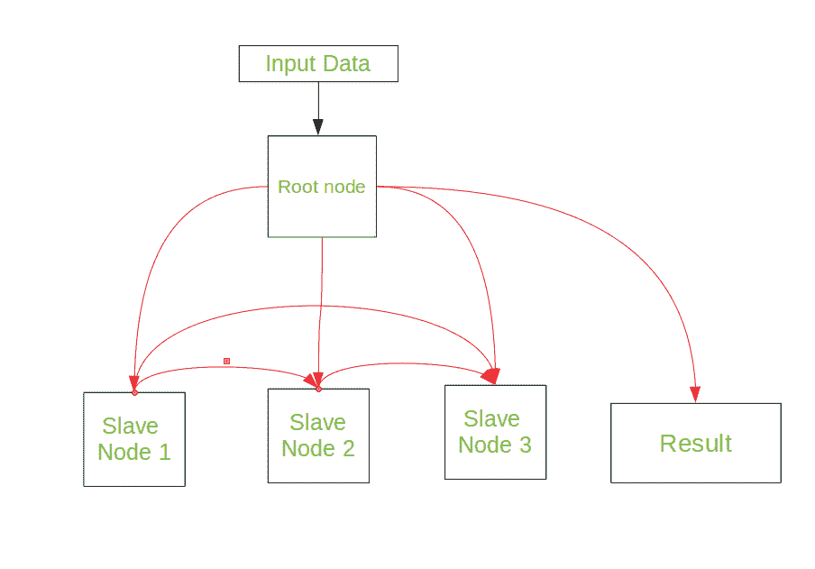
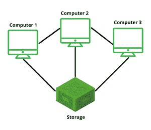

# 计算机组织中的集群

> 原文:[https://www . geesforgeks . org/clusters-computer-organization/](https://www.geeksforgeeks.org/clusters-computer-organisation/)

集群是一组松散或紧密连接的计算机，作为一个统一的计算资源一起工作，可以创造一个机器的假象。计算机集群的每个节点集都执行相同的任务，由软件控制和产生。

集群操作系统的工作方式类似于并行操作系统，因为它们有许多 CPU。当两个或多个计算机系统合并时，就创建了集群系统。基本上，他们有一台独立的计算机，但有共同的存储和系统一起工作。

集群的*组件通常使用快速局域网连接，每个节点运行自己的操作系统实例。在大多数情况下，所有节点都使用相同的硬件和相同的操作系统，尽管在某些设置中可以使用不同的硬件或不同的操作系统。*

为了使集群更有效，存在两个集群:

*   **硬件集群**
*   **软件集群**

**硬件集群**有助于实现系统间的高性能磁盘共享，而**软件集群**则允许所有系统协同工作。

**集群系统的类型:**

主要有两种类型的集群系统:

*   **非对称集群:**在这种类型的集群中，所有节点运行所需的应用程序，一个节点处于热备用模式。热备用节点用于监视服务器，直到它出现故障，当它出现故障时，它将取而代之。
*   **对称集群:**在这种类型的集群中，所有节点同时运行应用程序和监控其他节点。这种群集比非对称群集更有效，因为它没有任何热备用密钥。

**集群的分类:**
*计算机集群*以这样的方式排列在一起，以支持从通用业务需求(如网络服务支持)到计算密集型科学计算的不同目的。基本上，有三种类型的集群，它们是:

*   **负载平衡集群**–集群需要有效的能力来平衡可用计算机之间的负载。在这种情况下，集群节点共享计算工作负载以提高整体性能。例如，用于科学计算的高性能集群将平衡来自网络服务器集群的不同算法的负载，网络服务器集群可能只使用循环方法，将每个新请求分配给不同的节点。这种类型的集群用于网络服务器场(网络场)。
*   **故障转移集群**–将应用程序和数据资源从故障系统切换到集群中替代系统的功能称为故障转移。这些类型用于集群关键任务、邮件、文件和应用服务器的数据库
*   **高可用性集群**–这些也称为“高可用性集群”。它们提供了所有资源都可用的高概率。如果出现故障，例如系统停机或磁盘卷丢失，则正在进行的查询会丢失。任何丢失的查询，如果重试，将由群集中的另一台计算机提供服务。这种类型的集群广泛用于网络、电子邮件、新闻或文件传输协议服务器。

**优势:**

*   **绝对的可扩展性**–有可能创建甚至比最大的独立机器更强大的大型集群。一个集群可以有几十台*多处理器机器。*
*   **额外的可扩展性**–集群的配置方式是，可以以小增量向集群添加新系统。集群能够水平添加系统。这意味着可以将更多的计算机添加到集群中，以提高它们的性能、冗余度和容错能力(系统在节点出现故障的情况下继续工作的能力)。
*   **高可用性**–众所周知，集群中的每个节点都是一台独立的计算机，一个节点出现故障并不意味着失去服务。单个节点可以被拆除进行维护，而集群的其余部分承担该单个节点的负载。
*   **更好的性价比**–集群通常被设置为比单台计算机提高性能和可用性，同时通常比同等速度或可用性的单台计算机更具成本效益。