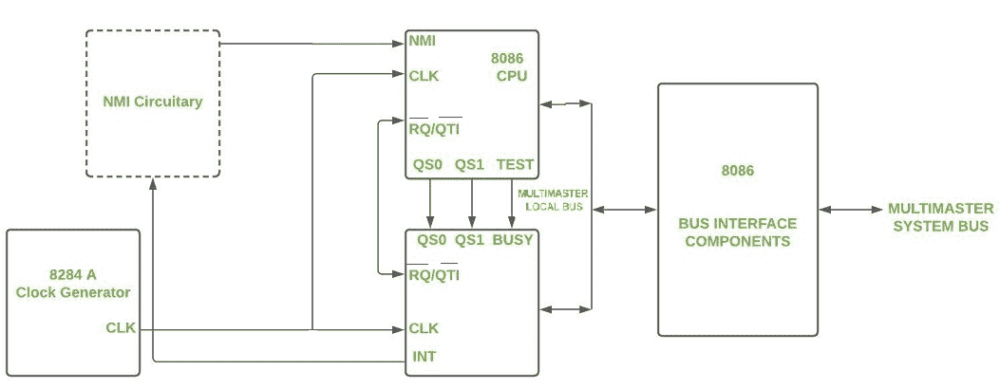

# 协处理器|计算机架构

> 原文:[https://www . geesforgeks . org/协处理器-计算机-架构/](https://www.geeksforgeeks.org/co-processor-computer-architecture/)

**简介:**
如果在微处理器芯片中，可以加入特殊用途的新电路来执行特殊任务或对数字进行运算，以此来卸载核心 CPU 的工作。然后，中央处理器可以更快地工作。

马达运转时，我们可以用传送带做一些额外的工作。因此，电机得到了更有效的利用。同样，当我们运行复杂的应用程序时，辅助处理器，即协处理器，处理工作的数学部分。

**什么是协处理器？**

*   协处理器很多时候被称为数学处理器。当协处理器执行例行的数学任务时，核心处理器从这种计算中解放出来，节省了时间。协处理器通过从核心中央处理器中承担专门的处理任务，减轻了主微处理器的压力，从而可以以更高的速度运行。
*   协处理器可以执行特殊任务，如复杂的数学计算或图形显示处理。它们执行此类任务的速度比核心 CPU 快。结果，系统的整体计算机速度增加。
*   对于一个 [ARM 处理器](https://www.geeksforgeeks.org/arm-processor-and-its-features/)，我们可以连接协处理器。一个协处理器在增加的时候，我们需要扩展核心 CPU 的指令集或者增加可配置的寄存器，来增加处理能力。协处理器接口允许几个协处理器连接到 ARM 中央处理器。

**协处理器是如何工作的？**
协处理器通过卸载中央处理器的特定任务来帮助系统更高效地运行。他们可以

1.  **独立型**–
    它与中央处理器以异步方式工作。每当它执行任何任务/某些计算时，都不会与中央处理器同步。协处理器可以在这里独立决策。然后，中央处理器可以自己工作，而不用担心协处理器的工作。发出请求的 CPU 被释放出来执行另一个任务，而不是同步等待。
2.  **直接控制类型**–
    直接控制类型，如浮点单元–由协处理器指令控制，协处理器指令是中央处理器指令集的一部分。发起请求的中央处理器等待或检查，直到协处理器完成操作。协处理器在这里不是独立的&由主 CPU 管理或控制。中央处理器&协处理器在这里同步工作。

处理器的设计和实现方式使得它可以向多个协处理器发送数据和指令。这些协处理器旨在与内核协同工作，并以相同的方式进行流水线操作。

通过增加一组新的专用指令，协处理器可以扩展指令集。例如，为了处理向量浮点(VFP)运算，一系列专门的指令可以添加到正常的 ARM 指令集。当指令被解码并被视为协处理器指令时，该指令被传递到适当的协处理器。但是，如果协处理器不存在或在其指令集中没有找到指令，ARM 会抛出一个未定义的指令异常。

**协处理器的属性:**

1.  没有主微处理器，协处理器就无法运行。
2.  主处理器必须识别和隔离程序中计算密集型指令。
3.  具有大量计算的指令由协处理器执行。
4.  主处理器处理所有其他活动。

**协处理器的功能:**

*   协处理器无法从内存中检索指令、管理内存、直接执行指令(流控制类型)、执行 I/O 操作等。
*   协处理器依赖主机(主)处理器来检索协处理器指令，并处理与协处理器无关的所有其他操作。
*   协处理器不是系统的主处理器。
*   协处理器可以执行:浮点算术运算，如加法、减法、乘法、计算给定数的平方根、估计给定数的对数值等。(对于浮点值)或信号、字符串、图形处理或加密/解密等。
*   协处理器支持计算机定制，因此如果客户不需要额外的性能，他们就不需要付费。

**示例–英特尔 8087 协处理器:**
英特尔 8087 是第一款适合 16 位运算的数学协处理器。它是为配合英特尔 8086 微处理器而设计的。其主要目的是减少应用程序给出输出(需要高浮点计算)所需的时间。
随着协处理器和主处理器的引入，人们注意到应用程序的性能从 20%提高到 500%。
8087 协处理器性能–每秒约 50 千次浮点运算。

8087 协处理器功能图

英特尔 8087 协处理器支持:

*   整数
*   BCD
*   单精度浮点数
*   双精度浮点数
*   扩展精度(80 位)浮点数

该图显示了带有 8086 微处理器的协处理器的连通性。
大多数协处理器都有–算术模块、临时寄存器和逻辑模块。