# 代码转换器–BCD(8421)至/自超额-3

> 原文:[https://www . geesforgeks . org/code-converters-BCD 8421-转自超额-3/](https://www.geeksforgeeks.org/code-converters-bcd8421-to-from-excess-3/)

**先决条件–**[数字系统和基数转换](https://www.geeksforgeeks.org/number-system-and-base-conversions/)

超额-3 二进制码是**未加权自补** BCD 码。
自补性质是指一个超额 3 数的 1 的补码是相应十进制数的 9 的补码的超额 3 码。这个属性很有用，因为十进制数可以像二进制数可以被 1 补一样容易地被 9 补(用于减法)；只需反转所有位。
比如 3(0011)的超额-3 码是 0110，要找到 3 补码的超额-3 码，我们只需要找到 0110 - > 1001 的 1 补码，这也是 3 的 9 补码的超额-3 码- > (9-3) = 6。

### 将 BCD(8421)转换为超额-3-

正如名字所表明的，一个 BCD 数字可以通过简单地加 3 转换成它对应的超额-3 代码。
设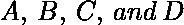为代表二进制数的位，其中为 LSB，为 MSB，
设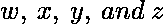为代表二进制数格雷码的位，其中为 LSB，为 MSB。
转换真值表如下。X 标记不在乎条件。
![ \begin{tabular}{||c|c|c|c||c|c|c|c||} \hline  \multicolumn{4}{||c||}{BCD(8421)} & \multicolumn{4}{|c||}{Excess-3}\\ \hline  A & B & C & D & w & x & y & z \\ \hline \hline  0 & 0 & 0 & 0 & 0 & 0 & 1 & 1 \\  \hline  0 & 0 & 0 & 1 & 0 & 1 & 0 & 0 \\  \hline  0 & 0 & 1 & 0 & 0 & 1 & 0 & 1 \\  \hline  0 & 0 & 1 & 1 & 0 & 1 & 1 & 0 \\  \hline \hline  0 & 1 & 0 & 0 & 0 & 1 & 1 & 1 \\  \hline  0 & 1 & 0 & 1 & 1 & 0 & 0 & 0 \\  \hline  0 & 1 & 1 & 0 & 1 & 0 & 0 & 1 \\  \hline  0 & 1 & 1 & 1 & 1 & 0 & 1 & 0 \\  \hline \hline  1 & 0 & 0 & 0 & 1 & 0 & 1 & 1 \\  \hline  1 & 0 & 0 & 1 & 1 & 1 & 0 & 0 \\  \hline  1 & 0 & 1 & 0 & X & X & X & X \\  \hline  1 & 0 & 1 & 1 & X & X & X & X \\  \hline \hline  1 & 1 & 0 & 0 & X & X & X & X \\  \hline  1 & 1 & 0 & 1 & X & X & X & X \\  \hline  1 & 1 & 1 & 0 & X & X & X & X \\ \hline  1 & 1 & 1 & 1 & X & X & X & X \\ \hline \hline \end{tabular} ](img/dcd7200cd26a857b859ee0807785f18b.png "Rendered by QuickLaTeX.com")
为了找到相应的数字电路，我们将使用 K-Map 技术，将每个超额 3 码位作为输出，将 BCD 号的所有位作为输入。

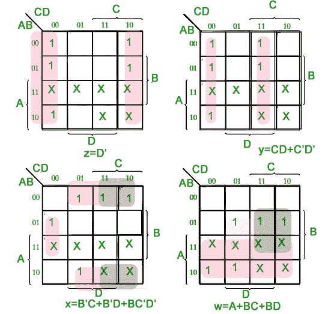

对应的最小化布尔表达式为超额-3 位代码–
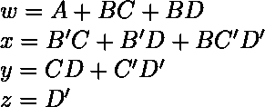
对应的数字电路-

### 将超额-3 转换为 BCD(8421)–

多余的-3 代码可以以同样的方式转换回 BCD。
设为代表二进制数的位，其中为 LSB，为 MSB，
设为代表二进制数格雷码的位，其中为 LSB，为 MSB。
转换真值表如下。X 标记不在乎条件。
![ \begin{tabular}{||c|c|c|c||c|c|c|c||} \hline  \multicolumn{4}{||c||}{Excess-3} & \multicolumn{4}{|c||}{BCD}\\ \hline  w & x & y & z & A & B & C & D \\ \hline \hline  0 & 0 & 0 & 0 & X & X & X & X \\  \hline  0 & 0 & 0 & 1 & X & X & X & X \\  \hline  0 & 0 & 1 & 0 & X & X & X & X \\  \hline  0 & 0 & 1 & 1 & 0 & 0 & 0 & 0 \\  \hline \hline  0 & 1 & 0 & 0 & 0 & 0 & 0 & 1 \\  \hline  0 & 1 & 0 & 1 & 0 & 0 & 1 & 0 \\  \hline  0 & 1 & 1 & 0 & 0 & 0 & 1 & 1 \\  \hline  0 & 1 & 1 & 1 & 0 & 1 & 0 & 0 \\  \hline \hline  1 & 0 & 0 & 0 & 0 & 1 & 0 & 1 \\  \hline  1 & 0 & 0 & 1 & 0 & 1 & 1 & 0 \\  \hline  1 & 0 & 1 & 0 & 0 & 1 & 1 & 1 \\  \hline  1 & 0 & 1 & 1 & 1 & 0 & 0 & 0 \\  \hline \hline  1 & 1 & 0 & 0 & 1 & 0 & 0 & 1 \\  \hline  1 & 1 & 0 & 1 & X & X & X & X \\  \hline  1 & 1 & 1 & 0 & X & X & X & X \\ \hline  1 & 1 & 1 & 1 & X & X & X & X \\ \hline \hline \end{tabular} ](img/60a9c7c1e73e388e0cbc1aa0f93dec9c.png "Rendered by QuickLaTeX.com")
K-Map 为 D-
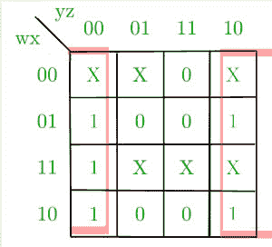
K-Map 为 C-
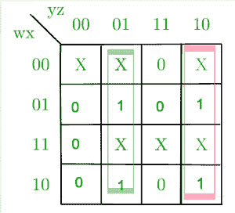
K-Map 为 B-
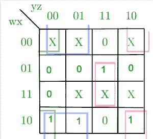
K-Map 为 A-
<img src =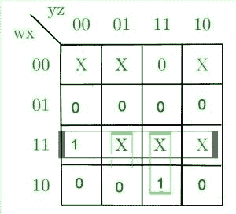
对应的最小化布尔表达式为超额-3 位代码–
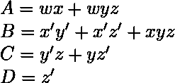
对应的数字电路–
这里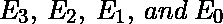对应的是和【T39】

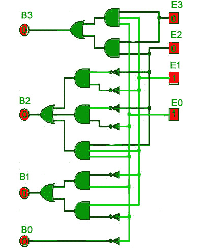

**参考文献-**

数字设计，第五版，由莫里斯·马诺和迈克尔·西莱蒂编辑
[overseas-3–维基百科](https://en.wikipedia.org/wiki/Excess-3)

本文由**奇拉·曼瓦尼**供稿。如果你喜欢 GeeksforGeeks 并想投稿，你也可以使用[contribute.geeksforgeeks.org](http://www.contribute.geeksforgeeks.org)写一篇文章或者把你的文章邮寄到 contribute@geeksforgeeks.org。看到你的文章出现在极客博客主页上，帮助其他极客。

如果你发现任何不正确的地方，或者你想分享更多关于上面讨论的话题的信息，请写评论。