# 代码转换器–二进制到/自格雷码

> 原文:[https://www . geeksforgeeks . org/code-converters-二进制转格雷码/](https://www.geeksforgeeks.org/code-converters-binary-to-from-gray-code/)

**先决条件–**[数字系统和基数转换](https://www.geeksforgeeks.org/number-system-and-base-conversions/)

格雷码系统是一种二进制数字系统，其中每对连续的数字仅相差一位。它用于由硬件生成的二进制数的正常序列在从一个数到下一个数的转换过程中可能产生错误或模糊的应用中。
例如，系统的状态可能从 3(011)变为 4(100) as- 011 — 001 — 101 — 100。因此，当系统从初始状态变为最终状态时，读取错误状态的可能性很高。
这可能会对使用该信息的机器产生严重后果。格雷码消除了这个问题，因为在两个数字之间的任何转换过程中，只有一位改变其值。

### 将二进制转换为格雷码–

设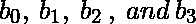为代表二进制数的位，其中为 LSB，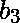为 MSB，
设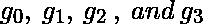为代表二进制数格雷码的位，其中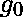为 LSB，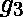为 MSB。
转换的真值表是-
![ \begin{tabular}{||c|c|c|c||c|c|c|c||} \hline  \multicolumn{4}{||c||}{Binary} & \multicolumn{4}{|c||}{Gray Code}\\ \hline  b_3 & b_2 & b_1 & b_0 & g_3 & g_2 & g_1 & g_0 \\ \hline \hline  0 & 0 & 0 & 0 & 0 & 0 & 0 & 0 \\  \hline  0 & 0 & 0 & 1 & 0 & 0 & 0 & 1 \\  \hline  0 & 0 & 1 & 0 & 0 & 0 & 1 & 1 \\  \hline  0 & 0 & 1 & 1 & 0 & 0 & 1 & 0 \\  \hline \hline  0 & 1 & 0 & 0 & 0 & 1 & 1 & 0 \\  \hline  0 & 1 & 0 & 1 & 0 & 1 & 1 & 1 \\  \hline  0 & 1 & 1 & 0 & 0 & 1 & 0 & 1 \\  \hline  0 & 1 & 1 & 1 & 0 & 1 & 0 & 0 \\  \hline \hline  1 & 0 & 0 & 0 & 1 & 1 & 0 & 0 \\  \hline  1 & 0 & 0 & 1 & 1 & 1 & 0 & 1 \\  \hline  1 & 0 & 1 & 0 & 1 & 1 & 1 & 1 \\  \hline  1 & 0 & 1 & 1 & 1 & 1 & 1 & 0 \\  \hline \hline  1 & 1 & 0 & 0 & 1 & 0 & 1 & 0 \\  \hline  1 & 1 & 0 & 1 & 1 & 0 & 1 & 1 \\  \hline  1 & 1 & 1 & 0 & 1 & 0 & 0 & 1 \\  \hline  1 & 1 & 1 & 1 & 1 & 0 & 0 & 0 \\  \hline \hline \end{tabular} ](img/893ae5116201a2d82ed946847da75402.png "Rendered by QuickLaTeX.com")
为了找到相应的数字电路，我们将对每个格雷码位使用 K-Map 技术作为输出，所有二进制位作为输入。
K 线图为–
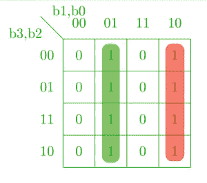
k 线图为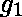–
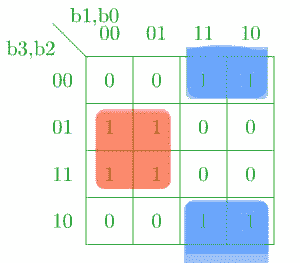
k 线图为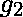–
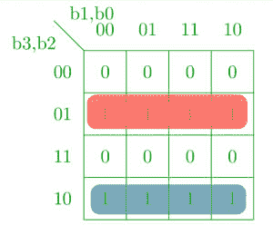
k 线图为–
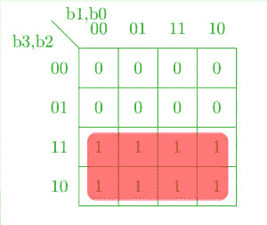

对应的最小化布尔表达式为格雷码位–

对应的数字电路–
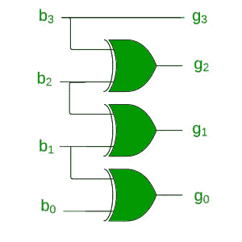

### 将格雷码转换为二进制–

将格雷码转换回二进制可以用类似的方式完成。
设为代表二进制数的位，其中为 LSB，为 MSB，
设为代表二进制数格雷码的位，其中为 LSB，为 MSB。
真值表-
![ \begin{tabular}{||c|c|c|c||c|c|c|c||} \hline  \multicolumn{4}{||c||}{Gray Code} & \multicolumn{4}{|c||}{Binary}\\ \hline  g_3 & g_2 & g_1 & g_0 & b_3 & b_2 & b_1 & b_0\\ \hline \hline  0 & 0 & 0 & 0 & 0 & 0 & 0 & 0 \\  \hline  0 & 0 & 0 & 1 & 0 & 0 & 0 & 1 \\  \hline  0 & 0 & 1 & 0 & 0 & 0 & 1 & 1 \\  \hline  0 & 0 & 1 & 1 & 0 & 0 & 1 & 0 \\  \hline \hline  0 & 1 & 0 & 0 & 0 & 1 & 1 & 1 \\  \hline  0 & 1 & 0 & 1 & 0 & 1 & 1 & 0 \\  \hline  0 & 1 & 1 & 0 & 0 & 1 & 0 & 0 \\  \hline  0 & 1 & 1 & 1 & 0 & 1 & 0 & 1 \\  \hline \hline  1 & 0 & 0 & 0 & 1 & 1 & 1 & 1 \\  \hline  1 & 0 & 0 & 1 & 1 & 1 & 1 & 0 \\  \hline  1 & 0 & 1 & 0 & 1 & 1 & 0 & 0 \\  \hline  1 & 0 & 1 & 1 & 1 & 1 & 0 & 1 \\  \hline \hline  1 & 1 & 0 & 0 & 1 & 0 & 0 & 0 \\  \hline  1 & 1 & 0 & 1 & 1 & 0 & 0 & 1 \\  \hline  1 & 1 & 1 & 0 & 1 & 0 & 1 & 1 \\  \hline  1 & 1 & 1 & 1 & 1 & 0 & 1 & 0 \\  \hline \hline \end{tabular} ](img/b10241408c09b07926fad83a711e0d86.png "Rendered by QuickLaTeX.com")

使用 K-map 从格雷码中取回二进制位––

K-map 为–

K-map 为–
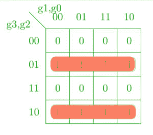
K-map 为–
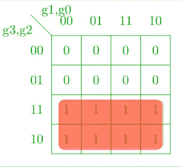

对应的布尔表达式–

![ \begin{align*} b_0 &=g_3^\prime g_2^\prime g_1^\prime g_0 + g_3^\prime g_2^\prime g_1g_0^\prime + g_3^\prime g_2g_1^\prime g_0^\prime  + g_3^\prime g_2g_1g_0 +g_3g_2^\prime g_1^\prime g_0^\prime  + g_3g_2^\prime g_1g_0 \\ &\:\:\:+g_3g_2g_1^\prime g_0 + g_3g_2g_1g_0^\prime \\ &= g_3^\prime g_2^\prime( g_1^\prime g_0 +  g_1g_0^\prime) + g_3^\prime g_2(g_1^\prime g_0^\prime  + g_1g_0) +g_3g_2^\prime(g_1^\prime g_0^\prime  +  g_1g_0 )\\ &\:\:\:+g_3g_2 (g_1^\prime g_0 + g_1g_0^\prime) \\ &= g_3^\prime g_2^\prime(g_0\oplus g_1) + g_3^\prime g_2(g_0\odot g_1)+g_3g_2^\prime(g_0\odot g_1) + g_3g_2 (g_0\oplus g_1) \\ &= (g_0\oplus g_1)(g_2\odot g_3) + (g_0\odot g_1)(g_2\oplus g_3)\\ &= g_3\oplus g_2\oplus g_1\oplus g_0\\ b_1 &= g_3^\prime g_2^\prime g_1 + g_3^\prime g_2g_1^\prime  + g_3g_2g_1 + g_3g_2^\prime g_1^\prime \\ &= g_3^\prime(g_2^\prime g_1 + g_2g_1^\prime)  + g_3(g_2g_1 + g_2^\prime g_1^\prime) \\ &= g_3^\prime(g_2\oplus g_1)  + g_3(g_2\odot g_1) \\ &= g_3\oplus g_2\oplus g_1\\ b_2 &= g_3^\prime g_2 + g_3g_2^\prime\\ &= g_3\oplus g_2\\ b_3 &= g_3 \end{align*} ](img/3e7bbdf812b93c83c69d291d841dcc03.png "Rendered by QuickLaTeX.com")

对应的数字电路–
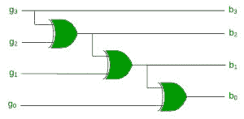

**参考文献–**

数字设计，第五版，莫里斯·马诺和迈克尔·西莱蒂

本文由**奇拉·曼瓦尼**供稿。如果你喜欢 GeeksforGeeks 并想投稿，你也可以使用[contribute.geeksforgeeks.org](http://www.contribute.geeksforgeeks.org)写一篇文章或者把你的文章邮寄到 contribute@geeksforgeeks.org。看到你的文章出现在极客博客主页上，帮助其他极客。

如果你发现任何不正确的地方，或者你想分享更多关于上面讨论的话题的信息，请写评论。